# Fitness AI Intelligence Platform

## Results & Impact

🎯 **87% ML classification accuracy** on 14 years of fitness data (2,409 workouts)  
🚀 **<5 second analysis** of 1,000+ workouts with real-time intelligence generation  
🧠 **Algorithm transparency**: Every AI insight traceable to source code with confidence scoring  
📊 **Live demo**: [workouts.barbhs.com](http://workouts.barbhs.com) - Production deployment with AI-first interface  
🔬 **200+ test methods** across comprehensive test suites ensuring production reliability  

## Navigation Guide

### 👔 For Recruiters (30-second scan)
- **[🚀 Live Demo](http://workouts.barbhs.com)** | **[📊 Key Results](#results--impact)** | **[🎯 Value Proposition](#what-makes-this-unique)**

### 👨‍💻 For Technical Review (5-minute deep dive)  
- **[🏗️ Architecture](#architecture-highlights)** | **[🤖 ML Approach](docs/ai/overview.md)** | **[📈 Performance](docs/developer/testing.md)**

### 🛠️ For Hands-on Evaluation (15-minute setup)
- **[⚡ Quick Start](docs/getting-started/quick-start.md)** | **[🔧 Installation](docs/getting-started/installation.md)**

---

## What Makes This Unique

**AI-First Design**: Unlike traditional fitness trackers, this platform puts machine learning intelligence at the center - the **Intelligence Dashboard** is the primary interface, not an afterthought.

**Algorithm Transparency**: Addresses the "black box AI" problem - every insight includes source code references, confidence scores, and plain English explanations of how the AI reached its conclusions.

**Production-Ready Architecture**: Built with enterprise practices including comprehensive testing, performance benchmarking, and scalable deployment on live infrastructure.

## Key Features
- **🤖 AI Workout Classification**: K-means clustering automatically categorizes 14 years of mixed activity data
- **📈 Intelligent Analytics**: Statistical analysis with confidence intervals, trend detection, and forecasting  
- **🔍 Algorithm Transparency**: Complete traceability from AI insights to source code (e.g., `intelligence_service.py:75-186`)
- **📊 Real-time Intelligence**: Daily intelligence briefs with personalized recommendations
- **🎨 Interactive Dashboards**: Intelligence-first interface with algorithm explanation system

## Quick Start

Get your AI-powered fitness intelligence running in **5 minutes**:

```bash
# Clone and setup
git clone https://github.com/dagny/fitness-dashboard.git
cd fitness-dashboard
poetry install

# Initialize database and load AI intelligence
python scripts/init.py
python src/update_db.py  # Optional: use your own MapMyRun data

# Launch AI Intelligence Platform  
streamlit run src/streamlit_app.py
# Visit: http://localhost:8501
```

**First Experience**: You'll land on the **Intelligence Dashboard** - your AI command center with:
- 🧠 Daily intelligence brief with personalized insights
- 🤖 Live ML classification demo showing algorithm reasoning
- 🔍 Complete algorithm transparency system with source code references
- 📊 Interactive confidence scoring for all AI predictions

## Architecture Highlights

```mermaid
graph TB
    subgraph "🧠 Intelligence Layer"
        A[Intelligence Dashboard]
        B[Algorithm Transparency]  
        C[AI Classification Demo]
    end
    
    subgraph "🤖 AI Services"
        D[Intelligence Service<br/>32KB - Core ML Logic]
        E[K-means Classification<br/>87% Accuracy]
        F[Statistical Analysis<br/>Confidence Intervals]
        G[Consistency Analyzer<br/>Multi-dimensional Scoring]
    end
    
    subgraph "📊 Data & Infrastructure"
        H[Database Service<br/>7KB - Optimized Queries]
        I[MySQL Database<br/>Production Ready]
        J[Config Management<br/>Environment Aware]
    end
    
    A --> D
    B --> D
    C --> E
    D --> E
    D --> F  
    D --> G
    E --> H
    F --> H
    G --> H
    H --> I
    J --> D
    
    style A fill:#e1f5fe
    style D fill:#f3e5f5
    style I fill:#f1f8e9
```



**Key Architectural Decisions:**
- **Intelligence-First Design**: AI capabilities prominently featured, not buried in menus
- **Algorithm Transparency**: Complete traceability from insights to source algorithms  
- **Virtual Classification**: No database schema changes needed, faster algorithm iteration
- **Comprehensive Testing**: 200+ test methods validate ML model accuracy and system performance

## Technical Deep Dive

### ML Pipeline Architecture
- **Data Processing**: 14 years of MapMyRun exports (2,409 workouts) with intelligent data quality detection
- **Feature Engineering**: Pace, distance, duration standardization for K-means clustering
- **Classification**: 3-cluster approach (fast/medium/slow) with confidence scoring and outlier detection
- **Intelligence Generation**: Real-time analysis with <5 second performance for 1K+ workout datasets

### Production Deployment
**Live System**: [workouts.barbhs.com](http://workouts.barbhs.com)
- **Infrastructure**: Nginx reverse proxy → Streamlit application → MySQL database
- **Monitoring**: systemd service management with automatic crash recovery
- **Environment**: Development (macOS/local MySQL) and Production (Linux/AWS RDS) configurations

### Development Environment
```bash
# Full development setup with auto-environment activation
poetry install
python scripts/init.py
streamlit run src/streamlit_app.py
```

### Testing & Quality Assurance
- **200+ test methods** across 6 comprehensive test suites
- **Performance benchmarking**: 1K workouts <5s, intelligence brief <3s  
- **Scalability validation**: 10K+ workouts tested, 10+ concurrent users supported
- **Memory management**: <500MB for large operations

## Documentation & Resources

### For Users
- **[📚 User Guide](docs/user-guide/)** - Complete feature walkthrough
- **[⚡ Quick Start](docs/getting-started/quick-start.md)** - Get running in 15 minutes  
- **[🔧 Installation](docs/getting-started/installation.md)** - Detailed setup instructions

### For Developers  
- **[🏗️ Architecture](docs/developer/architecture.md)** - Technical system design
- **[🤖 AI Services](docs/developer/ai-services.md)** - ML implementation details
- **[🧪 Testing](docs/developer/testing.md)** - Test framework and validation

### For AI/ML Analysis
- **[🔍 Algorithm Transparency](docs/ai/algorithm-transparency.md)** - Complete AI explainability system
- **[📊 Performance Benchmarks](docs/ai/performance.md)** - ML accuracy and system performance metrics

## License & Contact
**License**: MIT License - see [LICENSE](LICENSE) file  
**Questions**: [barbs@balex.com](mailto:barbs@balex.com)  
**Issues**: [GitHub Issues](https://github.com/dagny/fitness-dashboard/issues)

