# Fitness Dashboard

A web application that analyzes your workout data to help you understand patterns, track progress, and make informed decisions about your fitness routine.

## What It Does

The Fitness Dashboard imports your workout history from fitness apps (like MapMyRun) and provides:

- **Automatic workout categorization** (running vs walking vs mixed activities)
- **Trend analysis** showing how your performance changes over time
- **Interactive visualizations** of your fitness data
- **Smart suggestions** for improving consistency and performance
- **Custom analysis tools** for exploring specific questions about your workouts

## How Your Data Flows

```mermaid
flowchart LR
    A[📱 Export CSV from<br/>Fitness App] --> B[💾 Import to<br/>Database]
    B --> C[🔍 Analyze &<br/>Categorize]
    C --> D[📊 View Insights<br/>on Dashboard]

    style A fill:#e1f5fe
    style B fill:#f3e5f5
    style C fill:#e8f5e9
    style D fill:#fff3e0
```



## Dashboard Overview

```mermaid
graph TB
    A[🏠 Main Dashboard<br/>Insights & Recommendations] --> B[📊 Monthly View<br/>Calendar & Statistics]
    A --> C[📈 Trends Analysis<br/>Performance Charts]
    A --> D[🛠️ Model Management<br/>Classification Control]
    A --> E[🔍 Custom Queries<br/>SQL Interface]

    style A fill:#e3f2fd,stroke:#1976d2,stroke-width:3px
    style B fill:#f9fbe7,stroke:#689f38,stroke-width:2px
    style C fill:#fce4ec,stroke:#c2185b,stroke-width:2px
    style D fill:#fff3e0,stroke:#f57c00,stroke-width:2px
    style E fill:#f3e5f5,stroke:#7b1fa2,stroke-width:2px
```



## Quick Start

### Prerequisites
- Python 3.10+
- MySQL server
- Git

### Setup (5 minutes)
```bash
# 1. Clone and install
git clone https://github.com/dagny/fitness-dashboard.git
cd fitness-dashboard
poetry install

# 2. Set up database
python scripts/init.py

# 3. Import your data (optional - works with demo data too)
# Replace src/user2632022_workout_history.csv with your CSV export
python src/update_db.py

# 4. Start dashboard
streamlit run src/streamlit_app.py
```

Visit `http://localhost:8501` to see your dashboard!

## Key Features

### Smart Analysis
- **Workout Classification**: Automatically categorizes activities based on pace, distance, and duration
- **Trend Detection**: Statistical analysis of your performance over time
- **Pattern Recognition**: Identifies consistency patterns and suggests improvements
- **Outlier Detection**: Flags unusual workouts that might be data errors

### Interactive Tools
- **Multiple Dashboard Views**: Different perspectives on your data
- **Custom Queries**: SQL interface for specific analysis questions
- **Visualization Options**: Charts and graphs tailored to fitness data
- **Export Capabilities**: Save results for your own use

### Data Management
- **CSV Import**: Works with MapMyRun exports (adaptable to other formats)
- **Data Validation**: Checks for common issues during import
- **Historical Analysis**: Supports years of workout history
- **Privacy Focused**: All data stays on your local machine

## Documentation

### **Getting Started**
- **[📚 Complete User Guide](docs/index.md)** - Full documentation site
- **[⚡ Quick Reference](docs/user-guide/quick-reference.md)** - Cheat sheet for common tasks
- **[🔧 Installation Guide](docs/getting-started/installation.md)** - Detailed setup instructions

### **Daily Use**
- **[📊 Dashboard Guide](docs/user-guide/dashboard-overview.md)** - Understanding the interface
- **[📥 Data Import](docs/user-guide/data-import.md)** - Adding your workout data
- **[🛠️ Model Management](docs/user-guide/model-management.md)** - Controlling workout classification

### **Advanced**
- **[🔍 Custom Analysis](docs/user-guide/sql-queries.md)** - Writing your own queries
- **[📈 Trend Analysis](docs/user-guide/visualizations.md)** - Understanding charts and graphs
- **[🚨 Troubleshooting](docs/reference/troubleshooting.md)** - Common issues and solutions

## Example Use Cases

### Track Training Progress
- Monitor improvements in pace, distance, or frequency over time
- Compare different training periods (e.g., before/after program changes)
- Identify patterns in your most successful workouts

### Understand Workout Habits
- See when you exercise most consistently
- Analyze the balance between different activity types
- Spot seasonal patterns in your fitness routine

### Data Quality & Cleanup
- Find and fix obvious errors in imported data
- Identify workouts that might be miscategorized
- Clean up inconsistent activity naming

### Goal Setting & Tracking
- Use historical data to set realistic goals
- Monitor progress toward specific targets
- Adjust training based on data-driven insights

## Technical Details

- **Backend**: Python with Streamlit web framework
- **Database**: MySQL for data storage and analysis
- **Analytics**: Statistical analysis with scikit-learn and scipy
- **Visualization**: Interactive charts with Plotly
- **Data Format**: CSV import (MapMyRun optimized)

## Live Demo

See the dashboard in action: [workouts.barbhs.com](https://workouts.barbhs.com)

## Support

- **Questions**: Check the [troubleshooting guide](docs/reference/troubleshooting.md) first
- **Issues**: Submit problems on [GitHub Issues](https://github.com/dagny/fitness-dashboard/issues)
- **Feature requests**: Use GitHub Issues to suggest improvements

## Contributing

Contributions welcome! See [contributing guidelines](docs/developer/contributing.md) for details.

## License

MIT License - see [LICENSE](LICENSE) for details.

---

**Ready to understand your fitness data better?** Start with the [Quick Start](#quick-start) above or dive into the [full documentation](docs/index.md).