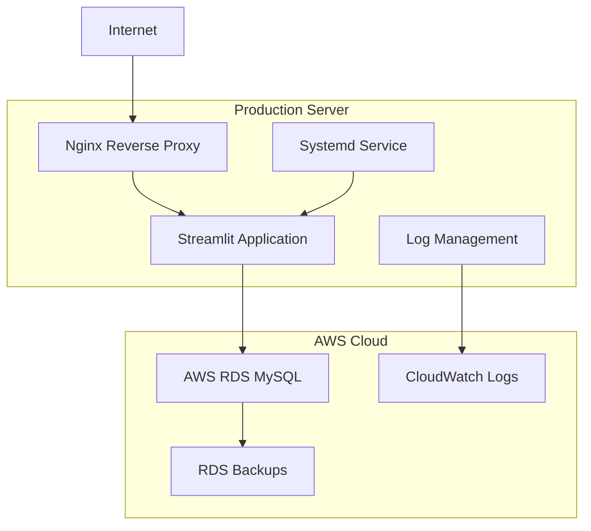

# Production Deployment Overview

This guide provides general information about deploying the Fitness Dashboard to a production environment. For detailed deployment instructions, please refer to your private documentation or contact the development team.

## Production Architecture

The production setup uses a cloud-based architecture with the following components:



## Server Requirements

### Minimum System Requirements

- **OS**: Ubuntu 20.04 LTS or similar Linux distribution
- **CPU**: 2 vCPUs minimum, 4 vCPUs recommended
- **RAM**: 4GB minimum, 8GB recommended
- **Storage**: 20GB SSD minimum
- **Network**: Stable internet connection with static IP

### Recommended Instance Types

**AWS EC2**:
- `t3.medium` (2 vCPU, 4GB RAM) - Minimum
- `t3.large` (2 vCPU, 8GB RAM) - Recommended
- `c5.large` (2 vCPU, 4GB RAM) - CPU optimized

**Digital Ocean**:
- `s-2vcpu-4gb` - Standard droplet
- `s-2vcpu-8gb` - Recommended

## Database Setup (AWS RDS)

### Database Configuration

The production environment uses a managed MySQL database service with:

- **Security**: SSL connections and encrypted storage
- **Backup**: Automated daily backups with point-in-time recovery
- **Performance**: Optimized instance sizing based on workload
- **Monitoring**: Performance insights and alerting

For specific configuration details, refer to your deployment documentation.

## Application Server Setup

### System Dependencies

```bash
# Update system
sudo apt update && sudo apt upgrade -y

# Install Python 3.10+
sudo apt install python3.10 python3.10-venv python3-pip -y

# Install system dependencies
sudo apt install git nginx supervisor curl -y

# Install Poetry
curl -sSL https://install.python-poetry.org | python3 -
```

### Application Deployment

The application deployment process includes:

- **User Setup**: Dedicated application user with appropriate permissions
- **Code Deployment**: Automated deployment from version control
- **Dependencies**: Production-only package installation
- **Environment Configuration**: Secure environment variable management
- **Permissions**: Proper file and directory permissions

Deployment is managed through automated scripts that handle:
- Code updates from the repository
- Dependency installation and updates
- Service restarts and health checks
- Rollback procedures if needed

## Web Server Configuration

### Nginx Setup

The web server configuration includes:

**Reverse Proxy Setup**:
- Nginx configured as reverse proxy to Streamlit application
- HTTP to HTTPS redirection for security
- Proper headers for Streamlit WebSocket connections

**SSL/TLS Configuration**:
- Modern TLS protocols (TLSv1.2, TLSv1.3)
- Secure cipher suites and security headers
- Automated certificate management with Let's Encrypt

**Performance Optimization**:
- Gzip compression for static assets
- Appropriate caching headers
- Connection keep-alive settings

**Security Headers**:
- Content Security Policy (CSP)
- X-Frame-Options, X-Content-Type-Options
- HTTP Strict Transport Security (HSTS)

### SSL Certificate (Let's Encrypt)

```bash
# Install Certbot
sudo apt install certbot python3-certbot-nginx -y

# Obtain SSL certificate
sudo certbot --nginx -d workouts.barbhs.com

# Verify auto-renewal
sudo systemctl status certbot.timer
sudo certbot renew --dry-run
```

## Process Management

### Systemd Service

Create a systemd service for the Streamlit application:

```bash
sudo tee /etc/systemd/system/fitness-dashboard.service << 'EOF'
[Unit]
Description=Fitness Dashboard Streamlit Application
After=network.target

[Service]
Type=simple
User=fitness-app
Group=fitness-app
WorkingDirectory=/home/fitness-app/fitness-dashboard
Environment=PATH=/home/fitness-app/.local/bin
EnvironmentFile=/home/fitness-app/.env
ExecStart=/home/fitness-app/.local/bin/poetry run streamlit run src/streamlit_app.py --server.port=8501 --server.address=127.0.0.1 --server.headless=true
Restart=always
RestartSec=3
StandardOutput=journal
StandardError=journal
SyslogIdentifier=fitness-dashboard

[Install]
WantedBy=multi-user.target
EOF

# Enable and start the service
sudo systemctl daemon-reload
sudo systemctl enable fitness-dashboard
sudo systemctl start fitness-dashboard

# Check status
sudo systemctl status fitness-dashboard
```

## Deployment Script

### Automated Deployment

Production deployments are handled through automated scripts that:

**Pre-Deployment Checks**:
- Validate configuration and environment
- Check service health and dependencies
- Create backup of current deployment

**Deployment Process**:
- Pull latest code from version control
- Install/update dependencies
- Run database migrations if needed
- Update configuration files

**Post-Deployment**:
- Restart application services
- Verify service health
- Run smoke tests
- Update monitoring dashboards

**Rollback Capability**:
- Automated rollback on deployment failure
- Quick rollback to previous stable version
- Database rollback procedures when needed

Make the script executable:

```bash
chmod +x deploy.sh
```

## Monitoring and Logging

### Application Logging

Configure structured logging for production:

```python
# src/config/logging_config.py (production settings)
LOGGING_CONFIG = {
    'version': 1,
    'disable_existing_loggers': False,
    'formatters': {
        'json': {
            'format': '{"timestamp": "%(asctime)s", "level": "%(levelname)s", "logger": "%(name)s", "message": "%(message)s"}',
            'datefmt': '%Y-%m-%d %H:%M:%S'
        }
    },
    'handlers': {
        'file': {
            'level': 'INFO',
            'class': 'logging.handlers.RotatingFileHandler',
            'filename': '/var/log/fitness-dashboard/app.log',
            'maxBytes': 10485760,  # 10MB
            'backupCount': 5,
            'formatter': 'json'
        }
    },
    'root': {
        'level': 'INFO',
        'handlers': ['file']
    }
}
```

### Log Rotation

```bash
# Configure logrotate
sudo tee /etc/logrotate.d/fitness-dashboard << 'EOF'
/var/log/fitness-dashboard/*.log {
    daily
    missingok
    rotate 14
    compress
    delaycompress
    notifempty
    create 644 fitness-app fitness-app
    postrotate
        systemctl reload fitness-dashboard
    endscript
}
EOF
```

### System Monitoring

Set up basic monitoring with scripts:

```bash
#!/bin/bash
# monitor.sh - Basic health check script

APP_URL="https://workouts.barbhs.com"
SERVICE_NAME="fitness-dashboard"
LOG_FILE="/var/log/fitness-dashboard/monitor.log"

# Check if service is running
if ! systemctl is-active --quiet $SERVICE_NAME; then
    echo "$(date): Service $SERVICE_NAME is not running" >> $LOG_FILE
    systemctl restart $SERVICE_NAME
fi

# Check if application responds
if ! curl -f -s $APP_URL > /dev/null; then
    echo "$(date): Application not responding at $APP_URL" >> $LOG_FILE
fi

# Check disk space
DISK_USAGE=$(df / | awk 'NR==2 {print $5}' | sed 's/%//')
if [ $DISK_USAGE -gt 80 ]; then
    echo "$(date): Disk usage is $DISK_USAGE%" >> $LOG_FILE
fi
```

Add to crontab:

```bash
# Run health check every 5 minutes
*/5 * * * * /home/fitness-app/monitor.sh
```

## Security Hardening

### Firewall Configuration

```bash
# Configure UFW firewall
sudo ufw default deny incoming
sudo ufw default allow outgoing
sudo ufw allow ssh
sudo ufw allow 'Nginx Full'
sudo ufw --force enable
```

### System Updates

```bash
# Enable automatic security updates
sudo apt install unattended-upgrades -y
sudo dpkg-reconfigure -plow unattended-upgrades

# Configure automatic updates
echo 'Unattended-Upgrade::Automatic-Reboot "false";' | sudo tee -a /etc/apt/apt.conf.d/50unattended-upgrades
```

### Application Security

**Environment Variables**:
- Never commit secrets to version control
- Use environment-specific configuration
- Rotate database passwords regularly
- Enable RDS encryption at rest

**Database Security**:
- Use SSL connections
- Limit database user privileges
- Enable query logging for monitoring
- Regular security updates

## Backup Strategy

### Database Backups

```bash
#!/bin/bash
# backup_prod_db.sh

DATE=$(date +"%Y%m%d_%H%M%S")
BACKUP_DIR="/home/fitness-app/backups"
S3_BUCKET="fitness-dashboard-backups"

# Create backup directory
mkdir -p $BACKUP_DIR

# Dump database
mysqldump -h $RDS_ENDPOINT -u $RDS_USER -p$RDS_PASSWORD \
    --single-transaction \
    --routines \
    --triggers \
    sweat > $BACKUP_DIR/prod_backup_$DATE.sql

# Compress backup
gzip $BACKUP_DIR/prod_backup_$DATE.sql

# Upload to S3 (optional)
aws s3 cp $BACKUP_DIR/prod_backup_$DATE.sql.gz s3://$S3_BUCKET/

# Clean local backups older than 7 days
find $BACKUP_DIR -name "prod_backup_*.sql.gz" -mtime +7 -delete

echo "Backup completed: prod_backup_$DATE.sql.gz"
```

Schedule with cron:

```bash
# Daily backup at 2 AM
0 2 * * * /home/fitness-app/backup_prod_db.sh >> /var/log/fitness-dashboard/backup.log 2>&1
```

## Performance Optimization

### Application Performance

**Caching Configuration**:
```python
# Streamlit caching for production
@st.cache_data(ttl=300, max_entries=100)
def get_cached_data(query_hash):
    """Cache frequently accessed data"""
    return database_service.execute_query(query)
```

**Database Connection Pooling**:
```python
# Use connection pooling for better performance
from sqlalchemy import create_engine
from sqlalchemy.pool import QueuePool

engine = create_engine(
    f"mysql+pymysql://{user}:{password}@{host}/{database}",
    poolclass=QueuePool,
    pool_size=5,
    max_overflow=10,
    pool_pre_ping=True
)
```

### Server Performance

**Nginx Optimization**:
```nginx
# Additional performance settings
worker_processes auto;
worker_connections 1024;

http {
    sendfile on;
    tcp_nopush on;
    tcp_nodelay on;
    keepalive_timeout 65;
    
    # Buffer sizes
    client_body_buffer_size 10M;
    client_max_body_size 10M;
    client_header_buffer_size 1k;
    large_client_header_buffers 4 4k;
}
```

## Troubleshooting Production Issues

### Common Issues

!!! error "Service Won't Start"
    **Check service logs**:
    ```bash
    sudo systemctl status fitness-dashboard
    sudo journalctl -u fitness-dashboard -f
    ```

!!! error "Database Connection Issues"
    **Check RDS connectivity**:
    ```bash
    # Test from application server
    mysql -h $RDS_ENDPOINT -u $RDS_USER -p
    ```

!!! error "High Memory Usage"
    **Monitor memory usage**:
    ```bash
    free -h
    top -p $(pgrep -f streamlit)
    ```

### Log Analysis

**Application Logs**:
```bash
# View recent logs
tail -f /var/log/fitness-dashboard/app.log

# Search for errors
grep -i error /var/log/fitness-dashboard/app.log

# View Nginx access logs
tail -f /var/log/nginx/access.log
```

## Maintenance Procedures

### Regular Maintenance Tasks

**Weekly Tasks**:
- Review application and system logs
- Check disk space and system resources
- Verify backup completion
- Update system packages

**Monthly Tasks**:
- Review database performance
- Analyze application metrics
- Update application dependencies
- Security patch review

**Quarterly Tasks**:
- SSL certificate renewal check
- Complete backup and recovery test
- Performance optimization review
- Security audit

For development setup, see the [Local Development Guide](local-development.md).