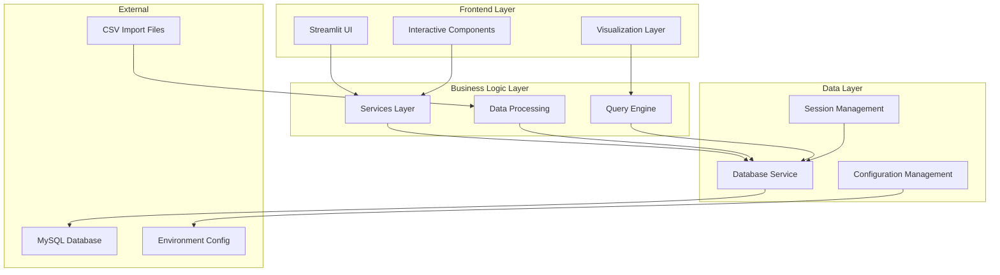
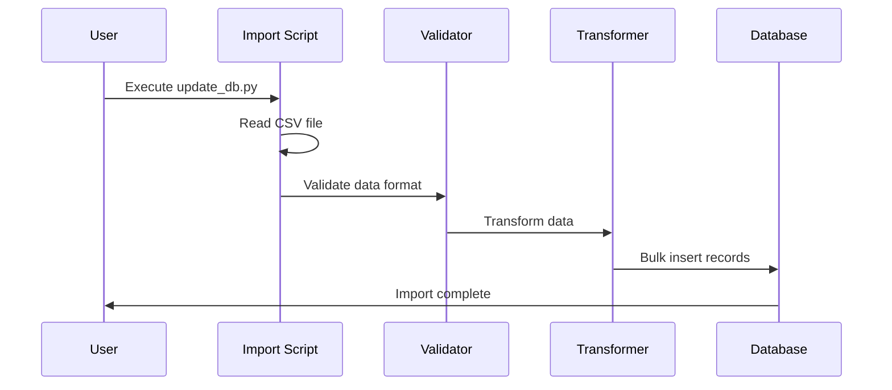
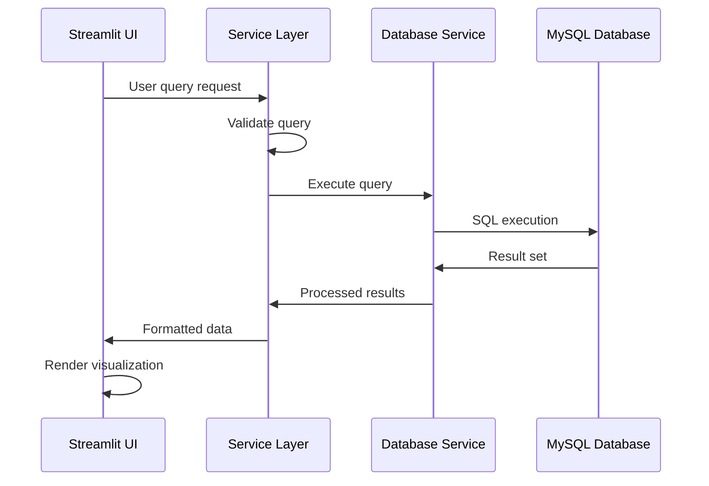

# Architecture

This document provides a comprehensive overview of the Fitness Dashboard's architecture, design patterns, and technical implementation.

## High-Level Architecture

The Fitness Dashboard follows a clean, layered architecture that separates concerns and promotes maintainability:



## Project Structure

The codebase is organized following modern Python project conventions:

```
fitness-dashboard/
├── src/                          # Source code
│   ├── config/                   # Configuration management
│   │   ├── __init__.py
│   │   ├── app.py               # Application settings
│   │   ├── database.py          # Database configuration
│   │   └── logging_config.py    # Logging setup
│   ├── models/                   # Data models (future expansion)
│   │   └── __init__.py
│   ├── services/                 # Business logic layer
│   │   ├── __init__.py
│   │   └── database_service.py  # Database operations
│   ├── utils/                    # Shared utilities
│   │   ├── __init__.py
│   │   ├── session_manager.py   # Session handling
│   │   ├── storage.py           # Data persistence
│   │   └── utilities.py         # Helper functions
│   ├── views/                    # UI components and pages
│   │   ├── __init__.py
│   │   ├── dash.py              # Main dashboard
│   │   ├── fitness-overview.py  # SQL interface
│   │   ├── login.py             # Authentication
│   │   ├── calendar_more.py     # Calendar view
│   │   └── tools/               # Analysis tools
│   │       ├── history.py
│   │       ├── mapping.py
│   │       ├── testcard.py
│   │       └── trends.py
│   ├── streamlit_app.py          # Application entry point
│   ├── calendar.py               # Calendar utilities
│   ├── update_db.py              # Data import script
│   └── style_config.json         # UI styling
├── scripts/                      # Setup and deployment
│   ├── init.py                  # Database initialization
│   └── deploy.sh                # Production deployment
├── tests/                        # Test suite
├── docs/                         # Documentation (MkDocs)
├── pyproject.toml               # Project configuration
└── requirements.txt             # Dependencies
```

## Core Components

### Configuration Layer (`src/config/`)

**Purpose**: Centralized configuration management with environment awareness

#### `app.py`
```python
# Application-wide settings
class AppConfig:
    """Application configuration with environment detection"""
    
    @staticmethod
    def get_environment():
        """Detect development vs production environment"""
        return "development" if platform.system() == "Darwin" else "production"
    
    @staticmethod
    def load_style_config():
        """Load UI styling configuration"""
        # Implementation details...
```

#### `database.py`
```python
# Database configuration with environment switching
class DatabaseConfig:
    """Environment-aware database configuration"""
    
    @staticmethod
    def get_connection_params():
        """Return connection parameters based on environment"""
        if AppConfig.get_environment() == "development":
            return local_mysql_config()
        else:
            return aws_rds_config()
```

#### `logging_config.py`
```python
# Centralized logging setup
def setup_logging():
    """Configure structured logging for the application"""
    # Implementation with proper log levels and formatting
```

### Services Layer (`src/services/`)

**Purpose**: Business logic and data access abstraction

#### `database_service.py`
```python
class DatabaseService:
    """Centralized database operations with connection management"""
    
    @contextmanager
    def get_connection(self):
        """Context manager for database connections"""
        # Connection pooling and error handling
        
    def execute_query(self, query: str, params: tuple = None):
        """Execute SQL queries with proper error handling"""
        
    def bulk_insert(self, table: str, data: List[Dict]):
        """Efficient bulk data insertion"""
        
    def get_workout_summary(self, filters: Dict = None):
        """Business logic for workout data retrieval"""
```

### Views Layer (`src/views/`)

**Purpose**: User interface components and page logic

#### Main Dashboard (`dash.py`)
- Monthly activity overview
- Interactive charts and visualizations  
- Key performance indicators
- Activity type breakdown

#### SQL Interface (`fitness-overview.py`)
- Custom query execution
- Result visualization
- Query history and favorites
- Performance metrics

#### Calendar View (`calendar_more.py`)
- Calendar-based workout browsing
- Daily activity summaries
- Historical data navigation

### Utilities Layer (`src/utils/`)

**Purpose**: Shared functionality and helper functions

#### `session_manager.py`
```python
class SessionManager:
    """Streamlit session state management"""
    
    @staticmethod
    def get_session_value(key: str, default=None):
        """Safely retrieve session values"""
        
    @staticmethod
    def set_session_value(key: str, value):
        """Set session values with validation"""
```

#### `utilities.py`
```python
# Type-safe utility functions
def safe_float_conversion(value: Any) -> Optional[float]:
    """Safely convert values to float with error handling"""
    
def format_duration(seconds: int) -> str:
    """Format duration for display"""
    
def calculate_pace(distance: float, duration: int) -> Optional[float]:
    """Calculate pace with validation"""
```

## Design Patterns

### Configuration Pattern

**Environment Detection**:
```python
def get_environment() -> str:
    """Automatic environment detection based on OS"""
    return "development" if platform.system() == "Darwin" else "production"
```

**Configuration Loading**:
```python
@lru_cache(maxsize=1)
def load_config():
    """Cached configuration loading"""
    return {
        "database": DatabaseConfig.get_connection_params(),
        "app": AppConfig.load_app_settings(),
        "logging": LoggingConfig.get_config()
    }
```

### Repository Pattern

Database access is abstracted through service classes:

```python
class WorkoutRepository:
    """Data access layer for workout entities"""
    
    def __init__(self, db_service: DatabaseService):
        self.db = db_service
    
    def get_workouts_by_date_range(self, start: datetime, end: datetime):
        """Retrieve workouts within date range"""
        
    def get_activity_summary(self, activity_type: str):
        """Get summary statistics for activity type"""
```

### Dependency Injection

Services are injected rather than instantiated directly:

```python
def create_dashboard_view(db_service: DatabaseService):
    """Factory function for dashboard with injected dependencies"""
    workout_repo = WorkoutRepository(db_service)
    return DashboardView(workout_repo)
```

## Data Flow Architecture

### Import Pipeline



### Query Execution Flow



## Security Considerations

### Database Security

**Connection Security**:
- Environment-specific credentials
- Connection pooling with timeouts
- SQL injection prevention through parameterized queries

**Data Protection**:
```python
def sanitize_query(query: str) -> str:
    """Sanitize user input for SQL queries"""
    # Remove dangerous SQL keywords
    # Validate query structure
    # Return safe query
```

### Configuration Security

**Secret Management**:
- Environment variables for sensitive data
- `.env` files excluded from version control
- Production secrets managed through deployment pipeline

**Access Control**:
- Database user with minimal required privileges
- Connection limits and timeouts
- Query execution limits

## Performance Optimizations

### Database Optimization

**Indexing Strategy**:
```sql
-- Performance indexes
CREATE INDEX idx_workout_date ON workout_summary(workout_date);
CREATE INDEX idx_activity_type ON workout_summary(activity_type);
CREATE INDEX idx_date_activity ON workout_summary(workout_date, activity_type);
```

**Query Optimization**:
- Date range filtering for large datasets
- Aggregation at database level
- Connection pooling and reuse

### Frontend Optimization

**Caching Strategy**:
```python
@st.cache_data(ttl=300)  # 5-minute cache
def get_monthly_summary(month: str):
    """Cached monthly data retrieval"""
    return database_service.get_monthly_data(month)
```

**Lazy Loading**:
- Progressive data loading for large datasets
- On-demand chart rendering
- Efficient state management

## Testing Architecture

### Test Structure

```
tests/
├── conftest.py              # Test configuration
├── test_queries.py          # Database query tests
├── test_session.py          # Session management tests
├── unit/                    # Unit tests
│   ├── test_services.py
│   ├── test_utilities.py
│   └── test_config.py
└── integration/             # Integration tests
    ├── test_database.py
    └── test_views.py
```

### Testing Patterns

**Database Testing**:
```python
@pytest.fixture
def test_database():
    """Test database fixture with sample data"""
    # Setup test database
    # Insert sample data
    yield database
    # Cleanup
```

**Service Testing**:
```python
def test_workout_summary_service(mock_database):
    """Test workout summary business logic"""
    service = WorkoutService(mock_database)
    result = service.get_monthly_summary("2024-01")
    assert result.total_workouts > 0
```

## Deployment Architecture

### Development Environment

**Local Setup**:
- MySQL server running locally
- Environment detection via OS
- Development-specific configurations
- Hot reload for rapid iteration

### Production Environment  

**Cloud Deployment**:
- AWS RDS for MySQL database
- Linux-based application server
- Nginx reverse proxy
- Systemd service management

**Deployment Pipeline**:
```bash
#!/bin/bash
# deploy.sh - Production deployment script

# Pull latest code
git pull origin main

# Install dependencies
poetry install --no-dev

# Database migrations (if any)
python scripts/migrate_db.py

# Restart services
sudo systemctl restart fitness-dashboard
sudo systemctl reload nginx
```

## Error Handling Strategy

### Exception Hierarchy

```python
class FitnessAppError(Exception):
    """Base exception for fitness application"""
    pass

class DatabaseError(FitnessAppError):
    """Database-related errors"""
    pass

class ValidationError(FitnessAppError):
    """Data validation errors"""
    pass

class ConfigurationError(FitnessAppError):
    """Configuration-related errors"""
    pass
```

### Error Recovery

**Database Connection Issues**:
- Automatic retry with exponential backoff
- Fallback to cached data when possible
- Graceful degradation of features

**Data Processing Errors**:
- Partial import recovery for CSV processing
- Data validation with detailed error reporting
- Rollback capabilities for failed operations

## Future Architecture Considerations

### Scalability Improvements

**Microservices Evolution**:
- Separate API service for data access
- Independent visualization service
- Event-driven architecture for real-time updates

**Caching Layer**:
- Redis for session and query caching
- CDN integration for static assets
- Database query result caching

### Technology Upgrades

**Database Evolution**:
- Consider PostgreSQL for advanced analytics
- Time-series database for high-frequency data
- Data warehouse integration for historical analysis

**Frontend Modernization**:
- Progressive Web App capabilities
- Real-time data streaming
- Mobile-first responsive design

For implementation details and API reference, see the [API Reference](api-reference.md) documentation.