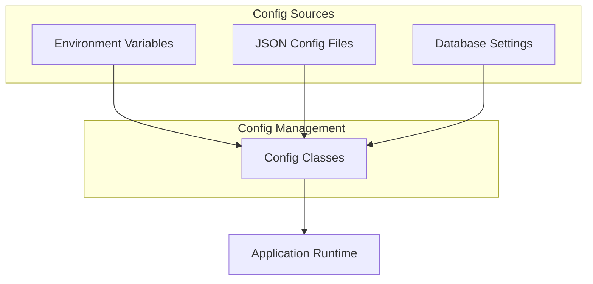

# Configuration

This guide covers all configuration options available in the Fitness Dashboard, including application settings, database configuration, and customization options.

## Configuration Overview

The Fitness Dashboard uses a multi-layered configuration approach:

- **Environment Variables**: Core settings and secrets
- **Configuration Files**: Application-specific settings
- **Runtime Configuration**: Dynamic settings managed by the application



## Environment Variables

### Core Environment Variables

Required environment variables for the application:

#### Database Configuration

```bash
# Development (Local MySQL)
MYSQL_USER=your_username
MYSQL_PWD=your_password
MYSQL_HOST=localhost
MYSQL_PORT=3306
MYSQL_DATABASE=database_name

# Production (Managed Database)
DB_ENDPOINT=your-database-endpoint
DB_USER=your_username
DB_PASSWORD=your_secure_password
DB_DATABASE=database_name
DB_PORT=3306
```

#### Application Settings

```bash
# Application Environment
ENVIRONMENT=development  # or 'production'
DEBUG=true              # Enable debug mode
LOG_LEVEL=INFO          # DEBUG, INFO, WARNING, ERROR

# Streamlit Configuration
STREAMLIT_SERVER_PORT=8501
STREAMLIT_SERVER_ADDRESS=127.0.0.1
STREAMLIT_SERVER_HEADLESS=false  # true for production
STREAMLIT_THEME=dark             # or 'light'

# Data Processing
CSV_IMPORT_BATCH_SIZE=1000
DATA_CACHE_TTL=300              # Cache timeout in seconds
```

#### Optional Settings

```bash
# Logging
LOG_FILE_PATH=/var/log/fitness-dashboard/app.log
LOG_MAX_SIZE=10485760          # 10MB
LOG_BACKUP_COUNT=5

# Performance
DB_CONNECTION_POOL_SIZE=5
DB_CONNECTION_TIMEOUT=30
QUERY_TIMEOUT=60

# Security
SESSION_SECRET_KEY=your-secret-key
ALLOWED_HOSTS=your-domain.com,localhost
```

### Environment Files

#### Development (.env)

```bash
# .env - Development configuration
MYSQL_USER=fitness_user
MYSQL_PWD=dev_password
MYSQL_HOST=localhost
MYSQL_PORT=3306
MYSQL_DATABASE=sweat

ENVIRONMENT=development
DEBUG=true
LOG_LEVEL=DEBUG
STREAMLIT_THEME=dark
```

#### Production (.env.prod)

```bash
# .env.prod - Production configuration
RDS_ENDPOINT=prod-rds.amazonaws.com
RDS_USER=admin
RDS_PASSWORD=secure_prod_password
RDS_DATABASE=sweat
RDS_PORT=3306

ENVIRONMENT=production
DEBUG=false
LOG_LEVEL=INFO
STREAMLIT_SERVER_HEADLESS=true
LOG_FILE_PATH=/var/log/fitness-dashboard/app.log
```

## Configuration Classes

### AppConfig (`src/config/app.py`)

Central application configuration management:

```python
class AppConfig:
    """Application configuration with environment detection"""
    
    @staticmethod
    def get_environment() -> str:
        """
        Detect environment automatically or from ENV variable
        
        Returns:
            str: 'development' or 'production'
        """
        # Check explicit environment variable first
        env = os.getenv('ENVIRONMENT')
        if env:
            return env.lower()
        
        # Auto-detect based on OS (Darwin = development)
        return "development" if platform.system() == "Darwin" else "production"
    
    @staticmethod
    def is_development() -> bool:
        """Check if running in development mode"""
        return AppConfig.get_environment() == "development"
    
    @staticmethod
    def is_production() -> bool:
        """Check if running in production mode"""
        return AppConfig.get_environment() == "production"
    
    @staticmethod
    def get_debug_mode() -> bool:
        """Get debug mode setting"""
        return os.getenv('DEBUG', 'false').lower() == 'true'
    
    @classmethod
    def load_style_config(cls) -> Dict[str, Any]:
        """
        Load UI styling configuration
        
        Returns:
            Dict containing style settings
        """
        config_path = Path(__file__).parent.parent / "style_config.json"
        
        try:
            with open(config_path, 'r') as f:
                return json.load(f)
        except FileNotFoundError:
            logger.warning(f"Style config not found: {config_path}")
            return cls._default_style_config()
    
    @staticmethod
    def _default_style_config() -> Dict[str, Any]:
        """Default style configuration"""
        return {
            "theme": {
                "primary_color": "#7B68EE",
                "background_color": "#FFFFFF",
                "secondary_background_color": "#F0F2F6",
                "text_color": "#262730"
            },
            "charts": {
                "color_palette": ["#7B68EE", "#FF6B6B", "#4ECDC4", "#45B7D1", "#96CEB4"],
                "background_color": "rgba(0,0,0,0)",
                "grid_color": "rgba(128,128,128,0.2)"
            }
        }
```

### DatabaseConfig (`src/config/database.py`)

Database connection configuration:

```python
class DatabaseConfig:
    """Database configuration management"""
    
    @classmethod
    def get_connection_params(cls) -> Dict[str, Any]:
        """
        Get database connection parameters based on environment
        
        Returns:
            Dict containing connection parameters
        """
        env = AppConfig.get_environment()
        
        if env == "development":
            return cls._get_local_mysql_config()
        else:
            return cls._get_rds_config()
    
    @staticmethod
    def _get_local_mysql_config() -> Dict[str, Any]:
        """Local MySQL configuration for development"""
        return {
            'host': os.getenv('MYSQL_HOST', 'localhost'),
            'port': int(os.getenv('MYSQL_PORT', 3306)),
            'user': os.getenv('MYSQL_USER'),
            'password': os.getenv('MYSQL_PWD'),
            'database': os.getenv('MYSQL_DATABASE', 'sweat'),
            'charset': 'utf8mb4',
            'autocommit': True,
            'connect_timeout': 30
        }
    
    @staticmethod
    def _get_rds_config() -> Dict[str, Any]:
        """AWS RDS configuration for production"""
        return {
            'host': os.getenv('RDS_ENDPOINT'),
            'port': int(os.getenv('RDS_PORT', 3306)),
            'user': os.getenv('RDS_USER'),
            'password': os.getenv('RDS_PASSWORD'),
            'database': os.getenv('RDS_DATABASE', 'sweat'),
            'charset': 'utf8mb4',
            'autocommit': True,
            'ssl_ca': '/opt/rds-ca-2019-root.pem',
            'ssl_verify_cert': True,
            'connect_timeout': 30
        }
    
    @classmethod
    def validate_connection_params(cls) -> bool:
        """
        Validate that all required connection parameters are available
        
        Returns:
            bool: True if configuration is valid
        """
        try:
            params = cls.get_connection_params()
            required_fields = ['host', 'user', 'password', 'database']
            
            for field in required_fields:
                if not params.get(field):
                    logger.error(f"Missing required database parameter: {field}")
                    return False
            
            return True
        except Exception as e:
            logger.error(f"Database configuration validation failed: {e}")
            return False
```

### LoggingConfig (`src/config/logging_config.py`)

Logging configuration management:

```python
class LoggingConfig:
    """Logging configuration management"""
    
    @classmethod
    def setup_logging(cls):
        """Configure application logging"""
        config = cls._get_logging_config()
        logging.config.dictConfig(config)
    
    @classmethod
    def _get_logging_config(cls) -> Dict[str, Any]:
        """Get logging configuration based on environment"""
        env = AppConfig.get_environment()
        log_level = os.getenv('LOG_LEVEL', 'INFO').upper()
        
        if env == "development":
            return cls._get_development_config(log_level)
        else:
            return cls._get_production_config(log_level)
    
    @staticmethod
    def _get_development_config(log_level: str) -> Dict[str, Any]:
        """Development logging configuration"""
        return {
            'version': 1,
            'disable_existing_loggers': False,
            'formatters': {
                'detailed': {
                    'format': '%(asctime)s - %(name)s - %(levelname)s - %(message)s'
                }
            },
            'handlers': {
                'console': {
                    'level': log_level,
                    'class': 'logging.StreamHandler',
                    'formatter': 'detailed'
                }
            },
            'root': {
                'level': log_level,
                'handlers': ['console']
            }
        }
    
    @staticmethod
    def _get_production_config(log_level: str) -> Dict[str, Any]:
        """Production logging configuration"""
        log_file = os.getenv('LOG_FILE_PATH', '/var/log/fitness-dashboard/app.log')
        max_bytes = int(os.getenv('LOG_MAX_SIZE', 10485760))  # 10MB
        backup_count = int(os.getenv('LOG_BACKUP_COUNT', 5))
        
        return {
            'version': 1,
            'disable_existing_loggers': False,
            'formatters': {
                'json': {
                    'format': '{"timestamp": "%(asctime)s", "level": "%(levelname)s", "logger": "%(name)s", "message": "%(message)s"}'
                }
            },
            'handlers': {
                'file': {
                    'level': log_level,
                    'class': 'logging.handlers.RotatingFileHandler',
                    'filename': log_file,
                    'maxBytes': max_bytes,
                    'backupCount': backup_count,
                    'formatter': 'json'
                }
            },
            'root': {
                'level': log_level,
                'handlers': ['file']
            }
        }
```

## Configuration Files

### Style Configuration (`src/style_config.json`)

UI styling and theming configuration:

```json
{
  "theme": {
    "primary_color": "#7B68EE",
    "background_color": "#FFFFFF",
    "secondary_background_color": "#F0F2F6",
    "text_color": "#262730",
    "font": "sans serif"
  },
  "charts": {
    "color_palette": [
      "#7B68EE",
      "#FF6B6B", 
      "#4ECDC4",
      "#45B7D1",
      "#96CEB4",
      "#FECA57",
      "#FF9FF3",
      "#54A0FF"
    ],
    "background_color": "rgba(0,0,0,0)",
    "grid_color": "rgba(128,128,128,0.2)",
    "font_size": 12,
    "font_family": "Arial, sans-serif"
  },
  "dashboard": {
    "sidebar_width": 300,
    "main_content_padding": 20,
    "chart_height": 400,
    "table_page_size": 25
  },
  "performance": {
    "cache_ttl": 300,
    "max_cache_entries": 100,
    "query_timeout": 30
  }
}
```

### Project Configuration (`pyproject.toml`)

Project-level configuration including data source settings:

```toml
[tool.poetry]
name = "fitness-dashboard"
version = "0.1.0"
description = "Comprehensive fitness tracking dashboard"
authors = ["Your Name <email@example.com>"]

[tool.poetry.dependencies]
python = "^3.10"
# ... other dependencies

[tool.project]
# Data Import Settings
input_filename = "user_workout_history.csv"
import_batch_size = 1000
debug = true

# Dashboard Settings
default_date_range = 30  # days
max_records_display = 1000
enable_sql_interface = true

# Chart Settings
default_chart_type = "line"
chart_animation = true
export_formats = ["png", "pdf", "svg"]

[tool.pytest.ini_options]
testpaths = ["tests"]
python_files = ["test_*.py"]
addopts = "--cov=src --cov-report=html"
```

## Streamlit Configuration

### Streamlit Config (`~/.streamlit/config.toml`)

Global Streamlit configuration:

```toml
[global]
developmentMode = false
showWarningOnDirectExecution = false

[server]
port = 8501
address = "127.0.0.1"
headless = false
enableCORS = false
enableXsrfProtection = true
maxUploadSize = 200

[browser]
gatherUsageStats = false
serverAddress = "localhost"

[theme]
primaryColor = "#7B68EE"
backgroundColor = "#FFFFFF"
secondaryBackgroundColor = "#F0F2F6"
textColor = "#262730"
font = "sans serif"

[runner]
magicEnabled = true
installTracer = false
fixMatplotlib = true
postScriptGC = true
fastReruns = true

[logger]
level = "info"
messageFormat = "%(asctime)s %(levelname) -7s %(name)s: %(message)s"
```

### Secrets Configuration (`~/.streamlit/secrets.toml`)

Streamlit secrets management:

```toml
# Database credentials
[database]
host = "localhost"
port = 3306
database = "sweat"
username = "fitness_user"
password = "your_password"

# API keys (if needed)
[api]
mapbox_token = "your_mapbox_token"
google_analytics_id = "GA_MEASUREMENT_ID"

# Application settings
[app]
session_secret = "your-secret-key"
admin_email = "admin@example.com"
```

## Dynamic Configuration

### Runtime Configuration Management

Configuration that can be changed during application runtime:

```python
class RuntimeConfig:
    """Runtime configuration management with session state"""
    
    @staticmethod
    def get_user_preferences() -> Dict[str, Any]:
        """Get user preferences from session state"""
        return st.session_state.get('user_preferences', {
            'theme': 'dark',
            'default_date_range': 30,
            'chart_type': 'line',
            'time_format': '12h',
            'units': 'imperial'
        })
    
    @staticmethod
    def set_user_preference(key: str, value: Any):
        """Set user preference in session state"""
        prefs = RuntimeConfig.get_user_preferences()
        prefs[key] = value
        st.session_state.user_preferences = prefs
    
    @staticmethod
    def get_dashboard_layout() -> Dict[str, Any]:
        """Get dashboard layout configuration"""
        return st.session_state.get('dashboard_layout', {
            'show_sidebar': True,
            'chart_arrangement': 'grid',
            'widgets_visible': ['summary', 'charts', 'recent_workouts'],
            'chart_size': 'medium'
        })
```

## Configuration Validation

### Validation Functions

```python
class ConfigValidator:
    """Configuration validation utilities"""
    
    @staticmethod
    def validate_database_config() -> Tuple[bool, List[str]]:
        """
        Validate database configuration
        
        Returns:
            Tuple of (is_valid, error_messages)
        """
        errors = []
        
        try:
            params = DatabaseConfig.get_connection_params()
            
            # Check required fields
            required = ['host', 'user', 'password', 'database']
            for field in required:
                if not params.get(field):
                    errors.append(f"Missing database {field}")
            
            # Validate port
            port = params.get('port')
            if not isinstance(port, int) or not (1 <= port <= 65535):
                errors.append("Invalid database port")
            
            # Test connection if config looks valid
            if not errors:
                try:
                    import pymysql
                    conn = pymysql.connect(**params)
                    conn.close()
                except Exception as e:
                    errors.append(f"Database connection failed: {str(e)}")
            
        except Exception as e:
            errors.append(f"Configuration error: {str(e)}")
        
        return len(errors) == 0, errors
    
    @staticmethod
    def validate_file_paths() -> Tuple[bool, List[str]]:
        """Validate file paths and permissions"""
        errors = []
        
        # Check CSV file if specified
        csv_file = get_csv_file_path()
        if csv_file and not os.path.exists(csv_file):
            errors.append(f"CSV file not found: {csv_file}")
        
        # Check log directory (production)
        if AppConfig.is_production():
            log_path = os.getenv('LOG_FILE_PATH', '/var/log/fitness-dashboard/app.log')
            log_dir = os.path.dirname(log_path)
            if not os.path.exists(log_dir):
                errors.append(f"Log directory not found: {log_dir}")
            elif not os.access(log_dir, os.W_OK):
                errors.append(f"Log directory not writable: {log_dir}")
        
        return len(errors) == 0, errors
    
    @classmethod
    def validate_all_config(cls) -> Dict[str, Any]:
        """
        Validate entire application configuration
        
        Returns:
            Dict with validation results
        """
        results = {
            'valid': True,
            'errors': [],
            'warnings': []
        }
        
        # Validate database
        db_valid, db_errors = cls.validate_database_config()
        if not db_valid:
            results['valid'] = False
            results['errors'].extend(db_errors)
        
        # Validate file paths
        file_valid, file_errors = cls.validate_file_paths()
        if not file_valid:
            results['valid'] = False
            results['errors'].extend(file_errors)
        
        # Check environment variables
        env_warnings = cls._check_environment_variables()
        results['warnings'].extend(env_warnings)
        
        return results
    
    @staticmethod
    def _check_environment_variables() -> List[str]:
        """Check for missing optional environment variables"""
        warnings = []
        
        optional_vars = [
            'LOG_LEVEL',
            'STREAMLIT_THEME', 
            'CSV_IMPORT_BATCH_SIZE',
            'DATA_CACHE_TTL'
        ]
        
        for var in optional_vars:
            if not os.getenv(var):
                warnings.append(f"Optional environment variable not set: {var}")
        
        return warnings
```

## Configuration Usage Examples

### Application Startup

```python
# src/streamlit_app.py
from src.config.app import AppConfig
from src.config.database import DatabaseConfig
from src.config.logging_config import LoggingConfig

# Setup logging
LoggingConfig.setup_logging()
logger = logging.getLogger(__name__)

# Validate configuration
validator_results = ConfigValidator.validate_all_config()
if not validator_results['valid']:
    st.error("Configuration errors found:")
    for error in validator_results['errors']:
        st.error(f"• {error}")
    st.stop()

# Load configurations
app_config = AppConfig.load_style_config()
db_config = DatabaseConfig.get_connection_params()

logger.info(f"Application started in {AppConfig.get_environment()} mode")
```

### Environment-Specific Behavior

```python
# Different behavior based on environment
if AppConfig.is_development():
    st.sidebar.checkbox("Debug Mode", value=True)
    st.sidebar.json(st.session_state)

if AppConfig.is_production():
    # Disable certain features in production
    show_sql_interface = False
    enable_data_export = False
```

### Dynamic Configuration Changes

```python
# Allow users to change preferences
with st.sidebar.expander("Preferences"):
    theme = st.selectbox("Theme", ["light", "dark"])
    RuntimeConfig.set_user_preference("theme", theme)
    
    date_range = st.slider("Default Date Range (days)", 7, 365, 30)
    RuntimeConfig.set_user_preference("default_date_range", date_range)
    
    chart_type = st.selectbox("Default Chart Type", ["line", "bar", "area"])
    RuntimeConfig.set_user_preference("chart_type", chart_type)
```

## Best Practices

### Configuration Management

1. **Environment Separation**: Keep development and production configs separate
2. **Secret Management**: Never commit secrets to version control
3. **Validation**: Always validate configuration at startup
4. **Documentation**: Document all configuration options
5. **Defaults**: Provide sensible defaults for optional settings

### Security Considerations

1. **Secrets Storage**: Use environment variables or secure vaults
2. **Access Control**: Limit configuration file permissions
3. **Validation**: Sanitize and validate all configuration inputs
4. **Logging**: Don't log sensitive configuration values

### Performance Optimization

1. **Caching**: Cache configuration objects when possible
2. **Lazy Loading**: Load configuration only when needed
3. **Environment Detection**: Optimize for target environment
4. **Resource Limits**: Set appropriate limits for production

For more information about application architecture, see the [Architecture Documentation](architecture.md).