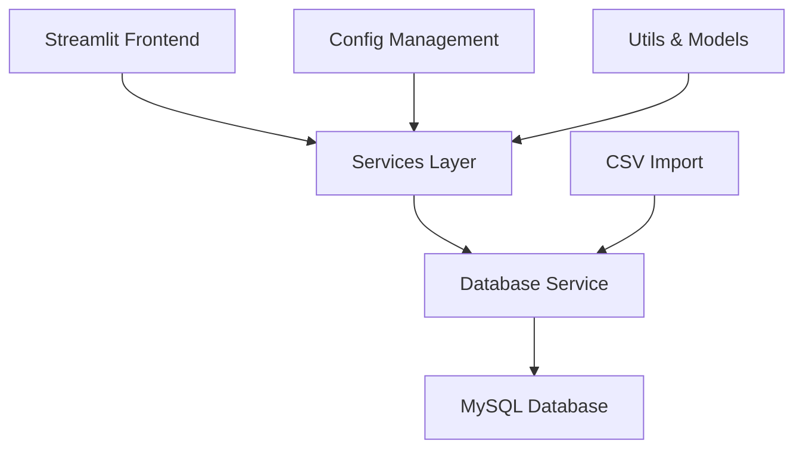

# Fitness Dashboard

A comprehensive web application for tracking and managing workout routines with interactive visualizations and data insights.

  

## Overview

The Fitness Dashboard is a modern web application designed to help users track their fitness journey through data-driven insights. Built with Streamlit and powered by a robust MySQL backend, it transforms raw workout data into meaningful visualizations and actionable insights.

### Key Features

=== "📊 Data Visualization"
    
    * Interactive charts and graphs using Plotly
    * Monthly and yearly workout trends
    * Performance metrics tracking
    * Customizable dashboard views

=== "🗃️ Data Management"
    
    * CSV import from popular fitness platforms
    * Robust MySQL database backend
    * Data validation and cleaning
    * Flexible schema for various workout types

=== "🔍 Analytics & Insights"
    
    * SQL query interface for advanced analysis
    * Performance trend analysis
    * Goal tracking and progress monitoring
    * Calendar-based workout views

=== "🚀 Developer Experience"
    
    * Well-architected codebase with clear separation of concerns
    * Comprehensive test coverage
    * Type hints and modern Python practices
    * Easy deployment with Poetry and Docker support

## Quick Start

Get up and running in minutes:

```bash
# Clone the repository
git clone https://github.com/dagny/fitness-dashboard.git
cd fitness-dashboard

# Install dependencies with Poetry
poetry install

# Initialize the database
python scripts/init.py

# Start the application
streamlit run src/streamlit_app.py
```

Visit `http://localhost:8501` to access your dashboard.

## Project Repository

Visit the project repository on [GitHub](https://github.com/dagny/fitness-dashboard) for the latest code, releases, and contribution guidelines.

## Architecture Highlights



The application follows modern software engineering principles:

- **Clean Architecture**: Clear separation between presentation, business logic, and data layers
- **Configuration Management**: Environment-aware settings for development and production
- **Type Safety**: Comprehensive type hints throughout the codebase
- **Error Handling**: Robust error handling and logging
- **Testing**: Unit and integration tests for critical components

## Platform Integration

Currently optimized for **MapMyRun** data import, with plans to support additional fitness platforms. The flexible database schema can accommodate various workout tracking formats.

## Community & Support

- **Documentation**: Comprehensive guides for users and developers
- **Issues**: Report bugs or request features on [GitHub](https://github.com/dagny/fitness-dashboard/issues)
- **Contact**: Questions? Reach out to [barbs@balex.com](mailto:barbs@balex.com)

---

Ready to start your fitness data journey? Head over to the [Getting Started](getting-started/installation.md) guide!