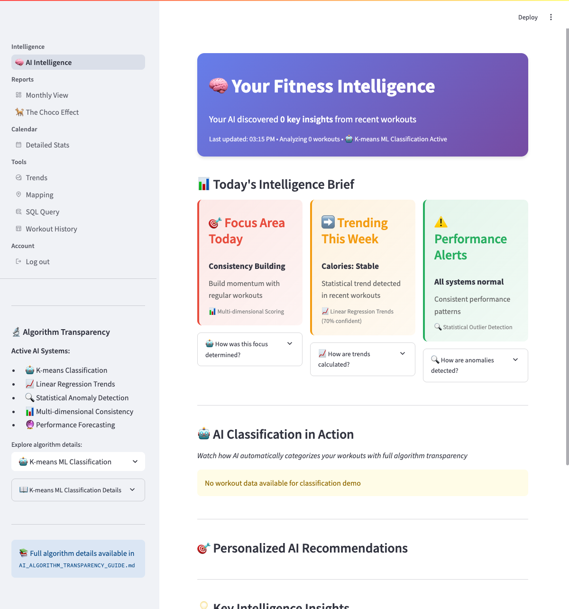

# Visual Assets Table of Contents

*Complete reference guide to all visual assets, diagrams, and screenshots in the Fitness AI Intelligence Platform documentation*

## 📸 Application Screenshots

### Main Application Pages
| Page | Screenshot | Description | Documentation |
|------|------------|-------------|---------------|
| **AI Intelligence Dashboard** |  | Complete intelligence-first interface with AI insights, algorithm transparency, and classification demo | [Intelligence Dashboard](ai/intelligence-dashboard.md) |
| **Dashboard Monthly View** |  | Traditional monthly calendar view with metrics and statistics | [Dashboard Overview](user-guide/dashboard-overview.md) |
| **The Choco Effect** |  | AI-powered behavioral transformation analysis with ML classification showcase | [User Journeys](user-guide/user-journeys.md) |
| **SQL Query Interface** |  | Interactive SQL query tool with trend analysis and data exploration | [SQL Queries](user-guide/sql-queries.md) |
| **Calendar Detailed Stats** |  | Calendar view with detailed daily statistics and workout data | [Visualizations](user-guide/visualizations.md) |
| **Trends Analysis** |  | Statistical analysis tools with trend detection and forecasting | [Visualizations](user-guide/visualizations.md) |

### UI Components & Features
| Component | Screenshot | Description | Documentation |
|-----------|------------|-------------|---------------|
| **Algorithm Transparency Sidebar** |  | Complete AI system transparency with algorithm explorer and documentation links | [Algorithm Transparency](ai/algorithm-transparency.md) |
| **Intelligence Brief Cards** |  | Three-card AI insight system: Focus Area, Trending, and Performance Alerts | [Intelligence Dashboard](ai/intelligence-dashboard.md) |
| **AI Classification Demo** |  | Step-by-step ML reasoning process with confidence scoring and user override | [ML Classification](ai/ml-classification.md) |

### Legacy Screenshots
| Asset | Screenshot | Status | Notes |
|-------|------------|--------|-------|
| **Intelligence Dashboard (Legacy)** |  | 🟡 Outdated | Replaced by `intelligence-dashboard-full.png` |
| **Algorithm Transparency (Legacy)** |  | 🟡 Outdated | Replaced by component-specific screenshots |

## 📊 Architecture Diagrams

### AI & ML Architecture
| Diagram | Description | Documentation | Status |
|---------|-------------|---------------|--------|
| **AI Architecture Flow** | High-level AI services and data flow architecture | [Architecture Diagrams](assets/diagrams/ai-architecture-flow.md) | 📝 Conceptual |
| **ML Classification Workflow** | Detailed K-means classification process and decision tree | [ML Classification Workflow](assets/diagrams/ml-classification-workflow.md) | 📝 Conceptual |
| **Algorithm Transparency System** | Algorithm registry and transparency implementation | [Algorithm Transparency System](assets/diagrams/algorithm-transparency-system.md) | 📝 Conceptual |
| **ML Pipeline Detailed** | End-to-end machine learning pipeline with data processing | [ML Pipeline](assets/diagrams/ml-pipeline-detailed.md) | 📝 Conceptual |

### System Architecture
| Diagram | Description | Documentation | Status |
|---------|-------------|---------------|--------|
| **Architecture Overview** | Complete system architecture with all services and components | [Architecture Overview](assets/diagrams/architecture-overview.md) | 📝 Conceptual |
| **Data Flow System** | Data flow from input to AI insights with all processing steps | [Data Flow](assets/diagrams/data-flow-system.md) | 📝 Conceptual |
| **Developer Workflow** | Development environment setup and deployment process | [Developer Workflow](assets/diagrams/developer-workflow.md) | 📝 Conceptual |

### User Experience
| Diagram | Description | Documentation | Status |
|---------|-------------|---------------|--------|
| **User Journey AI Features** | Complete user journey through AI-powered features | [User Journey](assets/diagrams/user-journey-ai-features.md) | 📝 Conceptual |

## 🔧 Technical Implementation Screenshots

### Database & Configuration
| Asset | Description | Location | Documentation |
|-------|-------------|----------|---------------|
| **Database Schema Visualization** | 🚫 Missing | *Needs creation* | [Database Schema](reference/database-schema.md) |
| **Configuration Screenshots** | 🚫 Missing | *Needs creation* | [Configuration](developer/configuration.md) |
| **Installation Process** | 🚫 Missing | *Needs creation* | [Installation](getting-started/installation.md) |

### Development & Testing
| Asset | Description | Location | Documentation |
|-------|-------------|----------|---------------|
| **Testing Interface** | 🚫 Missing | *Needs creation* | [Testing](developer/testing.md) |
| **API Documentation** | 🚫 Missing | *Needs creation* | [API Reference](developer/api-reference.md) |
| **Error Handling Examples** | 🚫 Missing | *Needs creation* | [Troubleshooting](reference/troubleshooting.md) |

## 📱 Mobile & Responsive Screenshots

### Mobile Views
| View | Screenshot | Status | Priority |
|------|------------|--------|----------|
| **Mobile Intelligence Dashboard** | 🚫 Missing | *Needs creation* | 🟡 Medium |
| **Mobile AI Classification** | 🚫 Missing | *Needs creation* | 🟡 Medium |
| **Mobile Calendar View** | 🚫 Missing | *Needs creation* | 🟠 Low |
| **Mobile SQL Interface** | 🚫 Missing | *Needs creation* | 🟠 Low |

## 🎯 Quick Reference by Documentation Section

### Getting Started
- [Quick Start](getting-started/quick-start.md): **Intelligence Dashboard Full**, **Brief Cards**, **Classification Demo**
- [Installation](getting-started/installation.md): *Needs installation process screenshots*
- [First AI Insights](getting-started/first-ai-insights.md): **Intelligence Dashboard Full**, **Algorithm Transparency Sidebar**

### User Guide
- [Dashboard Overview](user-guide/dashboard-overview.md): **Intelligence Dashboard Full**, **Dashboard Monthly View**, **Brief Cards**
- [Visualizations](user-guide/visualizations.md): **Choco Effect Dashboard**, **Trends Analysis**, **Calendar Stats**
- [SQL Queries](user-guide/sql-queries.md): **SQL Query Interface**
- [User Journeys](user-guide/user-journeys.md): **Choco Effect Dashboard**, **Classification Demo**

### AI Documentation
- [AI Overview](ai/overview.md): **Intelligence Dashboard Full**, **AI Architecture Flow** (conceptual)
- [Intelligence Dashboard](ai/intelligence-dashboard.md): **Intelligence Dashboard Full**, **Brief Cards**, **Algorithm Transparency Sidebar**
- [Algorithm Transparency](ai/algorithm-transparency.md): **Algorithm Transparency Sidebar**, **Algorithm Transparency System** (conceptual)
- [ML Classification](ai/ml-classification.md): **Classification Demo**, **ML Classification Workflow** (conceptual)

### Developer Resources
- [Architecture](developer/architecture.md): **Architecture Overview** (conceptual), **Data Flow System** (conceptual)
- [AI Services](developer/ai-services.md): **AI Architecture Flow** (conceptual), **ML Pipeline** (conceptual)
- [Testing](developer/testing.md): *Needs testing interface screenshots*

## 📋 Asset Creation Priorities

### 🔴 High Priority (Immediate Need)
1. **Database schema visualization** - Critical for developer onboarding
2. **Installation process screenshots** - Essential for getting started
3. **Mobile responsive views** - Important for accessibility

### 🟡 Medium Priority (Next Phase)
1. **Testing interface screenshots** - Helpful for developer documentation
2. **API documentation visuals** - Supports developer experience
3. **Configuration management screenshots** - Aids in setup process

### 🟠 Low Priority (Future Enhancement)
1. **Advanced mobile views** - Calendar, SQL on mobile
2. **Error handling examples** - Troubleshooting support
3. **Performance monitoring dashboards** - Advanced features

## 🛠️ Asset Management Guidelines

### Screenshot Standards
- **Resolution**: Minimum 1920x1080 for desktop views
- **Format**: PNG for UI screenshots, SVG for diagrams
- **Naming**: Descriptive kebab-case (e.g., `intelligence-dashboard-full.png`)
- **Location**: `docs/assets/screenshots/[category]/[filename]`

### Update Schedule
- **Major UI changes**: Update screenshots immediately
- **Feature additions**: Create new component screenshots
- **Monthly review**: Check for outdated assets
- **Documentation releases**: Verify all links work

### Quality Checklist
- ✅ Clear, readable text in screenshots
- ✅ Consistent browser/window chrome
- ✅ Representative data in examples
- ✅ Updated timestamps and UI elements
- ✅ Proper file optimization for web

---

**Last Updated**: September 13, 2025
**Total Assets**: 9 screenshots, 7 conceptual diagrams
**Coverage Status**: Core UI ✅ | Mobile Views 🚫 | Technical Diagrams 📝

*This TOC is automatically maintained. For asset requests or updates, see [Contributing Guidelines](../CONTRIBUTING.md).*