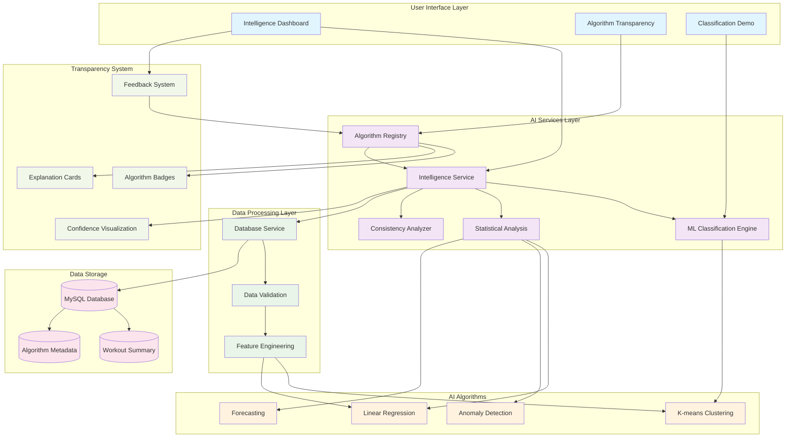

# AI Architecture Flow Diagram

This Mermaid diagram shows the complete AI architecture and data flow for the Fitness Intelligence Platform.

## Key Architecture Principles

### 1. **Intelligence-First Design**
- UI layer prioritizes AI insights over raw data
- Algorithm transparency is integrated throughout
- User feedback flows back to improve AI systems

### 2. **Layered AI Services** 
- Intelligence Service orchestrates all AI operations
- ML Classification Engine handles workout categorization
- Statistical Analysis provides trend detection and forecasting
- Consistency Analyzer evaluates workout patterns

### 3. **Complete Transparency**
- Algorithm Registry tracks all AI systems and their performance
- Every AI insight includes transparency metadata
- User feedback system enables continuous improvement

### 4. **Scalable Data Flow**
- Data validation ensures quality before AI processing  
- Feature engineering optimizes data for ML algorithms
- Performance monitoring ensures system reliability