# Algorithm Transparency System Diagram

This diagram illustrates how the algorithm transparency system provides complete explainability for all AI insights.

```mermaid
graph TB
    subgraph "User Interaction"
        UI[User Sees AI Insight]
        Click[Clicks Algorithm Badge]
        Explore[Explores Explanation]
        Feedback[Provides Feedback]
    end
    
    subgraph "Transparency Components"
        Badge[Algorithm Badge<br/>🤖 K-means ML Classification]
        Card[Explanation Card<br/>• Description<br/>• Implementation<br/>• Algorithm Type]
        Confidence[Confidence Score<br/>• 0-100% scale<br/>• Color-coded<br/>• Visual indicator]
        Source[Source Code Reference<br/>• File path<br/>• Method name<br/>• Line numbers]
    end
    
    subgraph "Algorithm Registry"
        AR[Algorithm Registry Database]
        Meta[Algorithm Metadata<br/>• Name & Type<br/>• Performance metrics<br/>• Parameter values<br/>• Version history]
        Perf[Performance Tracking<br/>• Accuracy rates<br/>• Confidence distribution<br/>• User feedback scores]
        Docs[Documentation Links<br/>• Technical details<br/>• Implementation notes<br/>• Usage examples]
    end
    
    subgraph "AI Systems"
        KM[🤖 K-means Classification<br/>intelligence_service.py:75-186]
        LR[📈 Linear Regression<br/>statistics.py:13-79] 
        AD[🔍 Anomaly Detection<br/>statistics.py:150-220]
        CA[📊 Consistency Analysis<br/>consistency_analyzer.py:45-180]
        FC[🔮 Forecasting<br/>statistics.py:81-148]
    end
    
    subgraph "Transparency Features"
        Interactive[Interactive Explanations<br/>• Step-by-step reasoning<br/>• Parameter exploration<br/>• Algorithm walkthrough]
        Visual[Visual Indicators<br/>• Confidence colors<br/>• Algorithm icons<br/>• Status badges]
        Trail[Transparency Trail<br/>• From insight to source<br/>• Complete audit trail<br/>• Reproducible results]
    end
    
    subgraph "User Feedback System"
        Collect[Feedback Collection<br/>• Thumbs up/down<br/>• Correction input<br/>• Improvement suggestions]
        Analysis[Feedback Analysis<br/>• Accuracy tracking<br/>• Pattern recognition<br/>• Model improvement]
        Update[Algorithm Updates<br/>• Parameter tuning<br/>• Model retraining<br/>• Documentation updates]
    end
    
    %% User flow
    UI --> Click
    Click --> Badge
    Badge --> Card
    Card --> Confidence
    Card --> Source
    Card --> Interactive
    
    %% Registry connections
    Badge --> AR
    Card --> Meta
    Confidence --> Perf
    Source --> Docs
    
    %% AI systems to registry
    KM --> AR
    LR --> AR
    AD --> AR
    CA --> AR
    FC --> AR
    
    %% Transparency features
    Interactive --> Visual
    Visual --> Trail
    Trail --> Explore
    
    %% Feedback loop
    Explore --> Feedback
    Feedback --> Collect
    Collect --> Analysis
    Analysis --> Update
    Update --> AR
    Update --> KM
    Update --> LR
    Update --> AD
    Update --> CA
    Update --> FC
    
    %% Performance monitoring
    Perf --> Visual
    Meta --> Interactive
    
    %% Styling
    classDef userLayer fill:#e8f4f8,stroke:#00bcd4,stroke-width:2px
    classDef transLayer fill:#f3e5f5,stroke:#9c27b0,stroke-width:2px
    classDef registryLayer fill:#fff3e0,stroke:#ff9800,stroke-width:2px
    classDef aiLayer fill:#e1f5fe,stroke:#2196f3,stroke-width:2px
    classDef featureLayer fill:#f1f8e9,stroke:#4caf50,stroke-width:2px
    classDef feedbackLayer fill:#fce4ec,stroke:#e91e63,stroke-width:2px
    
    class UI,Click,Explore,Feedback userLayer
    class Badge,Card,Confidence,Source transLayer
    class AR,Meta,Perf,Docs registryLayer
    class KM,LR,AD,CA,FC aiLayer
    class Interactive,Visual,Trail featureLayer
    class Collect,Analysis,Update feedbackLayer
```



## Transparency System Components

### **1. Algorithm Badges** 🏷️
- **Visual identifiers** for each AI system
- **Clickable elements** that expand to show details
- **Color-coded** by algorithm type and confidence
- **Consistent placement** across all AI insights

### **2. Explanation Cards** 📖
- **Progressive disclosure** of algorithm details
- **Plain English** descriptions of how algorithms work
- **Technical details** including file paths and line numbers
- **Interactive elements** for deeper exploration

### **3. Confidence Visualization** 📊
- **0-100% confidence scores** for all AI predictions
- **Color-coded indicators**: Green (high), Yellow (medium), Red (low)
- **Visual progress bars** or numerical displays
- **Contextual explanations** of what confidence means

### **4. Source Code References** 💻
- **Direct links** to implementation files
- **Method names and line numbers** for exact traceability
- **Parameter values** used in calculations
- **Version tracking** for algorithm changes

## Interactive Transparency Features

### **Algorithm Explorer** 🔍
```
User clicks algorithm badge
    ↓
Explanation card expands
    ↓
Shows: Description, Implementation, Parameters
    ↓
User can explore source code references
    ↓
Confidence score explanation available
    ↓
Feedback mechanism for improvements
```

### **Transparency Trail** 🛤️
```
AI Insight Generated
    ↓
Algorithm Registry records metadata
    ↓
UI displays transparency badge
    ↓
User clicks for explanation
    ↓
Complete audit trail shown
    ↓
Source code traceable
    ↓
User can verify or provide feedback
```

## Performance Monitoring

### **Real-time Accuracy Tracking**
- **Classification accuracy** rates updated continuously
- **Confidence score** distribution monitoring
- **User feedback** integration for improvement metrics
- **Algorithm performance** comparison across versions

### **User Feedback Integration**
- **Thumbs up/down** for quick feedback
- **Correction mechanism** for misclassifications  
- **Improvement suggestions** collection
- **Feedback analysis** for model enhancement

This transparency system ensures that users can always understand, verify, and improve the AI systems powering their fitness insights.