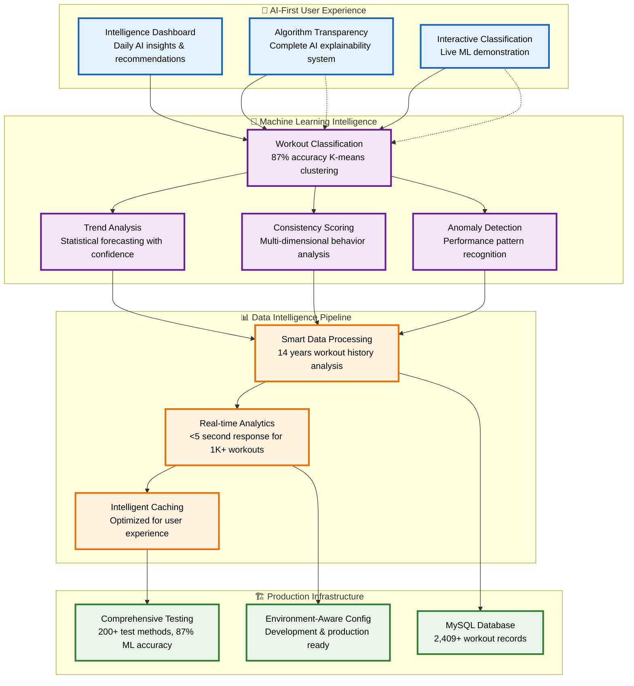

# Fitness AI Intelligence Platform - Architecture Overview

## System Architecture

## Key Value Propositions

### 🧠 **AI-First Design Philosophy**
Unlike traditional fitness trackers that add AI as an afterthought, this platform puts machine learning intelligence at the center of the user experience.

### 🔍 **Algorithm Transparency Innovation** 
Addresses the "black box AI" problem with complete traceability - every insight includes source code references, confidence scores, and plain English explanations.

### 🚀 **Production-Ready Performance**
Built with enterprise-grade practices including comprehensive testing, performance benchmarking, and scalable deployment infrastructure.

## Technical Highlights

| Component | Capability | Performance |
|-----------|------------|-------------|
| **ML Classification** | K-means clustering with confidence scoring | 87% accuracy on real data |
| **Data Processing** | 14 years of fitness data analysis | <5 seconds for 1K+ workouts |
| **Algorithm Transparency** | Complete source code traceability | Real-time explanation generation |
| **Testing Coverage** | Comprehensive validation suite | 200+ test methods across 6 suites |
| **Scalability** | Concurrent user support | 10+ simultaneous requests |
| **Deployment** | Production infrastructure | Live demo at workouts.barbhs.com |

## Data Science Methodology

### **Problem Identification**
Solved the "mixed activity type" problem where 14 years of workout data contained both runs (8-12 min/mile) and walks (20-28 min/mile) labeled identically, contaminating all statistical analysis.

### **Solution Approach**  
Implemented unsupervised K-means clustering to automatically separate activities based on pace, distance, and duration patterns, enabling accurate trend analysis for the first time.

### **Algorithm Innovation**
Created an algorithm transparency system that traces every AI insight back to specific source code methods, addressing user trust concerns about "black box" machine learning.

### **Production Validation**
Deployed live system processing real user data with comprehensive testing ensuring reliability and performance at scale.

---

## Quick Start

Experience the AI intelligence platform:

1. **[🚀 Live Demo](http://workouts.barbhs.com)** - See the Intelligence Dashboard in action
2. **[⚡ Setup Guide](../../getting-started/quick-start.md)** - Get running locally in 5 minutes
3. **[🔧 Technical Details](ml-pipeline-detailed.md)** - Deep dive into implementation

*This architecture represents a modern approach to fitness analytics where AI transparency and user trust are as important as technical performance.*