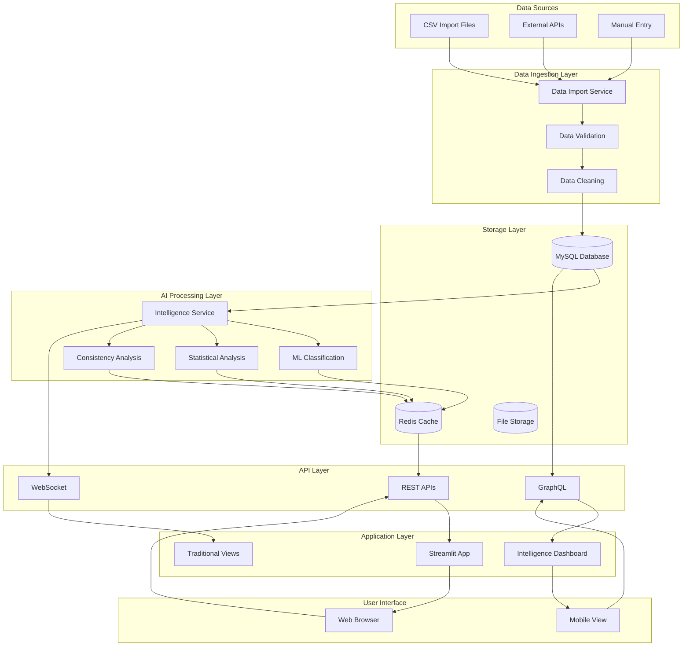
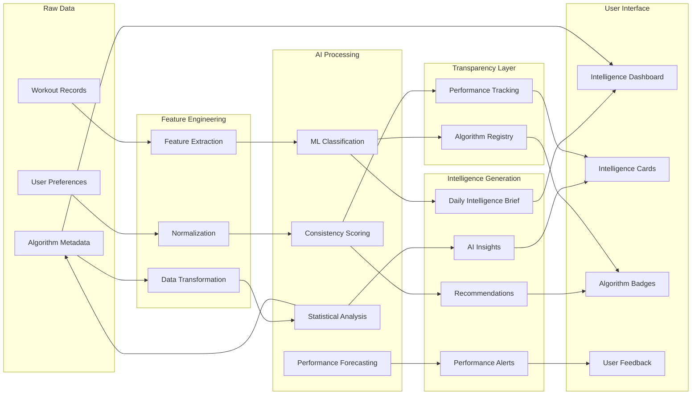
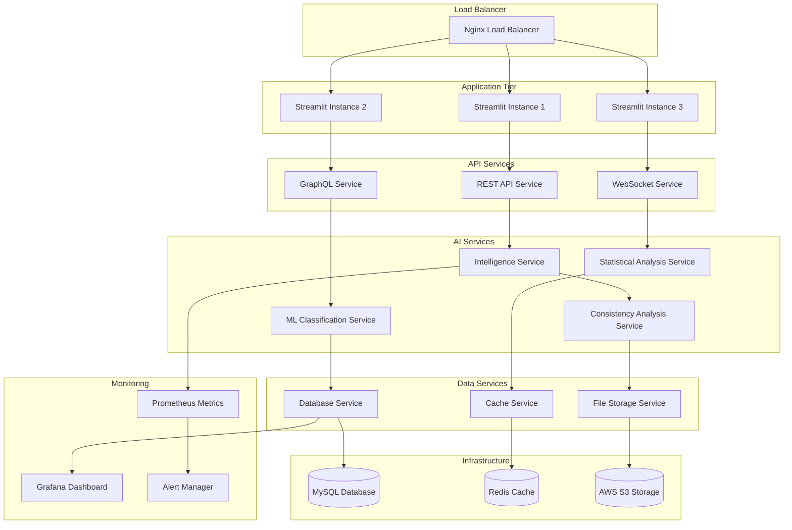
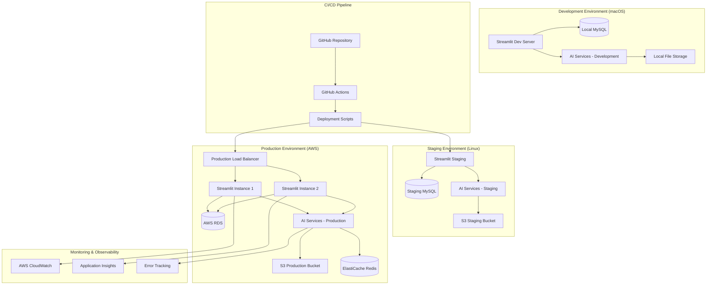
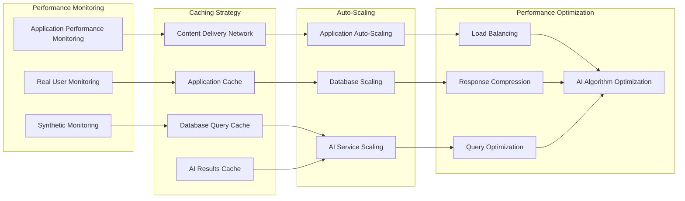

# Data Flow & System Overview Diagrams

Comprehensive visual diagrams showing data flow, system interactions, and deployment architecture for the AI-powered Fitness Intelligence Platform.

## Complete Data Flow Architecture



## AI Intelligence Data Pipeline



## System Deployment Architecture



## Development & Production Environments



## Security & Data Privacy Architecture

```mermaid
graph TB
    subgraph "External Access"
        User[User Browser]
        Mobile[Mobile Device]
    end
    
    subgraph "Security Layer"
        WAF[Web Application Firewall]
        SSL[SSL/TLS Termination]
        Auth[Authentication Service]
        RBAC[Role-Based Access Control]
    end
    
    subgraph "Application Security"
        InputVal[Input Validation]
        DataSan[Data Sanitization]
        SQLInject[SQL Injection Prevention]
        XSS[XSS Protection]
    end
    
    subgraph "Data Protection"
        Encrypt[Data Encryption at Rest]
        Transit[Encryption in Transit]
        Backup[Encrypted Backups]
        Anonymize[Data Anonymization]
    end
    
    subgraph "AI Security"
        ModelSec[Model Security]
        AlgoAudit[Algorithm Auditing]
        BiasMonitor[Bias Monitoring]
        Transparency[Transparency Logging]
    end
    
    subgraph "Infrastructure Security"
        VPC[Private Network (VPC)]
        Firewall[Network Firewall]
        Secrets[Secrets Management]
        Monitoring[Security Monitoring]
    end
    
    %% Security flow
    User --> WAF
    Mobile --> WAF
    WAF --> SSL
    SSL --> Auth
    Auth --> RBAC
    
    RBAC --> InputVal
    InputVal --> DataSan
    DataSan --> SQLInject
    SQLInject --> XSS
    
    XSS --> Encrypt
    Encrypt --> Transit
    Transit --> Backup
    Backup --> Anonymize
    
    Anonymize --> ModelSec
    ModelSec --> AlgoAudit
    AlgoAudit --> BiasMonitor
    BiasMonitor --> Transparency
    
    Transparency --> VPC
    VPC --> Firewall
    Firewall --> Secrets
    Secrets --> Monitoring
```

## Performance & Scalability Architecture



These comprehensive system diagrams provide complete visibility into the architecture, data flow, deployment strategy, and operational aspects of the AI-powered Fitness Intelligence Platform.