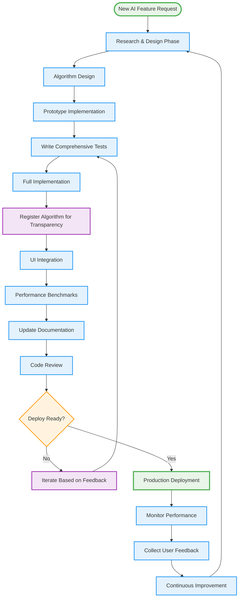
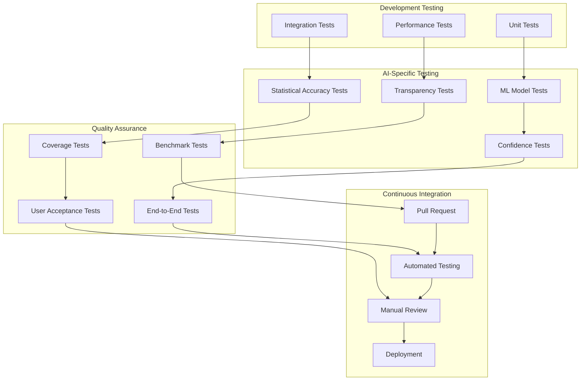
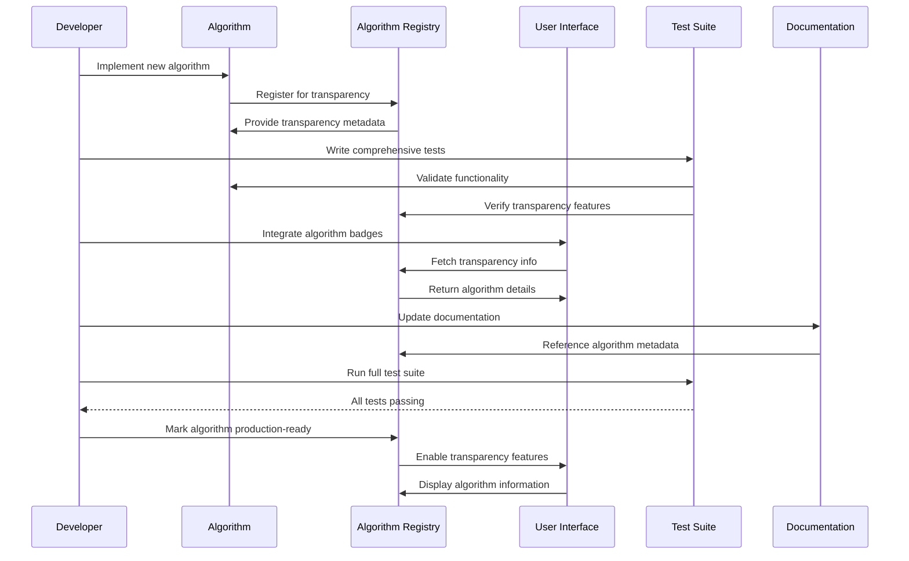
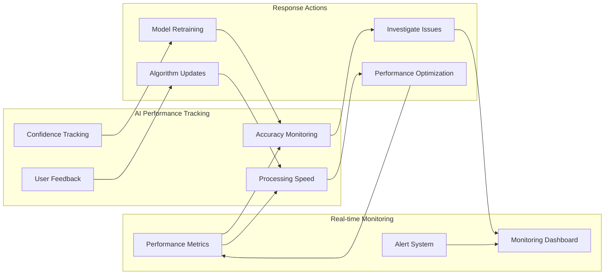
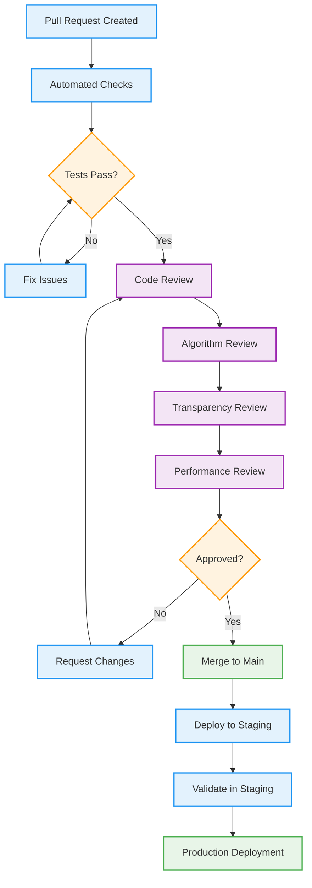
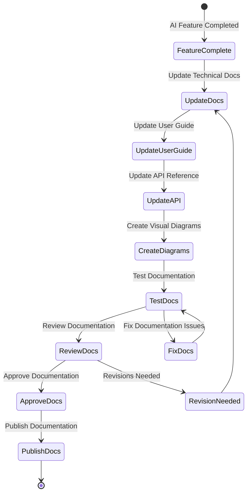
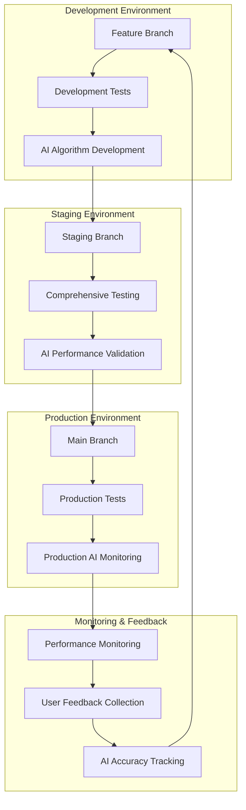
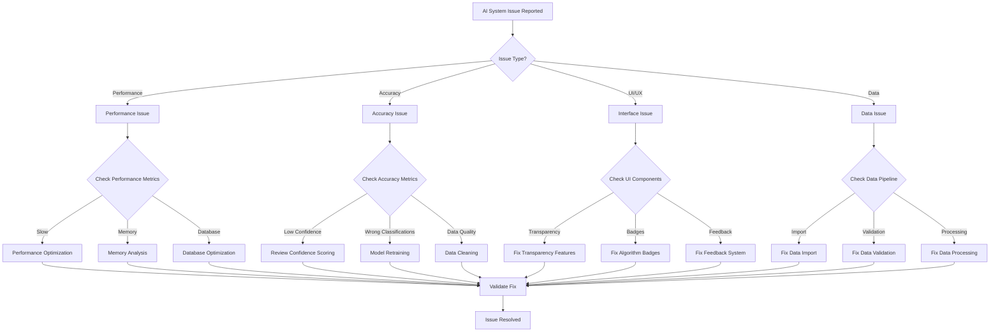

# Developer Workflow Diagrams

Visual diagrams illustrating development workflows for the AI-powered Fitness Intelligence Platform.

## AI Feature Development Workflow

## Testing Strategy Workflow

## Algorithm Integration Process

## Performance Monitoring Workflow

## Code Review Process for AI Features

## Documentation Update Workflow

## Deployment Pipeline for AI Features

## Troubleshooting Decision Tree

These developer workflow diagrams provide visual guidance for maintaining and extending the AI intelligence platform with proper testing, transparency, and quality assurance processes.