# Detailed ML Pipeline Architecture

## Technical Implementation Diagram

```mermaid
graph TB
    subgraph "🎯 User Interface Layer"
        A1[Intelligence Dashboard<br/>src/views/intelligence.py<br/>650+ lines, Algorithm Transparency UI]
        A2[Choco Effect Dashboard<br/>src/views/choco_effect.py<br/>Portfolio Storytelling Interface]
        A3[Interactive Tools<br/>src/views/tools/trends.py<br/>src/views/tools/history.py<br/>src/views/tools/mapping.py]
    end
    
    subgraph "🧠 Intelligence Processing Layer"
        B1[Intelligence Service<br/>src/services/intelligence_service.py<br/>32KB - Main AI Logic Engine]
        B2[Classification Engine<br/>classify_workout_types:75-186<br/>K-means + Confidence Scoring]
        B3[Statistical Analysis<br/>src/utils/statistics.py<br/>18KB - Trend & Anomaly Detection]
        B4[Consistency Analyzer<br/>src/utils/consistency_analyzer.py<br/>17KB - Multi-dimensional Scoring]
        B5[UI Components<br/>src/utils/ui_components.py<br/>Algorithm Transparency Widgets]
    end
    
    subgraph "🤖 Machine Learning Components"
        C1[K-means Clustering<br/>sklearn.cluster.KMeans<br/>3-cluster classification]
        C2[Standard Scaler<br/>sklearn.preprocessing<br/>Feature normalization]
        C3[Classification Logic<br/>real_run, choco_adventure<br/>mixed, outlier categories]
        C4[Confidence Calculation<br/>Distance-based scoring<br/>87% accuracy validation]
    end
    
    subgraph "📊 Data Processing Layer"
        D1[Database Service<br/>src/services/database_service.py<br/>7KB - Connection Management]
        D2[Data Loading<br/>_load_workout_data<br/>10min cache, pandas integration]
        D3[Feature Engineering<br/>pace, distance, duration<br/>standardization pipeline]
        D4[Query Optimization<br/>context managers<br/>connection pooling]
    end
    
    subgraph "🗄️ Data Storage Layer"
        E1[MySQL Database<br/>workout_summary table<br/>14 years, 2,409 records]
        E2[Configuration<br/>src/config/database.py<br/>Environment-aware setup]
        E3[Session Management<br/>src/utils/session_manager.py<br/>User state & caching]
    end
    
    subgraph "🧪 Quality Assurance Layer"  
        F1[Intelligence Tests<br/>tests/test_intelligence_service.py<br/>ML validation & benchmarks]
        F2[Performance Tests<br/>tests/test_performance_benchmarks.py<br/><5s for 1K workouts]
        F3[Integration Tests<br/>tests/test_database_integration.py<br/>End-to-end validation]
        F4[Statistical Tests<br/>tests/test_statistics.py<br/>Algorithm accuracy validation]
    end
    
    %% User Interface Flow
    A1 --> B1
    A2 --> B1
    A3 --> B1
    A1 --> B5
    
    %% Intelligence Processing Flow
    B1 --> B2
    B1 --> B3
    B1 --> B4
    B2 --> C1
    B2 --> C2
    B2 --> C3
    B2 --> C4
    
    %% Data Flow
    B1 --> D1
    B3 --> D1
    B4 --> D1
    D1 --> D2
    D1 --> D3
    D1 --> D4
    D2 --> E1
    D4 --> E1
    
    %% Configuration Flow
    D1 --> E2
    D2 --> E3
    
    %% Quality Assurance Flow
    B1 -.-> F1
    B2 -.-> F1
    D1 -.-> F2
    D1 -.-> F3
    B3 -.-> F4
    
    %% Styling
    classDef uiLayer fill:#e3f2fd,stroke:#1976d2,stroke-width:2px
    classDef aiLayer fill:#f3e5f5,stroke:#7b1fa2,stroke-width:2px
    classDef mlLayer fill:#fff3e0,stroke:#f57c00,stroke-width:2px
    classDef dataLayer fill:#e8f5e8,stroke:#388e3c,stroke-width:2px
    classDef storageLayer fill:#f1f8e9,stroke:#689f38,stroke-width:2px
    classDef testLayer fill:#fce4ec,stroke:#c2185b,stroke-width:2px
    
    class A1,A2,A3 uiLayer
    class B1,B2,B3,B4,B5 aiLayer
    class C1,C2,C3,C4 mlLayer
    class D1,D2,D3,D4 dataLayer
    class E1,E2,E3 storageLayer
    class F1,F2,F3,F4 testLayer
```



## Data Flow Details

### 1. **User Request Flow**
```
User → Intelligence Dashboard → Intelligence Service → ML Classification
     → Statistical Analysis → Database Query → Results Display
```

### 2. **ML Classification Pipeline**
```
Raw Data → Feature Engineering → StandardScaler → K-means Clustering
        → Confidence Scoring → Category Assignment → UI Display
```

### 3. **Algorithm Transparency Flow**
```
AI Insight → Source Reference → Algorithm Registry → Explanation Card
          → Confidence Visualization → User Feedback Collection
```

## Key Implementation Details

### Classification Algorithm (`intelligence_service.py:75-186`)
- **Input Features**: `avg_pace`, `distance_mi`, `duration_sec`
- **Preprocessing**: StandardScaler normalization
- **Algorithm**: K-means clustering (n_clusters=3)
- **Categories**: `real_run`, `choco_adventure`, `mixed`, `outlier`
- **Confidence**: Distance-based scoring with 87% validation accuracy

### Performance Specifications
- **Classification Speed**: <5 seconds for 1,000+ workouts
- **Cache Duration**: 10 minutes for real-time performance
- **Memory Usage**: <500MB for large datasets
- **Concurrent Users**: 10+ simultaneous requests supported

### Testing Coverage  
- **200+ test methods** across 6 comprehensive suites
- **ML validation**: Classification accuracy benchmarks
- **Performance benchmarks**: Response time validation
- **Integration tests**: End-to-end pipeline validation
- **Scalability tests**: 10K+ workout capacity verification

---

*This diagram represents the actual implementation as of September 2025. File sizes and line counts are approximate and reflect the current codebase structure.*