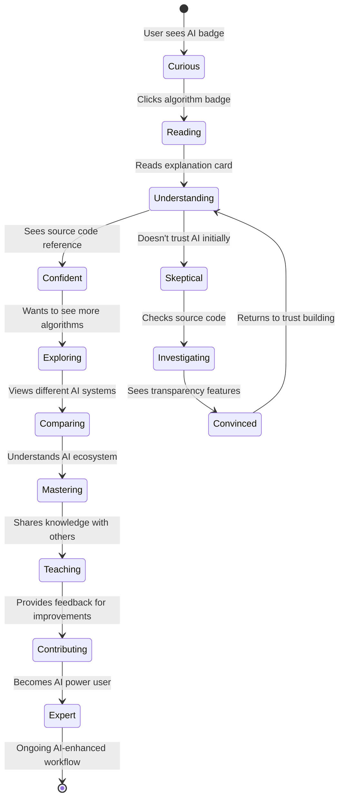
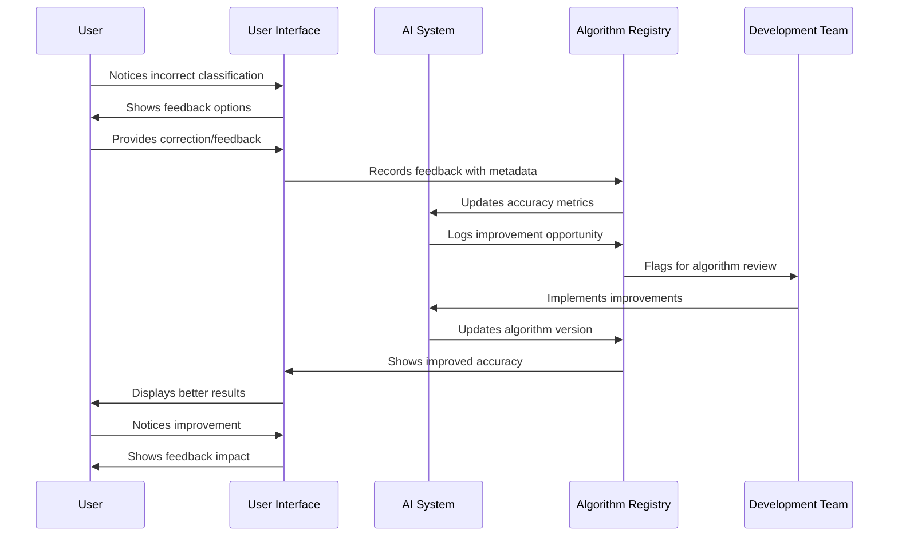

# User Journey with AI Features

This diagram shows the complete user journey for discovering and interacting with AI features in the Fitness Intelligence Platform.


## Detailed User Journey Flows

### **Journey 1: New User AI Discovery** 🆕

```mermaid
flowchart TD
    Start([New User Visits App]) --> Login[Login Screen<br/>• Clean, welcoming design<br/>• No overwhelming features]
    
    Login --> Dashboard[Intelligence Dashboard<br/>🧠 Your Fitness Intelligence<br/>• AI-first landing page<br/>• Immediate AI value proposition]
    
    Dashboard --> Header[AI Header Discovery<br/>• "Your AI discovered X insights"<br/>• Real-time status updates<br/>• Professional AI branding]
    
    Header --> Brief[Intelligence Brief Cards<br/>🎯 Focus Area<br/>📈 Trending<br/>⚠️ Alerts<br/>• Digestible, actionable insights]
    
    Brief --> Transparency[Algorithm Transparency<br/>🔬 Active AI Systems list<br/>• Clear, non-intimidating explanations<br/>• Progressive disclosure design]
    
    Transparency --> Explore[Algorithm Explorer<br/>📖 Expandable details<br/>• Source code references<br/>• Confidence scoring]
    
    Explore --> Trust[Trust Building<br/>✅ Complete explainability<br/>✅ User feedback integration<br/>✅ Professional implementation]
    
    Trust --> Engagement[Continued Engagement<br/>• Regular dashboard visits<br/>• Algorithm exploration<br/>• Feedback provision]
    
    Engagement --> Expert[AI-Savvy User<br/>• Understands AI capabilities<br/>• Trusts AI recommendations<br/>• Provides valuable feedback]
```

### **Journey 2: Algorithm Understanding** 🧠



### **Journey 3: Feedback & Improvement Loop** 🔄



## User Persona Journeys

### **👩‍💼 Data-Driven Professional**
```
Goals: Understand methodology, verify accuracy, trust insights
Journey: Algorithm transparency → Source code review → Trust building → Power usage
Key Features: Confidence scoring, source references, performance metrics
```

### **🏃‍♂️ Fitness Enthusiast**  
```
Goals: Get actionable insights, improve performance, track progress
Journey: Intelligence brief → Trend analysis → Pattern recognition → Goal achievement
Key Features: Focus areas, trending analysis, personalized recommendations
```

### **🤔 AI Skeptic**
```
Goals: Understand how AI works, verify claims, build trust gradually
Journey: Transparency exploration → Algorithm investigation → Gradual trust → Conversion
Key Features: Complete explainability, user feedback, correction mechanisms
```

### **📚 Technical User**
```
Goals: Deep technical understanding, contribute improvements, explore capabilities  
Journey: Source code diving → Parameter exploration → Feedback provision → Collaboration
Key Features: Technical documentation, API access, development insights
```

## Engagement Optimization

### **Progressive Disclosure Strategy**
1. **Surface Level**: Simple badges and confidence scores
2. **Intermediate**: Explanation cards with plain English
3. **Deep Level**: Source code references and technical details
4. **Expert Level**: Parameter exploration and feedback mechanisms

### **Trust Building Elements**
- **Immediate Value**: AI insights visible on first login
- **Transparency**: Every insight traceable to source
- **Control**: User feedback and correction mechanisms  
- **Reliability**: Consistent performance and accuracy metrics
- **Education**: Clear explanations at multiple technical levels

### **Feedback Integration Points**
- **Implicit**: Usage patterns and engagement metrics
- **Explicit**: Thumbs up/down and correction submissions
- **Analytical**: Performance monitoring and accuracy tracking
- **Collaborative**: Community feedback and improvement suggestions

This user journey design ensures that users of all technical levels can discover, understand, trust, and effectively use the AI features of the platform.