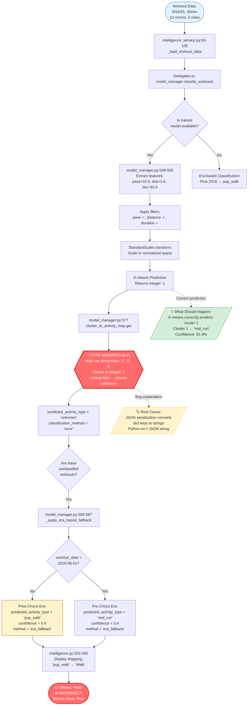

# Diagram 1: Current Classification Flow (With Bug)

## The Misclassification Pipeline - Why 10 min/mi Shows as "Walk"



## Key Points

### The Bug Location
**File:** `src/ml/model_manager.py:577`
**Line:** `activity_type = self.current_model.cluster_to_activity_map.get(cluster, 'unknown')`

### Why It Fails
1. **Training Phase** (`model_manager.py:436-443`): Cluster IDs stored as integers in Python dict
2. **Serialization** (`model_manager.py:246-256`): JSON.dump converts dict keys to strings: `{1: 'real_run'}` → `{"1": "real_run"}`
3. **Loading** (`model_manager.py:203-215`): Loaded back with string keys: `{"1": "real_run", "2": "mixed", "0": "pup_walk"}`
4. **Classification** (`model_manager.py:567-577`): K-means returns integer cluster ID: `1`
5. **Lookup Failure**: `dict.get(1, 'unknown')` with string keys returns `'unknown'`
6. **Fallback Triggered**: All workouts marked as 'unknown' → era_fallback → pup_walk (post-2018)

### Impact
- **ALL recent workouts** (Sept 2025) misclassified as "pup_walk"
- 10 min/mi workouts shown as "Walk" instead of "Run"
- ML model predictions completely ignored
- Users see inaccurate classifications despite trained model working correctly

### Cluster Centers (for reference)
```
Cluster 0 → pup_walk:  pace=23.07 min/mi, distance=2.00mi, duration=44.6min
Cluster 1 → real_run:  pace=9.58 min/mi,  distance=4.42mi, duration=41.5min
Cluster 2 → mixed:     pace=11.69 min/mi, distance=9.80mi, duration=103.6min
```

### Test Case Workout
```
Date: 09/24/25
Pace: 10.0 min/mi (running pace)
Distance: 3.0 miles
Duration: 30 minutes

Model Prediction: Cluster 1 (real_run) - 81.9% confidence ✅
Actual Display: "Walk" (pup_walk via era_fallback) ❌
```