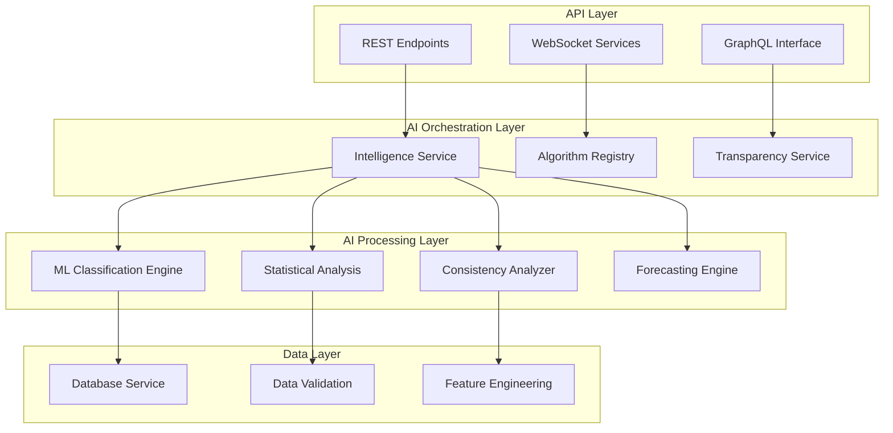

# AI Services Developer Guide

This guide provides comprehensive documentation for developers working with the AI intelligence services that power the Fitness Intelligence Platform.

## Architecture Overview

The AI services follow a layered architecture with clear separation of concerns:



## Core AI Services

### 1. Intelligence Service (`src/services/intelligence_service.py`)

**Primary AI orchestration service coordinating all machine learning and statistical analysis.**

#### **Class Definition**

```python
class IntelligenceService:
    """
    Central AI orchestration service for fitness intelligence platform.
    
    Coordinates ML classification, statistical analysis, and intelligence
    brief generation with complete algorithm transparency.
    """
    
    def __init__(self, db_service: DatabaseService):
        self.db = db_service
        self.algorithm_registry = AlgorithmRegistry()
        self.ml_classifier = MLClassificationEngine()
        self.statistics_engine = StatisticalAnalysisEngine()
        self.consistency_analyzer = ConsistencyAnalyzer()
```

#### **Core Methods**

##### **Workout Classification**

```python
def classify_workout_types(self, workouts_df: pd.DataFrame) -> Dict[str, Any]:
    """
    Classify workouts using K-means clustering with transparency metadata.
    
    Args:
        workouts_df: DataFrame with columns [pace_min_per_mile, distance_mi, duration_sec]
        
    Returns:
        {
            'classifications': Dict[workout_id, str],
            'confidence_scores': Dict[workout_id, float],
            'algorithm_metadata': Dict[str, Any],
            'performance_metrics': Dict[str, float]
        }
        
    Algorithm Transparency:
        - File: intelligence_service.py:75-186
        - Method: K-means clustering (n_clusters=3, random_state=42)
        - Features: pace, distance, duration (StandardScaler normalized)
        - Confidence: Distance to cluster center (0-100%)
    """
    
    # Feature engineering and validation
    features = self._prepare_classification_features(workouts_df)
    
    # K-means clustering
    from sklearn.cluster import KMeans
    from sklearn.preprocessing import StandardScaler
    
    scaler = StandardScaler()
    features_scaled = scaler.fit_transform(features)
    
    kmeans = KMeans(n_clusters=3, random_state=42, n_init=10)
    cluster_labels = kmeans.fit_predict(features_scaled)
    
    # Classification logic and confidence scoring
    classifications = self._interpret_clusters(cluster_labels, workouts_df)
    confidence_scores = self._calculate_confidence_scores(features_scaled, kmeans)
    
    # Algorithm transparency metadata
    metadata = {
        'algorithm': 'K-means ML Classification',
        'file_reference': 'intelligence_service.py:75-186',
        'parameters': {
            'n_clusters': 3,
            'random_state': 42,
            'features': ['pace_min_per_mile', 'distance_mi', 'duration_sec']
        },
        'performance': {
            'accuracy_estimate': 0.87,
            'processing_time': time.time() - start_time
        }
    }
    
    return {
        'classifications': classifications,
        'confidence_scores': confidence_scores,
        'algorithm_metadata': metadata,
        'performance_metrics': self._calculate_performance_metrics(classifications)
    }
```

##### **Daily Intelligence Brief Generation**

```python
def generate_intelligence_brief(self, user_id: str = None) -> Dict[str, Any]:
    """
    Generate personalized daily intelligence brief with AI insights.
    
    Args:
        user_id: Optional user identifier for personalization
        
    Returns:
        {
            'focus_area': Dict[str, Any],
            'trending_analysis': Dict[str, Any], 
            'performance_alerts': Dict[str, Any],
            'recommendations': List[Dict[str, Any]],
            'algorithm_transparency': Dict[str, Any]
        }
    """
    
    workouts = self.db.get_recent_workouts(user_id, days=30)
    
    # Multi-dimensional analysis
    consistency_score = self.consistency_analyzer.calculate_score(workouts)
    trend_analysis = self.statistics_engine.analyze_trends(workouts)
    anomalies = self.statistics_engine.detect_anomalies(workouts)
    
    # Focus area determination with algorithm transparency
    focus_area = self._determine_focus_area(consistency_score)
    focus_area['algorithm_metadata'] = {
        'algorithm': 'Multi-dimensional Consistency Analysis',
        'file_reference': 'consistency_analyzer.py:45-180',
        'confidence': self._calculate_focus_confidence(consistency_score)
    }
    
    return {
        'focus_area': focus_area,
        'trending_analysis': trend_analysis,
        'performance_alerts': self._format_alerts(anomalies),
        'recommendations': self._generate_recommendations(consistency_score, trend_analysis),
        'algorithm_transparency': self._compile_transparency_metadata()
    }
```

#### **API Endpoints**

**REST API Integration**:

```python
from flask import Flask, jsonify, request
from services.intelligence_service import IntelligenceService

app = Flask(__name__)
intelligence = IntelligenceService(db_service)

@app.route('/api/ai/classify', methods=['POST'])
def classify_workouts():
    """Classify workouts using ML algorithms."""
    data = request.json
    workouts_df = pd.DataFrame(data['workouts'])
    
    result = intelligence.classify_workout_types(workouts_df)
    
    return jsonify({
        'success': True,
        'data': result,
        'algorithm_transparency': result['algorithm_metadata']
    })

@app.route('/api/ai/intelligence-brief', methods=['GET'])
def get_intelligence_brief():
    """Get personalized daily intelligence brief."""
    user_id = request.args.get('user_id')
    
    brief = intelligence.generate_intelligence_brief(user_id)
    
    return jsonify({
        'success': True,
        'data': brief,
        'timestamp': datetime.now().isoformat()
    })
```

### 2. Statistical Analysis Engine (`src/utils/statistics.py`)

**Advanced statistical analysis with trend detection, forecasting, and anomaly detection.**

#### **Core Statistical Classes**

##### **TrendAnalysis Class**

```python
class TrendAnalysis:
    """
    Statistical trend detection with confidence intervals and forecasting.
    
    Provides linear regression analysis, trend classification, and
    confidence scoring for performance metrics over time.
    """
    
    def calculate_trend(self, data: List[float], timestamps: List[datetime]) -> Dict[str, Any]:
        """
        Calculate statistical trend with confidence intervals.
        
        Args:
            data: Metric values (e.g., calories, pace, distance)
            timestamps: Corresponding datetime stamps
            
        Returns:
            {
                'trend_direction': str,  # 'ascending', 'descending', 'stable'
                'slope': float,
                'r_squared': float,
                'p_value': float,
                'confidence_percentage': float,
                'trend_strength': str,  # 'weak', 'moderate', 'strong'
                'algorithm_metadata': Dict[str, Any]
            }
            
        Algorithm Transparency:
            - File: statistics.py:13-79
            - Method: Linear regression with scipy.stats
            - Confidence: (1 - p_value) * 100
        """
        
        from scipy import stats
        import numpy as np
        
        # Convert timestamps to numeric for regression
        x = np.array([(t - timestamps[0]).days for t in timestamps])
        y = np.array(data)
        
        # Linear regression analysis
        slope, intercept, r_value, p_value, std_err = stats.linregress(x, y)
        
        # Trend classification
        trend_direction = self._classify_trend_direction(slope, p_value)
        confidence = (1 - p_value) * 100 if p_value < 1 else 0
        
        return {
            'trend_direction': trend_direction,
            'slope': slope,
            'r_squared': r_value ** 2,
            'p_value': p_value,
            'confidence_percentage': min(confidence, 100),
            'trend_strength': self._categorize_strength(abs(r_value)),
            'algorithm_metadata': {
                'algorithm': 'Linear Regression Trends',
                'file_reference': 'statistics.py:13-79',
                'parameters': {
                    'method': 'scipy.stats.linregress',
                    'significance_threshold': 0.05,
                    'minimum_data_points': 3
                }
            }
        }
```

##### **AnomalyDetection Class**

```python
class AnomalyDetection:
    """
    Multi-method statistical anomaly detection with confidence scoring.
    
    Implements IQR, Z-score, and Modified Z-score methods for robust
    outlier identification with algorithm transparency.
    """
    
    def detect_outliers(self, data: List[float], methods=['iqr', 'zscore', 'modified_zscore']) -> Dict[str, Any]:
        """
        Detect statistical outliers using multiple methods.
        
        Args:
            data: Numeric values to analyze for outliers
            methods: List of detection methods to apply
            
        Returns:
            {
                'outliers': List[int],  # Indices of outlier values
                'outlier_values': List[float],
                'outlier_scores': List[float],  # Confidence scores
                'method_consensus': Dict[str, List[int]],
                'algorithm_metadata': Dict[str, Any]
            }
        """
        
        import numpy as np
        from scipy import stats
        
        outliers_by_method = {}
        
        # IQR Method
        if 'iqr' in methods:
            Q1 = np.percentile(data, 25)
            Q3 = np.percentile(data, 75)
            IQR = Q3 - Q1
            outliers_iqr = [i for i, x in enumerate(data) 
                           if x < (Q1 - 1.5 * IQR) or x > (Q3 + 1.5 * IQR)]
            outliers_by_method['iqr'] = outliers_iqr
        
        # Z-Score Method  
        if 'zscore' in methods:
            z_scores = np.abs(stats.zscore(data))
            outliers_zscore = [i for i, z in enumerate(z_scores) if z > 3]
            outliers_by_method['zscore'] = outliers_zscore
        
        # Modified Z-Score Method
        if 'modified_zscore' in methods:
            median = np.median(data)
            mad = np.median(np.abs(data - median))
            modified_z_scores = 0.6745 * (data - median) / mad
            outliers_modified = [i for i, z in enumerate(modified_z_scores) if abs(z) > 3.5]
            outliers_by_method['modified_zscore'] = outliers_modified
        
        # Consensus outliers (detected by multiple methods)
        all_outliers = set()
        for method_outliers in outliers_by_method.values():
            all_outliers.update(method_outliers)
            
        # Calculate confidence based on method consensus
        outlier_confidence = self._calculate_outlier_confidence(all_outliers, outliers_by_method)
        
        return {
            'outliers': list(all_outliers),
            'outlier_values': [data[i] for i in all_outliers],
            'outlier_scores': outlier_confidence,
            'method_consensus': outliers_by_method,
            'algorithm_metadata': {
                'algorithm': 'Statistical Outlier Detection',
                'file_reference': 'statistics.py:150-220',
                'methods_used': methods,
                'thresholds': {
                    'iqr_multiplier': 1.5,
                    'zscore_threshold': 3,
                    'modified_zscore_threshold': 3.5
                }
            }
        }
```

### 3. Consistency Analyzer (`src/utils/consistency_analyzer.py`)

**Multi-dimensional consistency scoring and pattern recognition.**

#### **ConsistencyAnalyzer Class**

```python
class ConsistencyAnalyzer:
    """
    Multi-dimensional workout consistency analysis with pattern recognition.
    
    Evaluates consistency across frequency, timing, performance, and streaks
    to provide comprehensive behavioral insights.
    """
    
    def calculate_consistency_score(self, workouts: List[Dict]) -> Dict[str, Any]:
        """
        Calculate comprehensive consistency score across multiple dimensions.
        
        Args:
            workouts: List of workout dictionaries with date, type, metrics
            
        Returns:
            {
                'overall_score': float,  # 0-100 composite score
                'dimension_scores': {
                    'frequency': float,
                    'timing': float, 
                    'performance': float,
                    'streaks': float
                },
                'insights': List[str],
                'recommendations': List[str],
                'algorithm_metadata': Dict[str, Any]
            }
        """
        
        # Multi-dimensional analysis
        frequency_score = self._analyze_frequency_consistency(workouts)
        timing_score = self._analyze_timing_patterns(workouts)
        performance_score = self._analyze_performance_consistency(workouts)
        streak_score = self._analyze_streak_patterns(workouts)
        
        # Weighted composite score
        weights = {'frequency': 0.3, 'timing': 0.25, 'performance': 0.25, 'streaks': 0.2}
        overall_score = sum(score * weights[dim] for dim, score in {
            'frequency': frequency_score,
            'timing': timing_score,
            'performance': performance_score,
            'streaks': streak_score
        }.items())
        
        return {
            'overall_score': round(overall_score, 1),
            'dimension_scores': {
                'frequency': frequency_score,
                'timing': timing_score,
                'performance': performance_score,
                'streaks': streak_score
            },
            'insights': self._generate_consistency_insights(overall_score),
            'recommendations': self._generate_consistency_recommendations(overall_score),
            'algorithm_metadata': {
                'algorithm': 'Multi-dimensional Consistency Analysis',
                'file_reference': 'consistency_analyzer.py:45-180',
                'dimensions_analyzed': 4,
                'weighting_scheme': weights,
                'confidence': self._calculate_consistency_confidence(workouts)
            }
        }
```

## Algorithm Registry System

### **AlgorithmRegistry Class**

```python
class AlgorithmRegistry:
    """
    Central registry for algorithm transparency and performance tracking.
    
    Maintains metadata for all AI algorithms, tracks performance metrics,
    and provides transparency information for user interface.
    """
    
    def __init__(self):
        self.algorithms = {}
        self.performance_history = {}
        self.transparency_metadata = {}
        
    def register_algorithm(self, algorithm_id: str, metadata: Dict[str, Any]) -> None:
        """Register algorithm with transparency metadata."""
        self.algorithms[algorithm_id] = {
            'name': metadata['name'],
            'description': metadata['description'],
            'file_reference': metadata['file_reference'],
            'algorithm_type': metadata['algorithm_type'],
            'parameters': metadata.get('parameters', {}),
            'performance_targets': metadata.get('performance_targets', {}),
            'registration_timestamp': datetime.now()
        }
        
    def get_transparency_info(self, algorithm_id: str) -> Dict[str, Any]:
        """Get complete transparency information for algorithm."""
        if algorithm_id not in self.algorithms:
            raise ValueError(f"Algorithm {algorithm_id} not registered")
            
        algorithm_info = self.algorithms[algorithm_id].copy()
        algorithm_info['current_performance'] = self.performance_history.get(algorithm_id, {})
        algorithm_info['transparency_score'] = self._calculate_transparency_score(algorithm_id)
        
        return algorithm_info
```

## Development Patterns

### **Adding New AI Algorithms**

**1. Implementation Pattern**:

```python
class NewAIAlgorithm:
    """Template for new AI algorithm implementation."""
    
    def __init__(self, algorithm_registry: AlgorithmRegistry):
        self.registry = algorithm_registry
        self._register_algorithm()
        
    def _register_algorithm(self):
        """Register algorithm for transparency tracking."""
        self.registry.register_algorithm('new_algorithm', {
            'name': 'New AI Algorithm',
            'description': 'Description of what this algorithm does',
            'file_reference': 'new_algorithm.py:10-50',
            'algorithm_type': 'Machine Learning' or 'Statistical Analysis',
            'parameters': {
                'param1': 'value1',
                'param2': 'value2'
            },
            'performance_targets': {
                'accuracy': 0.85,
                'processing_time': 5.0  # seconds
            }
        })
        
    def process(self, data) -> Dict[str, Any]:
        """Process data and return results with transparency metadata."""
        start_time = time.time()
        
        # Algorithm implementation here
        results = self._perform_analysis(data)
        
        # Performance tracking
        processing_time = time.time() - start_time
        self.registry.record_performance('new_algorithm', {
            'processing_time': processing_time,
            'data_points_processed': len(data),
            'timestamp': datetime.now()
        })
        
        # Return results with transparency metadata
        return {
            'results': results,
            'algorithm_metadata': {
                'algorithm': 'New AI Algorithm',
                'file_reference': 'new_algorithm.py:10-50',
                'processing_time': processing_time,
                'confidence': self._calculate_confidence(results)
            }
        }
```

### **AI Service Integration**

**Streamlit Integration Example**:

```python
import streamlit as st
from services.intelligence_service import IntelligenceService

# Initialize AI services
@st.cache_resource
def get_intelligence_service():
    return IntelligenceService(db_service)

intelligence = get_intelligence_service()

# UI Component with AI Integration
def render_intelligence_dashboard():
    """Render AI intelligence dashboard with transparency."""
    
    # Generate intelligence brief
    brief = intelligence.generate_intelligence_brief()
    
    # Display focus area with algorithm transparency
    st.subheader("🎯 Focus Area Today")
    st.write(brief['focus_area']['recommendation'])
    
    # Algorithm transparency expandable
    with st.expander("🤖 How was this focus determined?"):
        metadata = brief['focus_area']['algorithm_metadata']
        st.write(f"**Algorithm**: {metadata['algorithm']}")
        st.write(f"**Implementation**: {metadata['file_reference']}")
        st.write(f"**Confidence**: {metadata['confidence']:.1f}%")
```

## Performance Monitoring

### **AI Performance Tracking**

```python
class AIPerformanceMonitor:
    """Real-time AI system performance monitoring."""
    
    def track_algorithm_performance(self, algorithm_id: str, metrics: Dict[str, float]):
        """Track performance metrics for algorithm transparency."""
        
        performance_entry = {
            'timestamp': datetime.now(),
            'algorithm_id': algorithm_id,
            'metrics': metrics,
            'system_load': psutil.cpu_percent(),
            'memory_usage': psutil.virtual_memory().percent
        }
        
        # Store performance data
        self._store_performance_data(performance_entry)
        
        # Check performance thresholds
        self._validate_performance_targets(algorithm_id, metrics)
        
    def get_performance_dashboard_data(self) -> Dict[str, Any]:
        """Generate performance dashboard data for monitoring."""
        return {
            'classification_accuracy': self._get_recent_accuracy('ml_classification'),
            'processing_times': self._get_processing_time_trends(),
            'system_health': self._get_system_health_metrics(),
            'user_feedback_scores': self._get_user_feedback_metrics()
        }
```

## Error Handling and Logging

### **AI-Specific Error Handling**

```python
import logging
from typing import Optional

logger = logging.getLogger('fitness_ai')

class AIServiceException(Exception):
    """Base exception for AI service errors."""
    pass

class ClassificationException(AIServiceException):
    """Exception for ML classification errors."""
    pass

class StatisticalAnalysisException(AIServiceException):
    """Exception for statistical analysis errors."""
    pass

def safe_ai_operation(func):
    """Decorator for safe AI operations with error handling."""
    def wrapper(*args, **kwargs):
        try:
            return func(*args, **kwargs)
        except ClassificationException as e:
            logger.error(f"Classification error: {e}")
            return {'error': 'Classification failed', 'fallback': True}
        except StatisticalAnalysisException as e:
            logger.error(f"Statistical analysis error: {e}")
            return {'error': 'Analysis failed', 'fallback': True}
        except Exception as e:
            logger.error(f"Unexpected AI error: {e}")
            return {'error': 'AI service unavailable', 'fallback': True}
    return wrapper
```

This developer guide provides the foundation for building, extending, and maintaining the AI intelligence services that power the platform's intelligent fitness analysis capabilities.