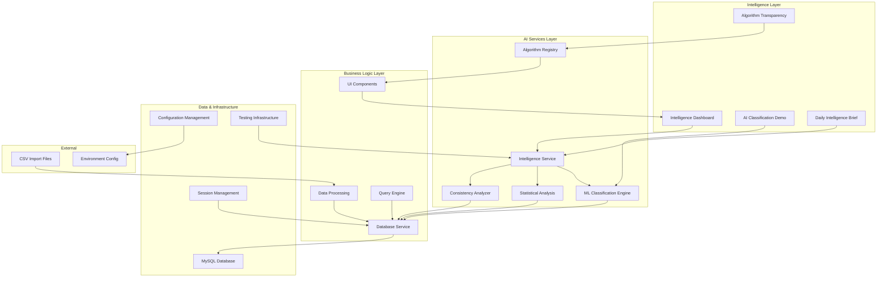
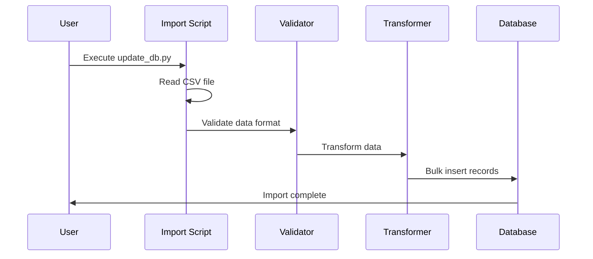
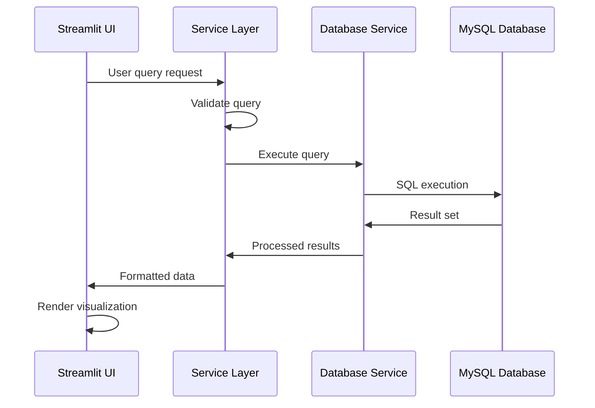

# Architecture

This document provides a comprehensive overview of the Fitness Dashboard's architecture, design patterns, and technical implementation.

## High-Level Architecture

The Fitness Dashboard follows a clean, layered architecture that separates concerns and promotes maintainability:



## Project Structure

The codebase is organized following modern Python project conventions:

```
fitness-dashboard/
├── src/                          # Source code
│   ├── config/                   # Configuration management
│   │   ├── __init__.py
│   │   ├── app.py               # Application settings
│   │   ├── database.py          # Database configuration
│   │   └── logging_config.py    # Logging setup
│   ├── services/                 # AI-powered business logic layer
│   │   ├── __init__.py
│   │   ├── database_service.py  # Database operations
│   │   └── intelligence_service.py # AI/ML intelligence engine
│   ├── utils/                    # AI & Analytics utilities
│   │   ├── __init__.py
│   │   ├── statistics.py        # Statistical analysis engine
│   │   ├── consistency_analyzer.py # Multi-dimensional consistency scoring
│   │   ├── ui_components.py     # Algorithm transparency UI components
│   │   ├── session_manager.py   # Session handling
│   │   ├── storage.py           # Data persistence
│   │   └── utilities.py         # Helper functions
│   ├── views/                    # AI-enhanced UI components and pages
│   │   ├── __init__.py
│   │   ├── intelligence.py      # Intelligence-first dashboard (NEW DEFAULT)
│   │   ├── dash.py              # Monthly dashboard view
│   │   ├── choco_effect.py      # AI-powered portfolio dashboard
│   │   ├── fitness-overview.py  # SQL interface
│   │   ├── login.py             # Authentication
│   │   ├── calendar_more.py     # Calendar view
│   │   └── tools/               # Enhanced analysis tools
│   │       ├── history.py       # Workout history with AI insights
│   │       ├── mapping.py       # Geographic visualization
│   │       ├── trends.py        # Statistical trend analysis
│   │       └── testcard.py      # Testing components
│   ├── streamlit_app.py          # Application entry point
│   ├── calendar.py               # Calendar utilities
│   ├── update_db.py              # Data import script
│   └── style_config.json         # UI styling
├── scripts/                      # Setup and deployment
│   ├── init.py                  # Database initialization
│   └── deploy.sh                # Production deployment
├── tests/                        # Comprehensive test suite (200+ methods)
│   ├── test_intelligence_service.py # AI/ML testing
│   ├── test_statistics.py       # Statistical analysis testing
│   ├── test_consistency_analyzer.py # Consistency analysis testing
│   ├── test_database_integration.py # Integration testing
│   ├── test_performance_benchmarks.py # Performance & scalability
│   └── test_queries.py          # Database query testing
├── docs/                         # AI-enhanced documentation
├── AI_ALGORITHM_TRANSPARENCY_GUIDE.md # Complete algorithm documentation
├── pyproject.toml               # Project configuration
└── requirements.txt             # Dependencies (includes scikit-learn, scipy)
```

## Core Components

### Configuration Layer (`src/config/`)

**Purpose**: Centralized configuration management with environment awareness

#### `app.py`
```python
# Application-wide settings
class AppConfig:
    """Application configuration with environment detection"""
    
    @staticmethod
    def get_environment():
        """Detect development vs production environment"""
        return "development" if platform.system() == "Darwin" else "production"
    
    @staticmethod
    def load_style_config():
        """Load UI styling configuration"""
        # Implementation details...
```

#### `database.py`
```python
# Database configuration with environment switching
class DatabaseConfig:
    """Environment-aware database configuration"""
    
    @staticmethod
    def get_connection_params():
        """Return connection parameters based on environment"""
        if AppConfig.get_environment() == "development":
            return local_mysql_config()
        else:
            return aws_rds_config()
```

#### `logging_config.py`
```python
# Centralized logging setup
def setup_logging():
    """Configure structured logging for the application"""
    # Implementation with proper log levels and formatting
```

### Services Layer (`src/services/`)

**Purpose**: AI-powered business logic and data access abstraction

#### `database_service.py`
```python
class DatabaseService:
    """Centralized database operations with connection management"""
    
    @contextmanager
    def get_connection(self):
        """Context manager for database connections"""
        # Connection pooling and error handling
        
    def execute_query(self, query: str, params: tuple = None):
        """Execute SQL queries with proper error handling"""
        
    def bulk_insert(self, table: str, data: List[Dict]):
        """Efficient bulk data insertion"""
        
    def get_workout_summary(self, filters: Dict = None):
        """Business logic for workout data retrieval"""
```

### Intelligence Services Layer (`src/services/`)

**Purpose**: AI-powered analysis and machine learning capabilities

#### `intelligence_service.py`
```python
class IntelligenceService:
    """AI/ML intelligence engine for workout analysis"""
    
    def classify_workout_types(self, workouts: List[Dict]) -> Dict:
        """ML classification using K-means clustering
        
        Categories workouts into:
        - real_run: Focused running sessions (8-12 min/mile)
        - choco_adventure: Walking activities (20-28 min/mile)  
        - mixed: Combined running/walking sessions
        - outlier: Unusual patterns requiring attention
        """
        
    def generate_daily_intelligence_brief(self, user_data: Dict) -> Dict:
        """Generate AI-powered daily intelligence brief
        
        Returns:
        - Key insights with confidence scores
        - Performance trends with statistical significance
        - Personalized recommendations
        - Algorithm transparency metadata
        """
        
    def analyze_specific_metric(self, metric: str, timeframe: str) -> Dict:
        """Deep analysis of specific performance metrics
        
        Features:
        - Trend analysis with confidence intervals
        - Anomaly detection using multiple methods
        - Performance forecasting
        - Classification-aware analysis
        """
        
    def get_classification_summary(self) -> Dict:
        """ML model performance and accuracy metrics"""
```

### AI/ML Utilities Layer (`src/utils/`)

**Purpose**: Advanced analytics and machine learning utilities

#### `statistics.py`
```python
class TrendAnalysis:
    """Advanced statistical analysis engine"""
    
    def calculate_trend(self, data: List[float]) -> Dict:
        """Trend detection with confidence intervals
        - Linear regression analysis
        - Statistical significance testing (p-values)
        - Confidence interval calculation
        """
        
    def forecast_values(self, data: List[float], periods: int = 14) -> Dict:
        """Performance forecasting with uncertainty bounds
        - Linear extrapolation method
        - Moving average forecasting
        - Confidence bands for predictions
        """

class AnomalyDetection:
    """Multi-method anomaly detection system"""
    
    def detect_outliers(self, data: List[float]) -> Dict:
        """Comprehensive outlier detection
        - IQR method (1.5 * interquartile range)
        - Z-score method (2.5 standard deviations)
        - Modified Z-score using median absolute deviation
        """
        
    def detect_performance_anomalies(self, workouts: List[Dict]) -> List[Dict]:
        """Workout-specific anomaly detection with rolling baselines"""
```

#### `consistency_analyzer.py`
```python
class ConsistencyAnalyzer:
    """Multi-dimensional consistency scoring and pattern recognition"""
    
    def calculate_consistency_score(self, workouts: List[Dict]) -> Dict:
        """Weighted composite consistency scoring
        - Frequency consistency (40% weight)
        - Timing consistency (20% weight)  
        - Performance consistency (20% weight)
        - Streak metrics (20% weight)
        """
        
    def analyze_workout_patterns(self, workouts: List[Dict]) -> Dict:
        """Pattern recognition and preference analysis
        - Preferred workout days (day-of-week analysis)
        - Seasonal patterns and monthly trends
        - Activity type preferences
        """
        
    def detect_consistency_phases(self, workouts: List[Dict]) -> List[Dict]:
        """Training phase detection with rolling analysis
        - High consistency periods (80%+ score)
        - Moderate consistency periods (60-80% score)
        - Low consistency periods (<60% score)
        """
```

#### `ui_components.py`
```python
def render_algorithm_badge(algorithm_type: str, confidence: float) -> str:
    """Algorithm transparency badge system
    - Visual indicators for AI insights
    - Confidence score visualization
    - Algorithm type identification
    """
    
def render_algorithm_explanation_card(algorithm_type: str) -> None:
    """Interactive algorithm explanation system
    - Complete algorithm descriptions
    - Source file references with line numbers
    - Parameter explanations and configuration
    """
```

### Views Layer (`src/views/`)

**Purpose**: AI-enhanced user interface components and pages

#### Intelligence Dashboard (`intelligence.py`) - **NEW DEFAULT PAGE**
- **Daily intelligence brief** with AI-generated insights
- **Interactive AI classification demo** with step-by-step reasoning
- **Algorithm transparency sidebar** with complete source traceability
- **Smart recommendations** with confidence scoring and user feedback

#### Enhanced Traditional Views
- **Monthly Dashboard (`dash.py`)**: Enhanced with AI insights
- **Choco Effect (`choco_effect.py`)**: AI-powered portfolio dashboard  
- **SQL Interface (`fitness-overview.py`)**: Query execution with AI annotations
- **Calendar View (`calendar_more.py`)**: Workout browsing with classification
- **Tools Section**: AI-enhanced analysis tools with transparency features

### Utilities Layer (`src/utils/`)

**Purpose**: Shared functionality and helper functions

#### `session_manager.py`
```python
class SessionManager:
    """Streamlit session state management"""
    
    @staticmethod
    def get_session_value(key: str, default=None):
        """Safely retrieve session values"""
        
    @staticmethod
    def set_session_value(key: str, value):
        """Set session values with validation"""
```

#### `utilities.py`
```python
# Type-safe utility functions
def safe_float_conversion(value: Any) -> Optional[float]:
    """Safely convert values to float with error handling"""
    
def format_duration(seconds: int) -> str:
    """Format duration for display"""
    
def calculate_pace(distance: float, duration: int) -> Optional[float]:
    """Calculate pace with validation"""
```

## Design Patterns

### Configuration Pattern

**Environment Detection**:
```python
def get_environment() -> str:
    """Automatic environment detection based on OS"""
    return "development" if platform.system() == "Darwin" else "production"
```

**Configuration Loading**:
```python
@lru_cache(maxsize=1)
def load_config():
    """Cached configuration loading"""
    return {
        "database": DatabaseConfig.get_connection_params(),
        "app": AppConfig.load_app_settings(),
        "logging": LoggingConfig.get_config()
    }
```

### Repository Pattern

Database access is abstracted through service classes:

```python
class WorkoutRepository:
    """Data access layer for workout entities"""
    
    def __init__(self, db_service: DatabaseService):
        self.db = db_service
    
    def get_workouts_by_date_range(self, start: datetime, end: datetime):
        """Retrieve workouts within date range"""
        
    def get_activity_summary(self, activity_type: str):
        """Get summary statistics for activity type"""
```

### Dependency Injection

Services are injected rather than instantiated directly:

```python
def create_dashboard_view(db_service: DatabaseService):
    """Factory function for dashboard with injected dependencies"""
    workout_repo = WorkoutRepository(db_service)
    return DashboardView(workout_repo)
```

## Data Flow Architecture

### Import Pipeline



### Query Execution Flow



## Security Considerations

### Database Security

**Connection Security**:
- Environment-specific credentials
- Connection pooling with timeouts
- SQL injection prevention through parameterized queries

**Data Protection**:
```python
def sanitize_query(query: str) -> str:
    """Sanitize user input for SQL queries"""
    # Remove dangerous SQL keywords
    # Validate query structure
    # Return safe query
```

### Configuration Security

**Secret Management**:
- Environment variables for sensitive data
- `.env` files excluded from version control
- Production secrets managed through deployment pipeline

**Access Control**:
- Database user with minimal required privileges
- Connection limits and timeouts
- Query execution limits

## Performance Optimizations

### Database Optimization

**Indexing Strategy**:
```sql
-- Performance indexes
CREATE INDEX idx_workout_date ON workout_summary(workout_date);
CREATE INDEX idx_activity_type ON workout_summary(activity_type);
CREATE INDEX idx_date_activity ON workout_summary(workout_date, activity_type);
```

**Query Optimization**:
- Date range filtering for large datasets
- Aggregation at database level
- Connection pooling and reuse

### Frontend Optimization

**Caching Strategy**:
```python
@st.cache_data(ttl=300)  # 5-minute cache
def get_monthly_summary(month: str):
    """Cached monthly data retrieval"""
    return database_service.get_monthly_data(month)
```

**Lazy Loading**:
- Progressive data loading for large datasets
- On-demand chart rendering
- Efficient state management

## Testing Architecture

### Comprehensive Test Infrastructure (200+ Test Methods)

The testing architecture includes comprehensive coverage for AI/ML systems with performance benchmarking and scalability validation.

```
tests/
├── conftest.py                         # Test configuration with AI fixtures
├── test_intelligence_service.py        # AI/ML intelligence testing (25+ methods)
├── test_statistics.py                  # Statistical analysis validation (30+ methods)  
├── test_consistency_analyzer.py        # Consistency analysis testing (25+ methods)
├── test_database_integration.py        # Integration pipeline testing (20+ methods)
├── test_performance_benchmarks.py      # Performance & scalability (15+ methods)
└── test_queries.py                     # Database query tests
```

### AI/ML Testing Capabilities

#### **Intelligence Service Testing**
- **ML Model Validation**: Classification accuracy and confidence scoring
- **Synthetic Data Generation**: Realistic workout patterns for testing
- **Performance Benchmarking**: 1K workout classification <5 seconds
- **Error Recovery**: Edge cases and graceful AI system degradation

#### **Statistical Analysis Testing**  
- **Trend Detection**: Validates statistical significance and confidence intervals
- **Forecasting Accuracy**: Tests linear and moving average prediction methods
- **Anomaly Precision**: Validates outlier detection with known anomalous data
- **Scalability Testing**: 10K+ data point analysis <2 seconds

#### **Performance Thresholds**
```python
# Established performance benchmarks
PERFORMANCE_THRESHOLDS = {
    'small_dataset_classification': 2,      # 100 workouts < 2 seconds
    'medium_dataset_classification': 5,     # 1K workouts < 5 seconds  
    'large_dataset_classification': 15,     # 10K workouts < 15 seconds
    'intelligence_brief_generation': 3,     # Intelligence brief < 3 seconds
    'memory_usage_limit': 500,              # Large operations < 500MB
    'concurrent_users_supported': 10        # 10+ simultaneous requests
}
```

### Testing Patterns

**Database Testing**:
```python
@pytest.fixture
def test_database():
    """Test database fixture with sample data"""
    # Setup test database
    # Insert sample data
    yield database
    # Cleanup
```

**Service Testing**:
```python
def test_workout_summary_service(mock_database):
    """Test workout summary business logic"""
    service = WorkoutService(mock_database)
    result = service.get_monthly_summary("2024-01")
    assert result.total_workouts > 0
```

## Deployment Architecture

### Development Environment

**Local Setup**:
- MySQL server running locally
- Environment detection via OS
- Development-specific configurations
- Hot reload for rapid iteration

### Production Environment  

**Cloud Deployment**:
- AWS RDS for MySQL database
- Linux-based application server
- Nginx reverse proxy
- Systemd service management

**Deployment Pipeline**:
```bash
#!/bin/bash
# deploy.sh - Production deployment script

# Pull latest code
git pull origin main

# Install dependencies
poetry install --no-dev

# Database migrations (if any)
python scripts/migrate_db.py

# Restart services
sudo systemctl restart fitness-dashboard
sudo systemctl reload nginx
```

## Error Handling Strategy

### Exception Hierarchy

```python
class FitnessAppError(Exception):
    """Base exception for fitness application"""
    pass

class DatabaseError(FitnessAppError):
    """Database-related errors"""
    pass

class ValidationError(FitnessAppError):
    """Data validation errors"""
    pass

class ConfigurationError(FitnessAppError):
    """Configuration-related errors"""
    pass
```

### Error Recovery

**Database Connection Issues**:
- Automatic retry with exponential backoff
- Fallback to cached data when possible
- Graceful degradation of features

**Data Processing Errors**:
- Partial import recovery for CSV processing
- Data validation with detailed error reporting
- Rollback capabilities for failed operations

## Future Architecture Considerations

### Scalability Improvements

**Microservices Evolution**:
- Separate API service for data access
- Independent visualization service
- Event-driven architecture for real-time updates

**Caching Layer**:
- Redis for session and query caching
- CDN integration for static assets
- Database query result caching

### Technology Upgrades

**Database Evolution**:
- Consider PostgreSQL for advanced analytics
- Time-series database for high-frequency data
- Data warehouse integration for historical analysis

**Frontend Modernization**:
- Progressive Web App capabilities
- Real-time data streaming
- Mobile-first responsive design

For implementation details and API reference, see the [API Reference](api-reference.md) documentation.