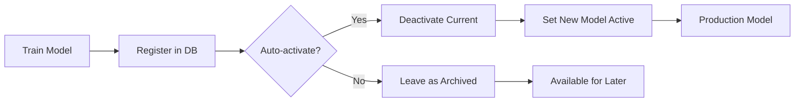

# Audit History and Model Versioning Guide

## Overview

This guide explains the comprehensive audit trail and model versioning system implemented for the Fitness Dashboard classification engine.

**Implemented Files:**
- `scripts/add_audit_tables.py` - Database migration script
- `src/services/audit_service.py` - Audit logging service
- `src/ml/model_manager_v2.py` - Enhanced model manager with audit integration

---

## Table of Contents

1. [System Architecture](#system-architecture)
2. [Database Schema](#database-schema)
3. [Installation & Migration](#installation--migration)
4. [Usage Examples](#usage-examples)
5. [Model Versioning Workflow](#model-versioning-workflow)
6. [Querying Audit History](#querying-audit-history)
7. [User Feedback Integration](#user-feedback-integration)
8. [Best Practices](#best-practices)

---

## System Architecture

### Component Overview

```
┌─────────────────────────────────────────────────────────┐
│                    Application Layer                     │
│  ┌──────────────┐  ┌──────────────┐  ┌──────────────┐  │
│  │ Streamlit UI │  │ Intelligence │  │  ML Training │  │
│  │              │  │   Service    │  │   Scripts    │  │
│  └──────┬───────┘  └───────┬──────┘  └──────┬───────┘  │
│         │                  │                 │          │
└─────────┼──────────────────┼─────────────────┼──────────┘
          │                  │                 │
          └──────────────────┼─────────────────┘
                             │
                             v
          ┌──────────────────────────────────┐
          │      EnhancedModelManager        │
          │  (model_manager_v2.py)           │
          │                                  │
          │  • Train & Register Models       │
          │  • Classify with Audit Logging   │
          │  • Version Management            │
          └────────────┬─────────────────────┘
                       │
          ┌────────────┴─────────────┐
          │                          │
          v                          v
┌─────────────────┐        ┌─────────────────┐
│  AuditService   │        │ DatabaseService │
│                 │        │                 │
│ • Log changes   │        │ • Execute SQL   │
│ • Track models  │        │ • Connections   │
│ • User feedback │        │                 │
└────────┬────────┘        └────────┬────────┘
         │                          │
         └──────────────┬───────────┘
                        │
                        v
         ┌──────────────────────────┐
         │    MySQL Database        │
         │                          │
         │  Tables:                 │
         │  • workout_summary       │
         │  • workout_classification│
         │    _history              │
         │  • ml_model_registry     │
         │  • user_classification   │
         │    _feedback             │
         │  • workout_ml            │
         │    _classifications      │
         └──────────────────────────┘
```

### Data Flow

1. **Model Training**: `EnhancedModelManager` → `AuditService.register_model()` → `ml_model_registry`
2. **Classification**: `EnhancedModelManager` → `AuditService.log_classification_change()` → `workout_classification_history`
3. **Persistence**: `EnhancedModelManager` → `AuditService.persist_classification()` → `workout_ml_classifications`
4. **User Feedback**: UI → `AuditService.save_user_feedback()` → `user_classification_feedback`

---

## Database Schema

### Table 1: `workout_classification_history`

Complete audit trail of all classification changes.

```sql
CREATE TABLE workout_classification_history (
    history_id INT AUTO_INCREMENT PRIMARY KEY,
    workout_id VARCHAR(20) NOT NULL,

    -- Classification details
    previous_classification VARCHAR(50),
    new_classification VARCHAR(50) NOT NULL,
    classification_source ENUM('csv_import', 'ml_prediction', 'ml_batch_update',
                               'user_override', 'admin_correction', 'era_fallback'),
    classification_confidence FLOAT,
    classification_method VARCHAR(100),

    -- Model versioning
    model_id VARCHAR(100),
    model_version VARCHAR(20),

    -- Audit metadata
    changed_by VARCHAR(100) DEFAULT 'system',
    changed_at TIMESTAMP DEFAULT CURRENT_TIMESTAMP,
    reason TEXT,

    -- Context
    features_used JSON,
    metadata JSON,

    FOREIGN KEY (workout_id) REFERENCES workout_summary(workout_id)
);
```

**Key Indexes:**
- `idx_workout_id` - Fast lookup by workout
- `idx_changed_at` - Temporal queries
- `idx_model_id` - Track model-specific changes
- `idx_source` - Filter by classification source

### Table 2: `ml_model_registry`

Central registry for all ML model versions.

```sql
CREATE TABLE ml_model_registry (
    registry_id INT AUTO_INCREMENT PRIMARY KEY,

    -- Model identification
    model_id VARCHAR(100) UNIQUE NOT NULL,
    model_name VARCHAR(100) NOT NULL,
    model_version VARCHAR(20) NOT NULL,

    -- Status tracking
    status ENUM('training', 'active', 'archived', 'deprecated', 'failed'),
    is_production BOOLEAN DEFAULT FALSE,

    -- Training metadata
    trained_at TIMESTAMP,
    activated_at TIMESTAMP,
    training_workouts_count INT,
    training_date_start DATE,
    training_date_end DATE,

    -- Performance metrics
    silhouette_score FLOAT,
    inertia FLOAT,
    cluster_distribution JSON,
    confidence_stats JSON,

    -- Model lineage
    parent_model_id VARCHAR(100),

    -- File references
    model_file_path VARCHAR(500),
    metadata_file_path VARCHAR(500),

    FOREIGN KEY (parent_model_id) REFERENCES ml_model_registry(model_id)
);
```

**Model Lifecycle:**
- `training` → `active` (via `activate_model()`)
- `active` → `archived` (when new model activated)
- `active` → `deprecated` (manually deprecated)
- Any → `failed` (if issues detected)

### Table 3: `user_classification_feedback`

User feedback for model improvement.

```sql
CREATE TABLE user_classification_feedback (
    feedback_id INT AUTO_INCREMENT PRIMARY KEY,

    -- Workout and classification
    workout_id VARCHAR(20) NOT NULL,
    ai_classification VARCHAR(50) NOT NULL,
    ai_confidence FLOAT,
    user_classification VARCHAR(50),

    -- Feedback details
    feedback_type ENUM('accept', 'reject', 'correct', 'uncertain'),
    user_certainty INT,  -- 1-5 scale
    comments TEXT,

    -- Processing status
    processed BOOLEAN DEFAULT FALSE,
    incorporated_in_model VARCHAR(100),

    FOREIGN KEY (workout_id) REFERENCES workout_summary(workout_id),
    FOREIGN KEY (model_id) REFERENCES ml_model_registry(model_id)
);
```

### Table 4: `workout_ml_classifications`

Current classification state (fast lookup without audit history scan).

```sql
CREATE TABLE workout_ml_classifications (
    classification_id INT AUTO_INCREMENT PRIMARY KEY,
    workout_id VARCHAR(20) NOT NULL UNIQUE,

    -- Current state
    current_classification VARCHAR(50) NOT NULL,
    classification_confidence FLOAT,
    model_id VARCHAR(100),

    -- Override tracking
    is_user_override BOOLEAN DEFAULT FALSE,
    original_ml_classification VARCHAR(50),

    -- Change tracking
    classification_change_count INT DEFAULT 0,
    classified_at TIMESTAMP,

    FOREIGN KEY (workout_id) REFERENCES workout_summary(workout_id)
);
```

---

## Installation & Migration

### Step 1: Run Migration Script

```bash
# Navigate to project root
cd /Users/bhs/PROJECTS/fitness-dashboard

# Run migration (creates all 4 audit tables)
python scripts/add_audit_tables.py
```

**Migration Output:**
```
╔══════════════════════════════════════════════════════════╗
║  Fitness Dashboard - Audit Tables Migration             ║
║  Version: 1.0.0                                          ║
╚══════════════════════════════════════════════════════════╝

This will create 4 new tables in your database. Continue? (y/n): y

============================================================
Creating Audit History and Model Versioning Tables
============================================================
✅ Database connection successful

Creating table: workout_classification_history...
✅ Table 'workout_classification_history' created successfully

Creating table: ml_model_registry...
✅ Table 'ml_model_registry' created successfully

Creating table: user_classification_feedback...
✅ Table 'user_classification_feedback' created successfully

Creating table: workout_ml_classifications...
✅ Table 'workout_ml_classifications' created successfully

============================================================
Migration Summary: 4/4 tables created
============================================================
🎉 All audit tables created successfully!
```

### Step 2: Verify Tables

```bash
# Connect to MySQL
mysql -u $MYSQL_USER -p$MYSQL_PWD sweat

# Verify tables exist
SHOW TABLES;

# Check structure
DESCRIBE workout_classification_history;
DESCRIBE ml_model_registry;
DESCRIBE user_classification_feedback;
DESCRIBE workout_ml_classifications;
```

---

## Usage Examples

### Example 1: Train Model with Versioning

```python
from ml.model_manager_v2 import EnhancedModelManager

# Initialize manager
manager = EnhancedModelManager()

# Train new model with automatic registration
result = manager.train_and_register_model(
    force_retrain=True,
    training_notes="Retrained with 500 new workouts - improved silhouette score",
    auto_activate=True  # Automatically set as production model
)

if result['success']:
    print(f"✅ Model trained: {result['model_id']}")
    print(f"   Version: {result['model_version']}")
    print(f"   Silhouette Score: {result['model_summary']['silhouette_score']}")
    print(f"   Training Duration: {result['training_duration_sec']:.1f}s")
else:
    print(f"❌ Training failed: {result['message']}")
```

### Example 2: Classify Workouts with Audit Logging

```python
import pandas as pd
from ml.model_manager_v2 import EnhancedModelManager
from services.database_service import DatabaseService

# Load workout data
db_service = DatabaseService()
query = "SELECT * FROM workout_summary WHERE workout_date >= '2025-01-01'"
workouts_df = pd.DataFrame(db_service.execute_query(query))

# Initialize manager (loads active model)
manager = EnhancedModelManager()

# Classify with full audit trail
classified_df = manager.classify_and_log_workouts(
    workouts_df,
    log_to_audit=True,        # Log to workout_classification_history
    persist_classifications=True  # Save to workout_ml_classifications
)

# Check results
print(f"Classified {len(classified_df)} workouts")
print(classified_df[['workout_id', 'predicted_activity_type', 'classification_confidence']].head())
```

### Example 3: Query Classification History

```python
from services.audit_service import AuditService

audit_service = AuditService()

# Get full history for a specific workout
workout_id = "12345678"
history = audit_service.get_classification_history(workout_id)

print(f"Classification history for {workout_id}:")
for entry in history:
    print(f"  {entry['changed_at']}: {entry['previous_classification']} → {entry['new_classification']}")
    print(f"    Source: {entry['classification_source']}, Confidence: {entry['classification_confidence']:.2f}")
    print(f"    Model: {entry['model_id']} (v{entry['model_version']})")
```

### Example 4: Model Performance Comparison

```python
from services.audit_service import AuditService

audit_service = AuditService()

# Get all models
models = audit_service.list_models(limit=10)

print("Model Performance Comparison:")
print("-" * 80)
for model in models:
    print(f"{model['model_id']} (v{model['model_version']})")
    print(f"  Trained: {model['trained_at']}")
    print(f"  Status: {model['status']} {'(PRODUCTION)' if model['is_production'] else ''}")
    print(f"  Silhouette Score: {model['silhouette_score']:.3f}")
    print(f"  Training Workouts: {model['training_workouts_count']}")
    print(f"  Parent Model: {model['parent_model_id'] or 'None'}")
    print()
```

### Example 5: User Feedback Collection

```python
from services.audit_service import AuditService

audit_service = AuditService()

# Save user feedback from UI
feedback_saved = audit_service.save_user_feedback(
    workout_id="12345678",
    ai_classification="real_run",
    ai_confidence=0.87,
    feedback_type="correct",
    user_classification="mixed",
    user_certainty=4,  # 1-5 scale
    comments="This was actually an interval workout, not pure running",
    model_id="workout_classifier_20250109_143022",
    user_id="user_bhs"
)

# Get unprocessed feedback for model improvement
unprocessed = audit_service.get_unprocessed_feedback(limit=100)

print(f"Found {len(unprocessed)} unprocessed feedback items for next training cycle")
```

---

## Model Versioning Workflow

### Semantic Versioning

Models follow semantic versioning: `MAJOR.MINOR.PATCH`

- **MAJOR**: Breaking changes (e.g., new features, different algorithm)
- **MINOR**: Improvements (e.g., better performance, more training data)
- **PATCH**: Bug fixes (e.g., fixes to cluster mapping)

### Model Lineage Tracking

```python
# Train initial model
result1 = manager.train_and_register_model(
    training_notes="Initial production model v1.0.0"
)
model_id_v1 = result1['model_id']

# Train improved model (linked to parent)
result2 = manager.train_and_register_model(
    force_retrain=True,
    parent_model_id=model_id_v1,
    training_notes="v1.1.0 - Retrained with 300 additional workouts"
)

# Query lineage
model_v2 = audit_service.get_model_by_id(result2['model_id'])
print(f"Parent model: {model_v2['parent_model_id']}")
```

### Model Activation Flow



---

## Querying Audit History

### Query 1: Get Classification Changes by Date Range

```sql
SELECT
    wch.workout_id,
    ws.workout_date,
    wch.previous_classification,
    wch.new_classification,
    wch.classification_source,
    wch.classification_confidence,
    wch.model_id,
    wch.changed_at
FROM workout_classification_history wch
JOIN workout_summary ws ON wch.workout_id = ws.workout_id
WHERE wch.changed_at BETWEEN '2025-01-01' AND '2025-01-31'
ORDER BY wch.changed_at DESC;
```

### Query 2: Find User Overrides

```sql
SELECT
    wch.workout_id,
    wch.new_classification as user_choice,
    wch.reason,
    wch.changed_by,
    wch.changed_at,
    wmc.original_ml_classification as ai_prediction
FROM workout_classification_history wch
JOIN workout_ml_classifications wmc ON wch.workout_id = wmc.workout_id
WHERE wch.classification_source = 'user_override'
ORDER BY wch.changed_at DESC;
```

### Query 3: Model Performance Over Time

```sql
SELECT
    model_id,
    model_version,
    silhouette_score,
    training_workouts_count,
    trained_at,
    CASE
        WHEN is_production THEN 'ACTIVE'
        ELSE status
    END as current_status
FROM ml_model_registry
ORDER BY trained_at DESC;
```

### Query 4: Classification Accuracy Analysis

```sql
SELECT
    ucf.ai_classification,
    ucf.feedback_type,
    COUNT(*) as feedback_count,
    AVG(ucf.ai_confidence) as avg_confidence,
    AVG(ucf.user_certainty) as avg_user_certainty
FROM user_classification_feedback ucf
WHERE ucf.submitted_at >= DATE_SUB(NOW(), INTERVAL 30 DAY)
GROUP BY ucf.ai_classification, ucf.feedback_type
ORDER BY feedback_count DESC;
```

---

## User Feedback Integration

### UI Implementation Example

```python
import streamlit as st
from services.audit_service import AuditService

def render_classification_override_ui(workout_row):
    """Render UI for user to override AI classification."""

    ai_classification = workout_row['predicted_activity_type']
    ai_confidence = workout_row['classification_confidence']

    st.subheader("🤖 AI Classification")
    st.metric("Classification", ai_classification, f"{ai_confidence*100:.0f}% confident")

    st.markdown("---")
    st.subheader("✏️ Correct Classification")

    user_choice = st.selectbox(
        "Is this classification correct?",
        ['Accept AI', 'real_run', 'pup_walk', 'mixed', 'outlier'],
        key=f"override_{workout_row['workout_id']}"
    )

    certainty = st.slider("How certain are you?", 1, 5, 3, key=f"certainty_{workout_row['workout_id']}")
    comments = st.text_area("Comments (optional)", key=f"comments_{workout_row['workout_id']}")

    if user_choice != 'Accept AI':
        if st.button("Submit Correction", key=f"submit_{workout_row['workout_id']}"):
            audit_service = AuditService()

            # Save feedback
            audit_service.save_user_feedback(
                workout_id=workout_row['workout_id'],
                ai_classification=ai_classification,
                ai_confidence=ai_confidence,
                feedback_type='correct',
                user_classification=user_choice,
                user_certainty=certainty,
                comments=comments,
                model_id=st.session_state.get('current_model_id'),
                user_id=st.session_state.get('user_id', 'anonymous')
            )

            # Log correction to audit history
            audit_service.log_classification_change(
                workout_id=workout_row['workout_id'],
                previous_classification=ai_classification,
                new_classification=user_choice,
                source='user_override',
                confidence=1.0,
                method='manual',
                changed_by=st.session_state.get('user_id', 'user'),
                reason=comments
            )

            # Update persisted classification
            audit_service.persist_classification(
                workout_id=workout_row['workout_id'],
                classification=user_choice,
                source='user_override',
                confidence=1.0,
                method='manual',
                is_user_override=True,
                original_ml_classification=ai_classification,
                override_reason=comments
            )

            st.success("✅ Thank you! Your feedback will improve future classifications.")
```

---

## Best Practices

### 1. Always Log Classifications

```python
# ✅ Good - Full audit trail
classified_df = manager.classify_and_log_workouts(df, log_to_audit=True)

# ❌ Avoid - No audit trail
classified_df = old_model_manager.classify_workouts(df)
```

### 2. Register All Models

```python
# ✅ Good - Model registered with metadata
result = manager.train_and_register_model(
    training_notes="Added 200 new workouts from January 2025"
)

# ❌ Avoid - Model trained but not tracked
old_model_manager.train_new_model()
```

### 3. Track Model Lineage

```python
# ✅ Good - Clear parent-child relationship
new_result = manager.train_and_register_model(
    parent_model_id=previous_model_id,
    training_notes="Improved version with bug fixes"
)

# ❌ Avoid - No lineage tracking
manager.train_and_register_model()  # parent_model_id=None
```

### 4. Capture User Feedback

Always provide UI for users to correct classifications and save feedback for model improvement.

### 5. Monitor Audit Tables

```python
# Regular audit health check
stats = audit_service.get_classification_stats(
    start_date=datetime.now() - timedelta(days=30)
)

print(f"Last 30 days: {stats['total_changes']} classification changes")
print(f"Unique workouts affected: {stats['unique_workouts']}")
```

### 6. Archive Old Models

Don't delete old models - keep them archived for rollback and comparison.

### 7. Version Bump Strategy

- **Patch (1.0.X)**: Bug fixes, minor corrections
- **Minor (1.X.0)**: Performance improvements, more training data
- **Major (X.0.0)**: Algorithm changes, new features

---

## Performance Considerations

### Indexing Strategy

All audit tables have appropriate indexes for common queries:

- `workout_id` - Fast lookup by workout
- `model_id` - Track model-specific operations
- `changed_at` / `submitted_at` - Temporal queries
- `is_production` - Quick active model lookup

### Batch Operations

For bulk classification updates, use batch operations:

```python
# ✅ Efficient - Batch insert
audit_service.log_batch_classifications(classification_records)

# ❌ Slow - Individual inserts
for record in classification_records:
    audit_service.log_classification_change(**record)
```

### Data Retention

Consider archiving old audit records (>1 year) to separate table for performance.

---

## Troubleshooting

### Issue: Migration fails with foreign key error

**Solution**: Ensure `workout_summary` table exists first:
```bash
python scripts/init.py  # Run before migration
python scripts/add_audit_tables.py
```

### Issue: Model not appearing as active

**Solution**: Check activation status:
```python
active_model = audit_service.get_active_model()
if not active_model:
    audit_service.activate_model(model_id)
```

### Issue: Classification history not recording

**Solution**: Verify `workout_id` exists in `workout_summary`:
```sql
SELECT workout_id FROM workout_summary WHERE workout_id = 'YOUR_ID';
```

---

## Future Enhancements

1. **Automated Model Retraining**: Schedule based on feedback threshold
2. **A/B Testing**: Compare multiple models in production
3. **Drift Detection**: Monitor classification distribution changes
4. **Feedback Dashboard**: Visualize user corrections and model accuracy
5. **Export/Import**: Backup and restore model registry

---

## References

- Database Schema: `src/config/database.py`
- Audit Service: `src/services/audit_service.py`
- Enhanced Model Manager: `src/ml/model_manager_v2.py`
- Migration Script: `scripts/add_audit_tables.py`

**Last Updated**: January 2025
**Version**: 1.0.0
