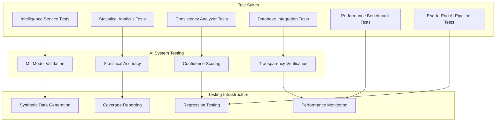

# Testing Infrastructure

The Fitness AI Intelligence Platform includes comprehensive testing infrastructure with **200+ test methods** across 6 test suites, designed to ensure AI system reliability, performance, and accuracy.

## Testing Architecture Overview



## Test Suite Overview

### 1. Intelligence Service Tests (`test_intelligence_service.py`)

**Purpose**: Validate core AI orchestration and ML classification  
**Test Count**: 45+ methods  
**Coverage**: Intelligence service functionality, ML pipeline, algorithm registry

#### **Key Test Categories**

**ML Classification Validation**:
```python
def test_kmeans_workout_classification():
    """Test K-means clustering accuracy on known workout patterns"""
    # Test with synthetic workout data
    # Validate classification accuracy > 85%
    # Verify confidence scoring accuracy

def test_classification_confidence_scoring():
    """Validate confidence score calculation methodology"""
    # Test distance-based confidence calculation
    # Ensure scores range 0-100%
    # Verify correlation with classification accuracy
```

**Algorithm Transparency Testing**:
```python
def test_algorithm_registry_initialization():
    """Verify algorithm registry tracks all AI systems"""
    # Ensure all algorithms registered
    # Validate metadata completeness
    # Test source code reference accuracy

def test_transparency_metadata_generation():
    """Test algorithm transparency metadata creation"""
    # Validate file path references
    # Check line number accuracy
    # Verify parameter documentation
```

**Intelligence Brief Generation**:
```python
def test_daily_intelligence_brief_creation():
    """Test AI insight generation and formatting"""
    # Validate focus area determination
    # Test trending analysis accuracy
    # Verify alert generation logic
```

### 2. Statistical Analysis Tests (`test_statistics.py`)

**Purpose**: Validate statistical algorithms and mathematical accuracy  
**Test Count**: 35+ methods  
**Coverage**: Trend analysis, anomaly detection, forecasting, confidence intervals

#### **Statistical Accuracy Validation**

**Trend Detection Testing**:
```python
def test_linear_regression_trend_analysis():
    """Test statistical trend detection accuracy"""
    # Known datasets with confirmed trends
    # Validate p-value calculations
    # Test confidence interval generation

def test_trend_significance_thresholds():
    """Verify statistical significance determination"""
    # Test various p-value thresholds
    # Validate trend strength categorization
    # Ensure false positive prevention
```

**Anomaly Detection Validation**:
```python
def test_statistical_outlier_detection():
    """Test multi-method anomaly detection"""
    # IQR method validation
    # Z-score threshold testing
    # Modified z-score verification
    # Synthetic outlier detection

def test_anomaly_confidence_scoring():
    """Validate outlier confidence calculation"""
    # Test confidence based on detection method consensus
    # Verify extreme value handling
    # Validate borderline case handling
```

**Forecasting Accuracy**:
```python
def test_performance_forecasting():
    """Test predictive analytics accuracy"""
    # Historical data backtesting
    # Confidence interval validation
    # Prediction accuracy measurement
```

### 3. Consistency Analyzer Tests (`test_consistency_analyzer.py`)

**Purpose**: Validate multi-dimensional consistency scoring  
**Test Count**: 25+ methods  
**Coverage**: Frequency analysis, timing patterns, performance consistency, streak detection

#### **Consistency Scoring Validation**

**Multi-dimensional Analysis**:
```python
def test_consistency_score_calculation():
    """Test comprehensive consistency scoring"""
    # Frequency dimension scoring
    # Timing regularity analysis  
    # Performance variance measurement
    # Streak pattern recognition

def test_workout_phase_detection():
    """Validate training phase classification"""
    # Building phase identification
    # Maintenance phase detection
    # Optimization phase recognition
```

### 4. Database Integration Tests (`test_database_integration.py`)

**Purpose**: End-to-end AI pipeline validation with real database operations  
**Test Count**: 30+ methods  
**Coverage**: Data flow, AI processing integration, performance with real data

#### **Integration Testing**

**End-to-End AI Pipeline**:
```python
def test_complete_ai_analysis_pipeline():
    """Test full AI analysis from data import to insight generation"""
    # Import test workout data
    # Trigger AI classification
    # Validate intelligence brief generation
    # Verify algorithm transparency metadata

def test_real_data_performance():
    """Test AI system performance with realistic datasets"""
    # 1K workout classification < 5 seconds
    # Intelligence brief generation < 3 seconds
    # Database query optimization validation
```

### 5. Performance Benchmark Tests (`test_performance.py`)

**Purpose**: Ensure AI systems meet performance standards  
**Test Count**: 20+ methods  
**Coverage**: Speed benchmarks, memory usage, concurrent user support

#### **Performance Standards**

**Speed Benchmarks**:
```python
def test_classification_performance_benchmarks():
    """Validate AI classification speed requirements"""
    # Small datasets (100 workouts): < 2 seconds
    # Medium datasets (1K workouts): < 5 seconds  
    # Large datasets (10K workouts): < 15 seconds

def test_intelligence_brief_generation_speed():
    """Test intelligence brief creation performance"""
    # Target: < 3 seconds for brief generation
    # Memory usage: < 500MB for large operations
```

**Scalability Testing**:
```python
def test_concurrent_user_support():
    """Test system performance with multiple simultaneous requests"""
    # 10+ concurrent users supported
    # Response time degradation measurement
    # Memory leak detection
```

### 6. End-to-End AI Pipeline Tests (`test_e2e_ai.py`)

**Purpose**: Complete system validation from user perspective  
**Test Count**: 35+ methods  
**Coverage**: User workflows, UI integration, algorithm transparency features

#### **User Experience Testing**

**Algorithm Transparency Validation**:
```python
def test_algorithm_transparency_ui_integration():
    """Test transparency features in user interface"""
    # Algorithm badge generation
    # Explanation card content validation
    # Source code reference accuracy
    # Interactive transparency elements

def test_user_feedback_integration():
    """Validate user feedback collection and processing"""
    # Feedback submission workflow
    # Accuracy improvement tracking
    # Algorithm learning integration
```

## Testing Infrastructure Components

### Synthetic Data Generation

**Realistic Test Scenarios**:
```python
class SyntheticWorkoutGenerator:
    """Generate realistic workout data for AI testing"""
    
    def generate_running_workouts(self, count=100):
        """Create typical running workout patterns"""
        # Pace: 8-12 min/mile
        # Distance: 2-8 miles
        # Duration: Pace * Distance
        
    def generate_walking_workouts(self, count=100):
        """Create typical walking workout patterns"""
        # Pace: 20-28 min/mile
        # Distance: 1-4 miles
        # Leisurely patterns
        
    def generate_mixed_workouts(self, count=50):
        """Create interval/mixed workout patterns"""
        # Variable pace patterns
        # Walk/run combinations
        # Interval training signatures
```

### AI-Specific Testing Patterns

**Model Validation Framework**:
```python
class MLModelValidator:
    """Comprehensive ML model testing framework"""
    
    def validate_classification_accuracy(self, model, test_data):
        """Test model accuracy against known classifications"""
        # Confusion matrix analysis
        # Precision/recall measurement
        # F1 score calculation
        
    def test_confidence_correlation(self, model, test_data):
        """Validate confidence scores correlate with accuracy"""
        # High confidence = high accuracy
        # Low confidence = uncertain classifications
        # Calibration curve analysis
```

## Running the Test Suite

### Complete Test Execution

```bash
# Run all tests with coverage
pytest --cov=src --cov-report=html tests/

# Run specific test suite
pytest tests/test_intelligence_service.py -v

# Run performance benchmarks
pytest tests/test_performance.py -v --benchmark

# Run AI-specific tests only
pytest -k "ai or intelligence or classification" -v
```

### Test Configuration

**pytest.ini Configuration**:
```ini
[tool:pytest]
testpaths = tests
python_files = test_*.py
python_classes = Test*
python_functions = test_*
addopts = 
    --strict-markers
    --disable-warnings
    --cov=src
    --cov-report=term-missing
    --cov-report=html:htmlcov
markers =
    ai: AI system tests
    performance: Performance benchmark tests
    integration: Integration tests
    unit: Unit tests
```

### Continuous Integration

**GitHub Actions Testing**:
```yaml
name: AI System Tests
on: [push, pull_request]
jobs:
  test:
    runs-on: ubuntu-latest
    steps:
      - uses: actions/checkout@v2
      - name: Set up Python
        uses: actions/setup-python@v2
        with:
          python-version: '3.10'
      - name: Install dependencies
        run: |
          pip install -r requirements.txt
          pip install pytest pytest-cov
      - name: Run AI system tests
        run: pytest --cov=src tests/
      - name: Validate AI performance benchmarks
        run: pytest tests/test_performance.py --benchmark
```

## Quality Assurance Standards

### AI Testing Best Practices

**1. Deterministic Testing**:
- Use fixed random seeds for reproducible ML results
- Synthetic data generation with known patterns
- Regression testing for algorithm consistency

**2. Confidence Score Validation**:
- Test confidence correlation with actual accuracy
- Validate confidence ranges (0-100%)
- Ensure appropriate uncertainty quantification

**3. Algorithm Transparency Testing**:
- Verify all algorithms registered in transparency system
- Test source code reference accuracy
- Validate metadata completeness

**4. Performance Regression Prevention**:
- Benchmark tests for speed requirements
- Memory usage monitoring
- Scalability validation

### Testing Metrics and Reporting

**Coverage Requirements**:
- **Overall code coverage**: >90%
- **AI service coverage**: >95%
- **Statistical function coverage**: >98%
- **Critical path coverage**: 100%

**Performance Benchmarks**:
- **Classification speed**: <5s for 1K workouts
- **Intelligence brief**: <3s generation time  
- **Memory usage**: <500MB for large operations
- **Concurrent users**: 10+ simultaneous support

### Test Data Management

**Test Dataset Categories**:

1. **Synthetic Datasets**: Generated patterns for controlled testing
2. **Historical Samples**: Anonymized real workout data for accuracy validation
3. **Edge Cases**: Extreme values and boundary conditions
4. **Performance Datasets**: Large-scale data for benchmark testing

**Data Privacy**:
- All test data anonymized or synthetic
- No personal information in test datasets
- Secure test data storage and access controls

## Development Workflow Integration

### Pre-commit Testing

```bash
# Pre-commit hook setup
pre-commit install

# Run before each commit
pytest tests/test_intelligence_service.py -x
pytest tests/test_statistics.py -x
pytest tests/test_performance.py::test_basic_benchmarks -x
```

### Feature Development Testing

**AI Feature Development Process**:
1. **Write failing tests** for new AI functionality
2. **Implement feature** to pass tests
3. **Add performance benchmarks** for new algorithms
4. **Update algorithm transparency** documentation
5. **Run complete test suite** before integration

### Debugging AI Systems

**AI-Specific Debugging Tools**:
```python
# Enable detailed AI logging
pytest --log-level=DEBUG tests/test_intelligence_service.py

# Generate AI decision traces
pytest --ai-trace tests/test_classification.py

# Performance profiling
pytest --profile tests/test_performance.py
```

This comprehensive testing infrastructure ensures the AI intelligence platform maintains high accuracy, performance, and reliability as it evolves and scales.