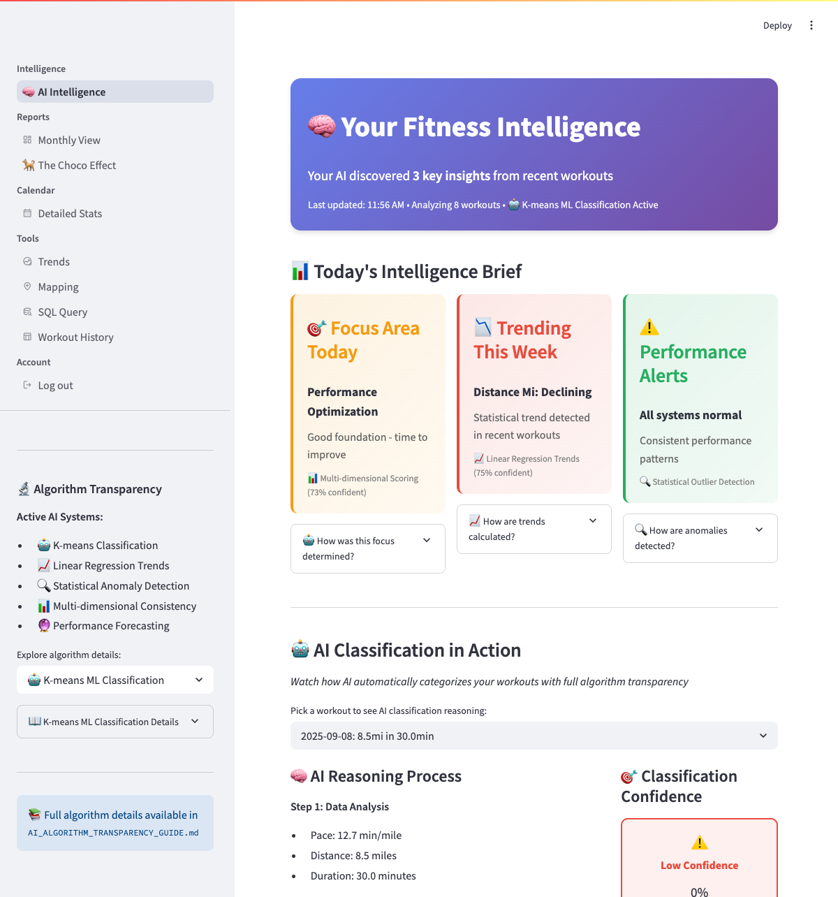

# Quick Start Guide

Get your Fitness Dashboard running in minutes and start analyzing your workout data!

## What You'll Accomplish

In about 10 minutes, you'll:

- 🔧 **Set up the dashboard** on your computer
- 📊 **Import your workout data** from fitness apps
- 🧠 **See personalized insights** about your fitness patterns
- 📈 **Understand trends** in your performance over time
- 💡 **Get suggestions** for improving your fitness routine

## Prerequisites

- ✅ Python 3.10+ installed
- ✅ Dependencies installed (see [Installation](installation.md))
- ✅ MySQL server running locally

## Step 1: Set Up the Database

Create the database that will store your workout data:

```bash
python scripts/init.py
```

This will create the database and tables needed to store your workout data.

!!! success "Success"
    You should see: `Database 'sweat' created successfully`

## Step 2: Import Your Workout Data

### Option A: Use Your Own Data (Recommended)

1. **Export your data**: Get your workout history as CSV from [MapMyRun](https://www.mapmyfitness.com/workout/export/csv)
2. **Replace the sample file**: Copy your CSV file to `src/user2632022_workout_history.csv`
3. **Import it**:

```bash
python scripts/update_db.py
```

This will analyze your workouts and categorize them automatically.

!!! tip "Linux or Windows"
    Set `FITNESS_DASHBOARD_ENV=development` before running the script so the app uses your local MySQL credentials. Otherwise, provide the `RDS_*` environment variables for a remote database connection.

### Option B: Try the Demo

Skip data import for now and explore with the built-in demo data.

## Step 3: Start the Dashboard

Launch your fitness dashboard:

```bash
streamlit run src/streamlit_app.py
```

Open your browser and go to: **http://localhost:8501**

You'll see the main dashboard with insights about your workouts!

## Step 4: Explore Your Dashboard



### What You'll See

The dashboard shows:
- **Summary of your workouts** - how many have been analyzed
- **Insight cards** with suggestions about your fitness patterns
- **Workout categorization** - runs vs walks vs mixed activities
- **Trend analysis** - how your performance is changing over time

### Key Features to Try

- **Click on any insight** to see how it was calculated
- **Explore the different tabs** to see various views of your data
- **Use the date filters** to focus on specific time periods
- **Provide feedback** if you see incorrect categorizations

## What's Next?

Now that you have the dashboard running:
1. **[Learn the interface](../user-guide/dashboard-overview.md)** - understand what each part of the dashboard does
2. **[Import more data](../user-guide/data-import.md)** - get better insights with more workout history
3. **[Explore common tasks](../user-guide/user-journeys.md)** - discover what you can do with the dashboard
4. **[Try advanced features](../user-guide/sql-queries.md)** - custom analysis and queries

## Troubleshooting

### **Dashboard won't start**
- Make sure MySQL is running
- Check that you ran `python scripts/init.py` successfully
- Verify all dependencies are installed with `poetry install`

### **No data showing**
- Import your workout data with `python scripts/update_db.py`
- Check that your CSV file is in the right location (`src/user2632022_workout_history.csv`)
- Try the demo mode first to make sure everything works

### **Getting errors**
- Check the [troubleshooting guide](../reference/troubleshooting.md)
- Look at the terminal where you ran `streamlit run` for error messages
- Make sure you're using Python 3.10+

## Need Help?

- **Check the [User Guide](../user-guide/dashboard-overview.md)** for detailed explanations
- **Review [Common Tasks](../user-guide/user-journeys.md)** for typical workflows
- **Submit issues** on [GitHub](https://github.com/dagny099/fitness-dashboard/issues) if you find bugs

Congratulations! You now have your personal fitness analytics dashboard running. Enjoy exploring your workout data!