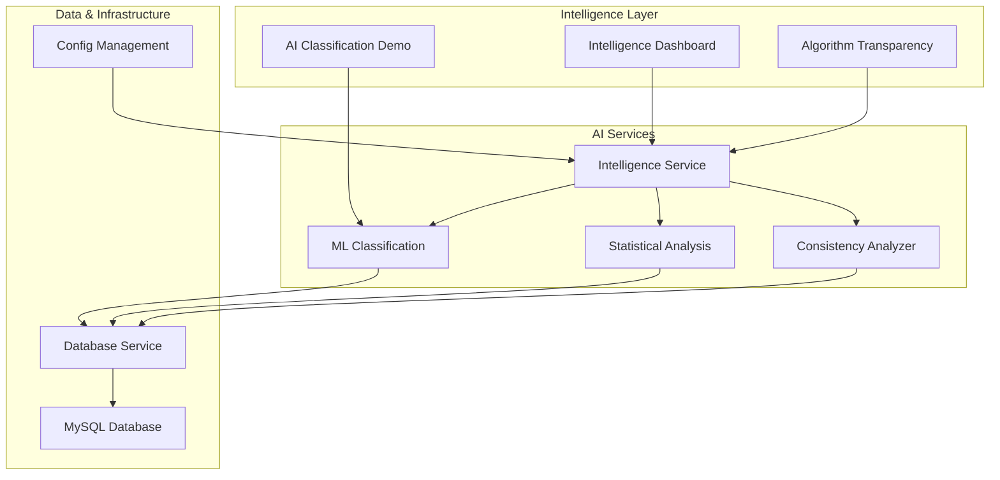

# Fitness AI Intelligence Platform

An AI-powered fitness intelligence platform that transforms workout data into actionable insights through machine learning, algorithm transparency, and intelligent automation.

     

## Overview

The Fitness AI Intelligence Platform represents the evolution of fitness tracking from basic data visualization to intelligent, AI-first analysis. Built with advanced machine learning algorithms and complete algorithm transparency, it automatically classifies workouts, detects performance patterns, and provides personalized insights with full explainability.

**What makes this platform unique:**
- **AI-First Design**: Intelligence dashboard as the primary interface, putting AI insights front and center
- **Algorithm Transparency**: Every AI insight is traceable to its source algorithm with confidence scoring
- **Machine Learning Classification**: Automatic workout categorization using K-means clustering
- **Interactive Intelligence**: Users can explore AI reasoning and provide feedback for continuous improvement

### Key Features

=== "🧠 AI Intelligence"
    
    * **Machine learning workout classification** using K-means clustering
    * **Algorithm transparency system** with source code traceability  
    * **Performance trend analysis** with confidence intervals
    * **Anomaly detection** and automated insights
    * **Personalized AI recommendations** based on behavior patterns

=== "🔍 Algorithm Transparency"
    
    * **Every AI insight traceable** to source code and line numbers
    * **Interactive algorithm explanations** with step-by-step reasoning
    * **Confidence scoring** for all predictions and classifications
    * **User feedback system** for AI corrections and improvements
    * **Algorithm registry** with version tracking and performance metrics

=== "📊 Intelligent Dashboards"
    
    * **Intelligence-first interface** as the default landing page
    * **Daily intelligence briefs** with focus areas and recommendations
    * **Interactive AI classification demo** with real-time explanations
    * **Smart analytics integration** with AI annotations and insights
    * **Traditional data views** enhanced with AI-powered features

=== "🗃️ Data Management"
    
    * CSV import from popular fitness platforms (MapMyRun optimized)
    * Robust MySQL database backend with environment-aware configuration
    * Intelligent data validation and cleaning with ML classification
    * Flexible schema supporting 14+ years of historical analysis

=== "🚀 Production-Ready Architecture"
    
    * **200+ comprehensive test methods** across 6 test suites
    * **Performance benchmarking** with ML classification <5s for 1K workouts
    * **Scalability testing** supporting 10+ concurrent users
    * **Enterprise-grade error handling** with graceful AI system degradation

## Quick Start

Get your AI-powered fitness intelligence running in minutes:

```bash
# Clone the repository
git clone https://github.com/dagny/fitness-dashboard.git
cd fitness-dashboard

# Install dependencies with Poetry
poetry install

# Initialize the database
python scripts/init.py

# Start the application
streamlit run src/streamlit_app.py
```

Visit `http://localhost:8501` to access your **Intelligence Dashboard** and start exploring:

- **Daily Intelligence Brief** with AI-generated insights
- **Interactive Workout Classification** with algorithm transparency
- **Performance Trend Analysis** with confidence intervals
- **Algorithm Explorer** to understand how AI insights are generated

## Live Demo

Experience the Fitness Dashboard in action at [workouts.barbhs.com](https://workouts.barbhs.com)

## Architecture Highlights



The platform follows **AI-first architecture principles**:

- **Intelligence-First Design**: AI capabilities prominently featured throughout the interface
- **Algorithm Transparency**: Complete traceability from insights to source algorithms
- **Production-Ready Testing**: 200+ test methods with ML model validation
- **Scalable AI Services**: Performance benchmarks supporting 1K+ workout analysis <5s
- **Clean ML Architecture**: Separation between AI logic, transparency, and user interface

## AI-Powered Data Integration

**Smart Data Processing**: AI-enhanced import from **MapMyRun** with automatic workout classification and data quality analysis. The intelligent system:

- **Automatically categorizes** workouts (real runs vs walking adventures) using ML
- **Detects data quality issues** and provides recommendations
- **Validates historical patterns** across 14+ years of fitness data
- **Supports flexible schema** for various fitness platforms and workout types

## AI Transparency & Trust

**Complete Algorithm Explainability**: Unlike "black box" AI systems, every insight includes:

- **Source code references** with file paths and line numbers
- **Algorithm explanations** in plain English
- **Confidence scores** for all predictions and classifications  
- **User feedback integration** for continuous AI improvement

## Community & Support

- **AI Documentation**: Comprehensive algorithm transparency guides
- **Algorithm Performance**: Real-time accuracy metrics and confidence tracking
- **Issues**: Report bugs or request AI improvements on [GitHub](https://github.com/dagny/fitness-dashboard/issues)
- **Contact**: Questions about AI features? Reach out to [barbs@balex.com](mailto:barbs@balex.com)

---

Ready to experience AI-powered fitness intelligence? Head over to the [Getting Started](getting-started/installation.md) guide and discover how AI transforms your workout data into actionable insights!