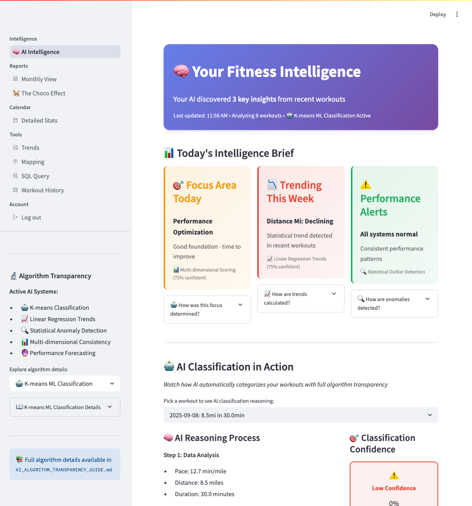

# Understanding the Dashboard

This guide explains the main interface and how to use the different views available in your Fitness Dashboard.

## Main Dashboard

When you open the application at `http://localhost:8501`, you'll see your main dashboard with personalized insights about your workouts.



## What You'll See

### Header Summary
The top of the page shows a summary of your data:

```
🧠 Your dashboard analyzed 2,409 workouts and found 4 key insights
Last updated: 2 minutes ago | Analysis confidence: 87%
```

This tells you:
- **How many workouts** have been analyzed
- **When the analysis was last updated**
- **How confident** the system is about its classifications
- **How many insights** were found in your recent data

### Main Insight Cards

The dashboard shows three main cards with insights about your workouts:


#### **🎯 Focus Area**
Based on your workout patterns, the system suggests what to work on:

- **Building Consistency** (if you have irregular workout patterns): Focus on establishing a regular schedule
- **Adding Frequency** (if you're consistent but infrequent): Try to work out more often
- **Optimizing Performance** (if you're consistent and frequent): Focus on improving your times or distances

**Example:**
```
🎯 FOCUS AREA: Building Consistency
📊 Current score: 42/100
💡 Suggestion: Try to establish a regular workout schedule
   Based on: Pattern analysis of your workout frequency
   Confidence: 85%
```

#### **📈 Trending**
Shows how your performance is changing over time:

- **Improving trends** - metrics that are getting better
- **Declining trends** - metrics that may need attention
- **Stable patterns** - metrics that are staying consistent

**Example:**
```
📈 TRENDING: Calorie Burn Improving
📊 +12.5% increase over 30 days
💡 Based on: Statistical analysis of your recent workouts
   Confidence: 91%
```

#### **⚠️ Alerts**
Highlights anything unusual in your recent workouts:

- **All normal** - when your patterns are consistent
- **Unusual patterns** - when something looks different from your typical workouts
- **Data quality issues** - when there might be problems with imported data

**Example:**
```
⚠️ Unusual pattern detected
📊 Recent pace much slower than typical
💡 Based on: Comparison with your workout history
```

### Understanding How It Works

If you're curious about how the analysis works, the dashboard includes explanations:


#### **"How was this calculated?" Links**
Throughout the dashboard, you'll see links that explain:
- **What analysis was used** - in simple terms
- **How confident** the system is in its conclusions
- **What the results mean** for your workouts
- **How to improve** the accuracy if needed

#### **Workout Categorization Demo**
There's an interactive section that shows how workouts get categorized:


**Workout Types:**
- **Real Runs**: Focused running sessions (typically 8-12 min/mile pace)
- **Walking/Hiking**: Leisurely activities (typically 20-28 min/mile pace)
- **Mixed Activities**: Combined running and walking
- **Outliers**: Unusual workouts that don't fit typical patterns

You can click on any workout to see why it was categorized the way it was.

### Personalized Suggestions

Based on your workout patterns, the dashboard may suggest:
- **Training focus areas** based on your current consistency and frequency
- **Performance improvements** based on trend analysis
- **Schedule adjustments** to help build better habits
- **Data quality improvements** to get better insights

## Dashboard Navigation Map

Here's how all the different sections connect and what each one offers:

```mermaid
mindmap
  root((🏠 Main<br/>Dashboard))
    📊 Monthly View
      📅 Calendar Display
      📈 Monthly Stats
      📋 Recent Workouts
      🎯 Activity Breakdown

    📈 Trends Analysis
      📊 Performance Charts
      📉 Statistical Trends
      🔮 Forecasting
      📏 Time Comparisons

    🛠️ Model Management
      🤖 Classification Control
      📊 Accuracy Metrics
      🔧 Retraining Tools
      ✏️ Correction Interface

    🔍 Data Explorer
      💾 SQL Query Interface
      🗂️ Custom Filters
      📤 Export Tools
      📋 Raw Data Table

    🐕 The Choco Effect
      📊 Behavior Analysis
      📈 Pattern Changes
      🔄 Transformation View
      📉 Before/After Stats

    📖 Quick Reference
      ⚡ Common Commands
      🔧 Troubleshooting
      📋 SQL Examples
      🎯 Task Guides
```



Each section serves different analysis needs - from quick daily insights to deep custom analysis. The main dashboard ties everything together with personalized recommendations.

## Other Dashboard Views

Besides the main dashboard, you can access different views using the navigation menu:

### **Monthly View**
Shows your workout data organized by month:
- Monthly statistics and summaries
- Calendar view of your workouts
- Activity breakdowns by type
- Recent workout history

### **Trends Analysis**
Detailed charts and graphs showing:
- Performance trends over time
- Statistical analysis of your progress
- Comparisons between different time periods
- Forecasting based on your patterns

### **Data Explorer**
Advanced tools for custom analysis:
- SQL query interface for detailed data exploration
- Custom date ranges and filters
- Export options for your data
- Raw workout data table with all imported information

### **The Choco Effect**
A specialized view that:
- Analyzes behavior changes over time
- Shows how your workout patterns have evolved
- Highlights significant transformations in your fitness journey

### **Workout History**
Simple table view showing:
- All your imported workouts
- Categorization results
- Basic statistics for each workout
- Links to map data (if available)

## Getting Help

### **Understanding Results**
If you see results that don't make sense:
- Click the "How was this calculated?" links for explanations
- Check the confidence scores - low confidence may indicate uncertain results
- Review your imported data for any obvious errors

### **Improving Accuracy**
You can help improve the analysis by:
- **Correcting misclassifications** when you see them
- **Providing feedback** through the interface
- **Ensuring data quality** in your imports
- **Using consistent activity naming** when exporting from your fitness app

### **Common Questions**
- **"Why is this workout categorized wrong?"** - Click on the workout to see the reasoning, and use the correction feature if needed
- **"Why don't I see any trends?"** - You may need more workout data (typically 10+ workouts) for meaningful trend analysis
- **"What does the confidence score mean?"** - It shows how certain the system is about its analysis (higher is better)

## Next Steps

Now that you understand the main dashboard:
- **[Import your data](data-import.md)** to see personalized insights
- **[Learn about common tasks](user-journeys.md)** to get the most from the dashboard
- **[Explore visualization features](visualizations.md)** for deeper analysis
- **[Try custom queries](sql-queries.md)** for advanced data exploration