# Model Management

The Model Management page helps you understand and control how the dashboard categorizes your workouts. This is where you can see how well the automatic classification is working and make improvements.

## What is Model Management?

The dashboard uses machine learning to automatically categorize your workouts into types like "real runs," "walking," and "mixed activities." The Model Management page lets you:

- **See how accurate** the classification is
- **Retrain the model** when you add new data
- **Review classifications** that might be incorrect
- **Understand what the model has learned** about your workout patterns

## Accessing Model Management

1. Open your dashboard at `http://localhost:8501`
2. Look for **"Model Management"** in the navigation menu
3. Click to open the model management interface

## What You'll See

### Model Status Overview
- **Current model version** and when it was last trained
- **Classification accuracy** percentage
- **Number of workouts** the model was trained on
- **Model health** indicators

### Training Controls
- **Retrain Model** button to update with new workout data
- **Training progress** bar when retraining is running
- **Training history** showing when the model was last updated

### Model Performance
- **Accuracy metrics** showing how often classifications are correct
- **Confusion matrix** showing which workout types get confused with others
- **Performance trends** over time as you add more data

### Classification Review
- **Recent classifications** with confidence scores
- **Uncertain classifications** that might need your review
- **Correction tools** to fix misclassified workouts

## Common Tasks

### When to Retrain the Model

You should consider retraining when:
- **You've imported new workout data** (especially large amounts)
- **Classification accuracy seems lower** than usual
- **You've corrected many misclassifications** and want the model to learn
- **Your workout patterns have changed** significantly

### How to Retrain

1. Click the **"Retrain Model"** button
2. Wait for training to complete (usually 30-60 seconds)
3. Review the new accuracy metrics
4. Check if classifications have improved

### Reviewing Classifications

1. Look at the **"Recent Classifications"** section
2. **Check low-confidence classifications** (usually below 70%)
3. **Correct any obvious mistakes** using the correction tools
4. **Retrain the model** if you make several corrections

### Understanding Accuracy

- **85%+ accuracy**: Excellent - model is working well
- **70-85% accuracy**: Good - some room for improvement
- **Below 70%**: Needs attention - consider retraining or checking data quality

## How Classification Works

The system uses this decision logic to categorize your workouts:

```mermaid
flowchart TD
    A[📊 New Workout Data<br/>Pace, Distance, Duration] --> B{🔍 Data Quality Check}

    B -->|✅ Valid Data| C{⚡ Pace Analysis}
    B -->|❌ Issues Found| D[⚠️ Flag as Outlier<br/>Needs Review]

    C -->|8-12 min/mile| E[🏃 Real Run<br/>Focused Running]
    C -->|20-28 min/mile| F[🚶 Walking<br/>Leisurely Activity]
    C -->|12-20 min/mile| G{📏 Distance Check}
    C -->|Other Pace| H{🔄 Pattern Analysis}

    G -->|> 2 miles| I[🏃‍♂️ Slow Run<br/>Endurance Training]
    G -->|< 2 miles| J[🚶‍♂️ Brisk Walk<br/>Short Activity]

    H -->|Variable Pace| K[🔄 Mixed Activity<br/>Run/Walk Intervals]
    H -->|Extreme Values| D

    E --> L[📈 High Confidence<br/>85-95%]
    F --> M[📈 High Confidence<br/>85-95%]
    I --> N[📊 Medium Confidence<br/>70-85%]
    J --> N
    K --> O[📉 Low Confidence<br/>60-75%]
    D --> P[❌ Very Low Confidence<br/>< 60%]

    style A fill:#e3f2fd,stroke:#1976d2,stroke-width:2px
    style E fill:#e8f5e9,stroke:#4caf50,stroke-width:2px
    style F fill:#e8f5e9,stroke:#4caf50,stroke-width:2px
    style I fill:#fff3e0,stroke:#ff9800,stroke-width:2px
    style J fill:#fff3e0,stroke:#ff9800,stroke-width:2px
    style K fill:#f3e5f5,stroke:#9c27b0,stroke-width:2px
    style D fill:#ffebee,stroke:#f44336,stroke-width:2px
    style L fill:#e8f5e9,stroke:#4caf50,stroke-width:3px
    style M fill:#e8f5e9,stroke:#4caf50,stroke-width:3px
    style N fill:#fff3e0,stroke:#ff9800,stroke-width:2px
    style O fill:#fce4ec,stroke:#e91e63,stroke-width:2px
    style P fill:#ffebee,stroke:#f44336,stroke-width:2px
```

This decision tree shows why workouts get specific categories and confidence levels. Understanding this helps you provide better feedback for improvements.

*[View detailed technical diagram](../assets/diagrams/classification-algorithm.md) for implementation specifics.*

## Troubleshooting

### **Model training fails**
- Check that you have enough workout data (minimum 20-30 workouts recommended)
- Verify your workout data has valid pace, distance, and duration values
- Try restarting the dashboard if training seems stuck

### **Low accuracy**
- Make sure your imported data is clean and consistent
- Check if your workout patterns are very diverse (makes classification harder)
- Consider manually correcting some classifications and retraining

### **Classifications don't make sense**
- Review the workout data being classified - look for extreme or unusual values
- Check if the pace calculations are reasonable
- Use the correction tools to fix obvious mistakes

## Advanced Features

### Model Versioning
- The system keeps track of different model versions
- You can compare performance between versions
- Previous versions can be restored if needed

### Performance Metrics
- **Precision**: How many classified workouts are actually correct
- **Recall**: How many actual workouts of each type were correctly identified
- **F1-Score**: Overall balance of precision and recall

### Learned Parameters
- View what the model has learned about your workout patterns
- See the typical characteristics of each workout category
- Understand why certain workouts get classified as they do

## Best Practices

1. **Regular Retraining**: Retrain monthly or when you add significant new data
2. **Quality Control**: Review and correct classifications regularly
3. **Data Consistency**: Keep your workout data export format consistent
4. **Monitor Accuracy**: Watch for drops in classification accuracy
5. **Patient Training**: Allow sufficient data accumulation before expecting perfect results

## Next Steps

- **[Understanding the Dashboard](dashboard-overview.md)**: Learn how classifications appear in the main interface
- **[Data Import Guide](data-import.md)**: Best practices for importing workout data
- **[Algorithm Transparency](../ai/algorithm-transparency.md)**: Deep dive into how classification works

The Model Management page puts you in control of how your workouts get analyzed, helping ensure the insights you receive are as accurate as possible.