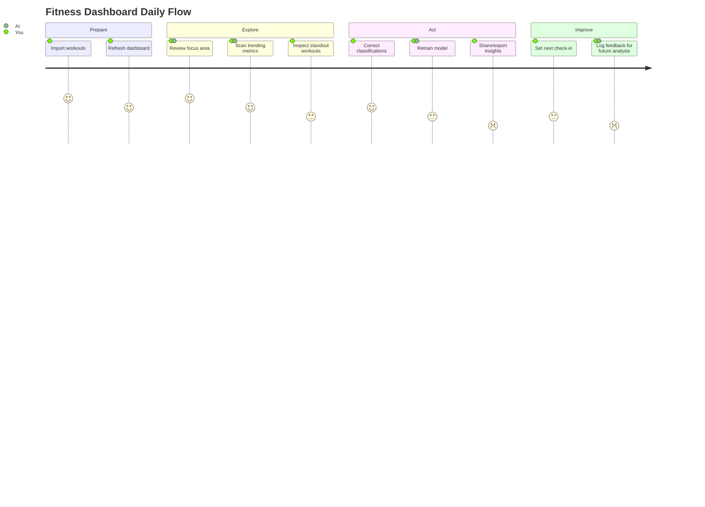
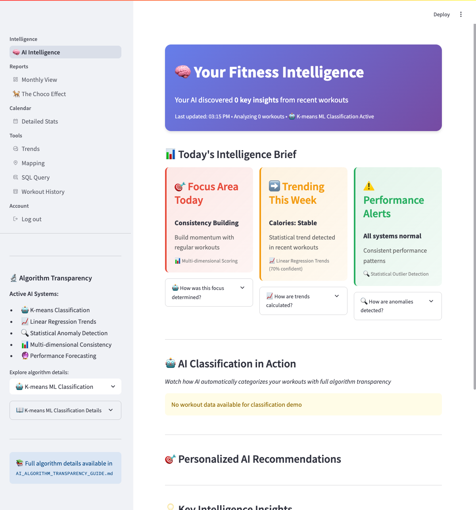
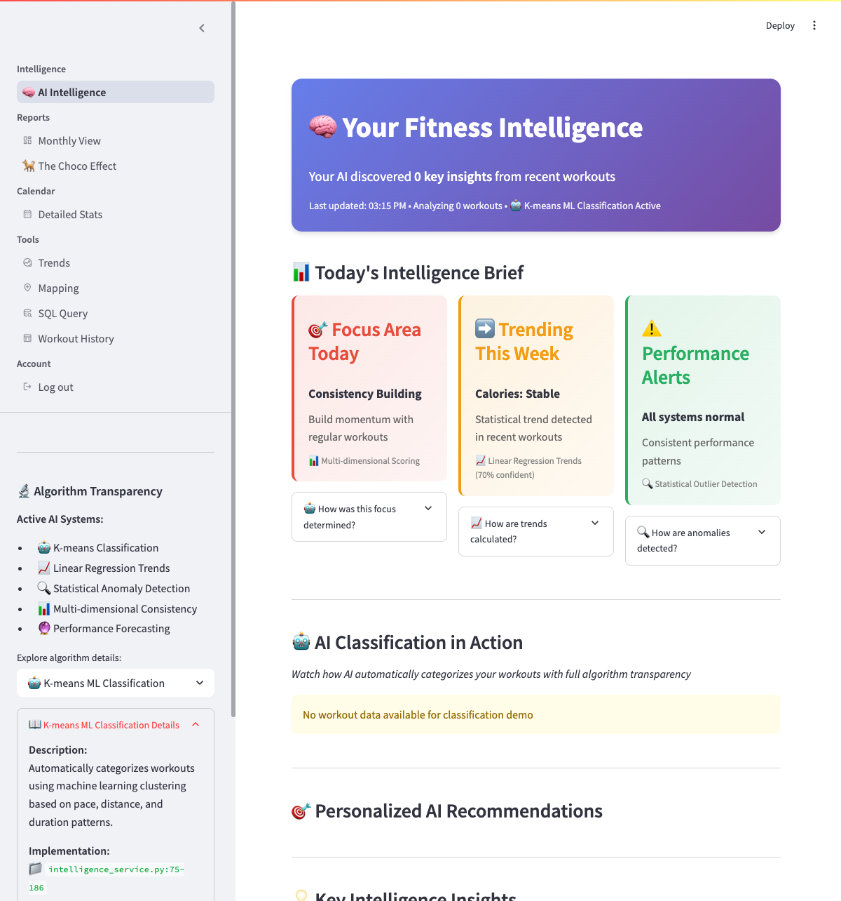

# Common Tasks

This guide shows you how to accomplish typical tasks with your Fitness Dashboard. Each section includes step-by-step instructions for the most common things users want to do.

!!! info "How to use this guide"
    * **Scan the visuals first** for a quick mental model of the experience.
    * **Jump to the playbook** that matches what you are trying to do right now.
    * **Follow the numbered steps** and the linked resources for deeper explanations.

## Visual journey at a glance



## Dashboard landmarks

<figure>
  
  <figcaption><strong>Figure 1.</strong> Intelligence Dashboard hotspots: (1) Summary cards for consistency, frequency, and performance insights, (2) Trending metrics timeline, (3) Focus Area recommendations, (4) Quick links to data tools.</figcaption>
</figure>

## Getting Started Tasks

Use these playbooks the first time you open the dashboard or whenever you import a fresh batch of workouts.

| Scenario | Visual cue | Outcome |
| --- | --- | --- |
| **View Your Workout Summary** | Focus Area, Trending, and Consistency cards in Figure&nbsp;1 | Quick snapshot of how you are doing right now |
| **Import New Workout Data** | Upload confirmation in terminal + refreshed charts | Latest workouts visible in dashboards and queries |
| **Fix Incorrect Workout Classifications** | Classification Review panel on Model Management page | Cleaner dataset and smarter future suggestions |

### View Your Workout Summary

**What you want**: A quick overview of your recent fitness activity.

**How to do it**:
1. Open the dashboard (main page)
2. Look at the summary cards at the top
3. Check the "Focus Area" card for personalized suggestions
4. Review the "Trending" card to see if your performance is improving

??? tip "Prefer a visual walkthrough?"
    Revisit the **Dashboard Overview** for annotated screenshots of every card and data panel.

### Import New Workout Data

**What you want**: Add recent workouts from your fitness app.

**How to do it**:
1. Export your data from your fitness app (MapMyRun, etc.) as CSV
2. Replace the file `src/user2632022_workout_history.csv` with your new data
3. Run `python scripts/update_db.py` in your terminal
4. Refresh the dashboard to see updated analysis

??? info "Keep an eye on automation"
    The import command also updates machine-learning features. If you change the CSV manually, run `python scripts/update_db.py` again so the model retrains with the corrections.

### Fix Incorrect Workout Classifications

**What you want**: Correct workouts that were categorized wrong (e.g., a walk labeled as a run).

**How to do it**:
1. Go to the **Model Management** page
2. Look for the "Classification Review" section
3. Find the incorrect classification
4. Use the correction tools to fix the category
5. Click "Retrain Model" to improve future classifications

## Analysis Tasks

!!! abstract "Questions this section answers"
    * *Am I improving month over month?*
    * *Which workouts stand out the most?*
    * *What patterns should I act on next?*

### Compare Different Time Periods

**What you want**: See how your performance has changed over months or years.

**How to do it**:
1. Go to the **Trends** page
2. Use the date range picker to select your first period (e.g., "January 2023")
3. Note the statistics
4. Change the date range to your second period (e.g., "January 2024")
5. Compare the numbers to see your progress

### Find Your Best/Worst Workouts

**What you want**: Identify your fastest runs, longest walks, or most unusual workouts.

**How to do it**:
1. Go to the **Custom Queries** page
2. Use the pre-built query templates, or
3. Write a custom query like:
   ```sql
   SELECT * FROM workout_summary
   WHERE activity_type = 'real_run'
   ORDER BY avg_pace_min_mi LIMIT 10;
   ```
4. Click "Run Query" to see results

??? example "See it in action"
    ```mermaid
    flowchart LR
        Data[Workout data] --> Trends[Trends page]
        Trends -->|Change date range| Comparison{Compare periods}
        Comparison -->|Spot improvement| Action[Adjust training plan]
        Comparison -->|Find dips| Investigation[Review workout notes]
    ```

### Analyze Workout Patterns

**What you want**: Understand when you exercise most, which activities you prefer, etc.

**How to do it**:
1. Go to the **Charts & Visualizations** page
2. Look at the activity distribution charts
3. Check the time-of-day patterns
4. Review the monthly/seasonal trends
5. Use filters to focus on specific workout types

## Data Management Tasks

!!! question "When should I clean data?"
    * Before major race blocks or training cycles
    * After large CSV imports from a new source
    * Whenever you notice obviously incorrect trends

### Clean Up Bad Data

**What you want**: Remove or fix workouts with obviously wrong information.

**How to do it**:
1. Go to **Custom Queries**
2. Look for extreme outliers:
   ```sql
   SELECT * FROM workout_summary
   WHERE avg_pace_min_mi > 60 OR avg_pace_min_mi < 4
   OR distance_mi > 50 OR distance_mi < 0.1;
   ```
3. Review the results and decide which to delete or correct
4. Use the dashboard's editing features or manually edit your CSV file
5. Re-import if you made changes to the source file

### Export Your Analysis

**What you want**: Save insights or data to share with others or keep as records.

**How to do it**:
1. Take screenshots of interesting charts or insights
2. Use the **Custom Queries** page to export specific data sets
3. Copy and paste query results into spreadsheets
4. Use your browser's print function to save pages as PDFs

### Set Up Regular Data Updates

**What you want**: Keep your dashboard updated with minimal effort.

**How to do it**:
1. Set a recurring reminder (weekly/monthly) to export data from your fitness app
2. Create a simple script or batch file to run the import command
3. Check the Model Management page periodically to retrain when needed
4. Bookmark the dashboard for easy access

## Troubleshooting Tasks

{ width="720" }

<small>Figure 2. The Algorithm Transparency panel shows which classifiers are active and highlights low-confidence predictions that may need your intervention.</small>

### Dashboard Shows No Data

**What you want**: Fix an empty or blank dashboard.

**How to do it**:
1. Check if you've imported any workout data
2. Run `python scripts/update_db.py` to ensure data is imported
3. Verify the CSV file is in the correct location and format
4. Check the terminal for any error messages during import
5. Try the demo mode first to ensure the dashboard works

### Improve Classification Accuracy

**What you want**: Get better automatic workout categorization.

**How to do it**:
1. Go to **Model Management**
2. Review classifications with low confidence scores
3. Correct obvious mistakes using the feedback tools
4. Ensure your workout data includes consistent pace, distance, and duration
5. Retrain the model after making corrections
6. Import more varied workout data if classifications seem too generic

### Speed Up Slow Performance

**What you want**: Make the dashboard load and analyze faster.

**How to do it**:
1. Check how much data you have - very large datasets (10,000+ workouts) may be slow
2. Use date filters to focus on smaller time periods
3. Clear your browser cache
4. Restart the dashboard application
5. Consider using a more powerful computer for very large datasets

## Advanced Tasks

??? tip "Reuse favorite analyses"
    Save complex queries in a shared doc or use the Custom Queries page bookmarks so teammates can revisit them without rewriting SQL.

### Create Custom Analysis

**What you want**: Answer specific questions about your fitness data.

**How to do it**:
1. Think about what question you want to answer
2. Go to **Custom Queries**
3. Write SQL queries to get the specific data you need
4. Experiment with different filters and groupings
5. Save successful queries for future use

### Track Specific Goals

**What you want**: Monitor progress toward particular fitness objectives.

**How to do it**:
1. Define your goal clearly (e.g., "run 3 times per week")
2. Use the **Trends** page to see relevant patterns
3. Create custom queries to track specific metrics
4. Set up regular check-ins (weekly/monthly) to review progress
5. Adjust your approach based on what the data shows

## Getting Help

If you're stuck on a task:
- Check the **[Troubleshooting Guide](../reference/troubleshooting.md)**
- Look at the **[Dashboard Overview](dashboard-overview.md)** for interface explanations
- Submit questions on **[GitHub Issues](https://github.com/dagny099/fitness-dashboard/issues)**

Remember: The dashboard is designed to help you understand your fitness patterns. Focus on insights that help you make better decisions about your health and exercise routine.
