# User Journeys with AI Features

This guide provides complete user journey documentation for discovering, understanding, and mastering the AI features of the Fitness Intelligence Platform. Each journey is designed for different user personas and technical comfort levels.

## Journey Overview

The AI-first platform supports multiple user paths:

- **🆕 New User Discovery**: First-time exploration of AI features
- **🧠 Algorithm Understanding**: Learning how AI systems work  
- **🔄 Feedback & Improvement**: Contributing to AI enhancement
- **📈 Advanced Analytics**: Leveraging AI for deep insights
- **🛠️ Technical Deep Dive**: Understanding implementation details

---

## Journey 1: New User AI Discovery 🆕

**User Profile**: First-time visitor, no prior AI experience  
**Goal**: Understand AI value and build initial trust  
**Duration**: 5-10 minutes  

### Step-by-Step Journey

#### **Landing & First Impression** (30 seconds)

**What the user sees:**
- Clean, professional login interface
- No overwhelming technical jargon
- Clear "AI Intelligence" navigation item

**User thoughts:** *"This looks professional and mentions AI insights"*

#### **AI Value Discovery** (2 minutes)

**What the user sees:**
- **Intelligence Header**: "Your AI analyzed 2,409 workouts and discovered 4 key insights"
- **Focus Area Card**: Clear recommendation with explanation
- **Trending Card**: Performance trends with confidence scoring
- **Alerts Card**: "All systems normal" with algorithm transparency

**User thoughts:** *"This AI actually gives me useful information I can act on"*

#### **Trust Building Through Transparency** (3 minutes)

```mermaid
flowchart TD
    Curious[User Curious About AI] --> Badge[Clicks Algorithm Badge 🤖]
    Badge --> Card[Explanation Card Opens]
    Card --> Understanding[Reads Plain English Explanation]
    Understanding --> Source[Sees Source Code Reference]
    Source --> Trust[Trust Built Through Transparency]
    Trust --> Exploration[Continues Exploring AI Features]
```

**What the user sees:**
- **Algorithm badges** throughout the interface
- **Expandable explanation cards** with clear descriptions
- **Source code references** showing complete transparency
- **Confidence scores** with visual indicators

**User thoughts:** *"I can actually understand how this AI works - it's not a black box"*

#### **Initial Engagement** (5 minutes)
- User scrolls through Intelligence Dashboard
- Explores algorithm transparency sidebar
- Reads active AI systems list
- Clicks expandable algorithm details
- Sees AI classification demo

**Conversion Point**: User bookmarks or returns to app

---

## Journey 2: Algorithm Understanding 🧠

**User Profile**: Curious user who wants to understand AI methodology  
**Goal**: Comprehensive understanding of AI systems  
**Duration**: 15-20 minutes

### Learning Path

#### **AI System Overview** (5 minutes)

```mermaid
graph LR
    Start[Algorithm Transparency Sidebar] --> List[Active AI Systems List]
    List --> K[🤖 K-means Classification]
    List --> L[📈 Linear Regression] 
    List --> A[🔍 Anomaly Detection]
    List --> C[📊 Consistency Analysis]
    List --> F[🔮 Forecasting]
    
    K --> Detail[Detailed Explanations]
    L --> Detail
    A --> Detail
    C --> Detail
    F --> Detail
```

**Learning Experience:**
- **Progressive disclosure** from simple to complex
- **Interactive exploration** of each AI system
- **Visual confidence indicators** for all algorithms
- **Plain English explanations** accessible to all users

#### **Deep Dive Exploration** (10 minutes)

**Deep Understanding Elements:**
- **File paths and line numbers** for exact traceability
- **Algorithm parameters** with explanations
- **Performance metrics** showing accuracy rates
- **Technical implementation details** for advanced users

#### **Confidence Building** (5 minutes)
User develops understanding of:
- **How algorithms make decisions**
- **Why confidence scores vary**
- **What transparency features mean**
- **How to interpret AI recommendations**

**Outcome**: User trusts AI recommendations and uses them regularly

---

## Journey 3: Feedback & Improvement Loop 🔄

**User Profile**: Engaged user who notices AI improvements  
**Goal**: Contribute to AI system enhancement  
**Duration**: Ongoing relationship

### Feedback Workflow

#### **Issue Detection** (1 minute)

**Example Scenario:**
- User sees workout classified as "real_run"
- Knows it was actually a walking session
- Wants to help improve AI accuracy

#### **Feedback Submission** (2 minutes)

**User Experience:**
- **Easy feedback mechanisms** integrated throughout UI
- **Clear correction options** for misclassifications
- **Optional explanation** for improvement context
- **Immediate confirmation** showing feedback received

#### **Impact Visibility** (Ongoing)

**Long-term Engagement:**
- **Performance improvements** visible to user
- **Accuracy metrics** updated with user contributions
- **Impact reports** showing how feedback helps
- **Community contribution** recognition

---

## Journey 4: Advanced Analytics Deep Dive 📈

**User Profile**: Data-driven user seeking comprehensive insights  
**Goal**: Leverage AI for advanced fitness analysis  
**Duration**: 30+ minutes per session

### Advanced Usage Patterns

#### **Multi-Algorithm Analysis** (10 minutes)

**Advanced User Workflow:**
1. **Start with Intelligence Dashboard** for overview insights
2. **Deep dive into Trends** with AI-enhanced analysis
3. **Use SQL interface** with AI query suggestions
4. **Explore Choco Effect** for behavioral insights
5. **Combine multiple AI systems** for comprehensive analysis

#### **Cross-Algorithm Insights** (15 minutes)
Advanced users learn to:
- **Correlate AI insights** from multiple algorithms
- **Understand algorithm limitations** and strengths
- **Combine statistical and ML approaches** for robust analysis
- **Use confidence scoring** for decision weighting

#### **Power User Features** (10 minutes)
- **Algorithm performance monitoring**
- **Technical parameter exploration**
- **Source code verification**
- **Feedback impact tracking**

---

## Journey 5: Technical Deep Dive 🛠️

**User Profile**: Developer, data scientist, or technical stakeholder  
**Goal**: Understand implementation for contribution or integration  
**Duration**: 60+ minutes

### Technical Exploration Path

#### **Architecture Understanding** (20 minutes)

**Technical Resources:**
- **[AI Architecture Flow](../assets/diagrams/ai-architecture-flow.md)**: System design
- **[ML Classification Workflow](../assets/diagrams/ml-classification-workflow.md)**: Algorithm details
- **[Algorithm Transparency System](../assets/diagrams/algorithm-transparency-system.md)**: Implementation

#### **Code Investigation** (25 minutes)
Technical users explore:
- **`src/services/intelligence_service.py`**: Core AI orchestration
- **`src/utils/statistics.py`**: Statistical analysis engine
- **`src/utils/consistency_analyzer.py`**: Multi-dimensional scoring
- **Test suites**: 200+ comprehensive test methods

#### **Integration Possibilities** (15 minutes)
- **API endpoints** for external integration
- **Algorithm extension points** for new AI features
- **Data pipeline interfaces** for additional data sources
- **Performance optimization opportunities**

---

## Cross-Journey Success Metrics

### **Trust Building Indicators**
- **Time spent** exploring algorithm transparency features
- **Frequency** of algorithm badge clicks
- **Feedback submission** rates and quality
- **Return usage** patterns showing sustained engagement

### **Learning Progression Markers**
- **Progressive disclosure usage** (surface → intermediate → deep)
- **Multi-algorithm exploration** across different AI systems
- **Source code reference** clicks for technical verification
- **Advanced feature adoption** rates

### **Engagement Quality Metrics**
- **AI recommendation** adoption rates
- **Correction accuracy** in user feedback
- **Cross-feature usage** combining multiple AI insights
- **Community contribution** to algorithm improvement

---

## Journey Optimization Guidelines

### **Design Principles**
1. **Progressive Disclosure**: Start simple, allow depth exploration
2. **Trust Through Transparency**: Show how AI works, don't hide complexity
3. **Immediate Value**: Provide useful insights from first interaction
4. **Feedback Integration**: Make user input valuable for AI improvement

### **Accessibility Considerations**
- **Multiple explanation levels** for different technical backgrounds
- **Visual indicators** supplemented with text descriptions
- **Keyboard navigation** for all AI exploration features
- **Screen reader support** for algorithm transparency elements

### **Personalization Opportunities**
- **Adaptive complexity** based on user exploration patterns
- **Personalized AI explanations** matching user technical level
- **Custom algorithm preferences** for different user workflows
- **Progressive feature introduction** based on usage maturity

These user journeys ensure that every type of user - from AI newcomer to technical expert - can successfully discover, understand, trust, and leverage the AI capabilities of the Fitness Intelligence Platform.