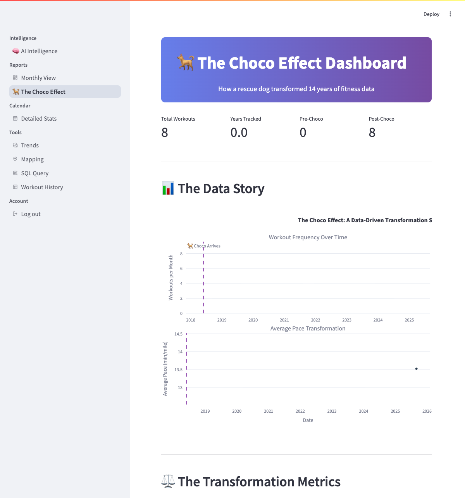

# Charts & Visualizations

The Fitness Dashboard provides interactive charts and graphs to help you understand your fitness data, track progress, and discover patterns in your workout history.

## Chart Types Overview

### The Choco Effect Dashboard

**Purpose**: Analyze how your workout patterns have changed over time



**What you'll see**:
- **Timeline Charts**: How your workout frequency and pace have changed over time
- **Before/After Comparison**: Statistics comparing different periods of your fitness journey
- **Activity Breakdown**: Pie charts showing the mix of different workout types
- **Pattern Analysis**: Visual representation of significant changes in your exercise habits

**Key Features**:
- **Automatic Period Detection**: Identifies major changes in your workout patterns
- **Confidence Indicators**: Shows how certain the system is about pattern classifications
- **Statistical Analysis**: Trend analysis with confidence intervals
- **Interactive Exploration**: Click and zoom to explore different time periods

### Time Series Charts

**Purpose**: Track performance metrics over time

**Features**:
- Interactive zoom and pan
- Hover tooltips with detailed data
- Multiple metrics on the same chart
- Customizable time ranges

**Use Cases**:
- Monthly distance trends
- Calorie burn patterns
- Performance improvements over time
- Seasonal activity variations

```python
# Example: Distance over time
SELECT workout_date, SUM(distance_mi) as daily_distance
FROM workout_summary 
WHERE workout_date >= '2024-01-01'
GROUP BY DATE(workout_date)
ORDER BY workout_date;
```

### Activity Distribution Charts

**Purpose**: Understand workout composition and preferences

**Chart Types**:
- **Pie Charts**: Activity type percentages
- **Bar Charts**: Activity frequency and volume
- **Stacked Charts**: Combined metrics by activity

**Interactive Features**:
- Click to filter by activity type
- Legend toggling
- Percentage vs. absolute value switching

### Performance Analytics

**Purpose**: Analyze workout intensity and progress

**Visualizations**:
- **Pace Analysis**: Average vs. maximum pace trends
- **Duration Distribution**: Workout length patterns  
- **Intensity Heatmaps**: Performance by day/time
- **Progress Indicators**: Goal achievement tracking

### AI-Powered Analytics Charts

**Purpose**: Leverage machine learning for deeper fitness insights

**Statistical Visualizations**:
- **Trend Lines with Confidence Intervals**: Statistical significance of performance improvements
- **Anomaly Detection Plots**: Highlight unusual workouts with confidence scores
- **Classification Scatter Plots**: Visual representation of ML workout categorization
- **Consistency Heat Maps**: Multi-dimensional consistency scoring across time periods

**Smart Features**:
- **Automated Pattern Recognition**: Charts automatically highlight significant changes
- **Predictive Forecasting**: Future performance projections with uncertainty bands
- **Behavioral Segmentation**: Visual clustering of different activity patterns
- **Intelligence Overlays**: AI-generated insights displayed directly on charts

## Interactive Features

### Zoom and Pan

**Mouse Controls**:
- **Scroll wheel**: Zoom in/out on charts
- **Click and drag**: Pan across data
- **Double-click**: Reset zoom to fit all data

**Touch Controls** (Mobile/Tablet):
- **Pinch**: Zoom in/out
- **Swipe**: Pan across charts
- **Double-tap**: Reset zoom

### Data Filtering

**Date Range Selection**:
- Date picker widgets for start/end dates
- Quick buttons for common ranges (7 days, 30 days, 90 days)
- Custom range input

**Activity Type Filtering**:
- Multi-select dropdowns
- Checkbox filters
- Quick toggle buttons for common activities

### Hover Tooltips

Rich hover information includes:
- **Date and time** of workout
- **Activity type** and duration
- **Performance metrics** (distance, calories, pace)
- **Links** to original workout data

## Chart Customization

### Theme Options

=== "Light Theme"
    
    - Clean white background
    - High contrast colors
    - Professional appearance
    - Optimal for printing/sharing

=== "Dark Theme"
    
    - Dark background with bright accents
    - Reduced eye strain
    - Modern appearance
    - Better for extended viewing

### Color Schemes

**Activity-Based Coloring**:
- Consistent colors for each activity type
- Colorblind-friendly palette
- Customizable color mapping

**Performance-Based Coloring**:
- Heat map styling for intensity
- Gradient coloring for progress
- Threshold-based color coding

### Layout Options

**Chart Sizing**:
- Responsive design adapts to screen size
- Adjustable aspect ratios
- Full-screen viewing mode

**Multi-Chart Layouts**:
- Side-by-side comparisons
- Stacked vertical layouts
- Dashboard grid arrangements

## Advanced Visualizations

### Calendar Heatmap

Visual representation of daily activity levels:

- **Color intensity** indicates activity volume
- **Hover details** show daily statistics
- **Click navigation** to specific dates
- **Monthly/yearly views** for pattern analysis

### Trend Analysis

**Moving Averages**:
- 7-day, 30-day, 90-day rolling averages
- Smooth trend lines over data points
- Seasonal adjustment options

**Regression Lines**:
- Linear trend fitting
- Performance improvement visualization
- Goal projection based on current trends

### Comparative Analysis

**Period Comparisons**:
- Year-over-year performance
- Month-over-month changes
- Week-over-week variations

**Goal Tracking**:
- Progress bars for monthly/annual goals
- Achievement indicators
- Pace toward goal completion

## Chart Export Options

### Static Image Export

Export charts as high-quality images:

```python
# Available formats
formats = ['PNG', 'JPEG', 'SVG', 'PDF']

# High resolution options
resolutions = ['72 DPI', '150 DPI', '300 DPI']
```

### Interactive Export

Share interactive charts:
- **HTML export**: Fully interactive charts
- **URL sharing**: Permalink to specific views
- **Embed codes**: Integration with external sites

### Data Export

Export underlying chart data:
- **CSV format**: For spreadsheet analysis
- **JSON format**: For API integration  
- **Excel format**: For advanced analysis

## Performance Optimization

### Large Dataset Handling

**Data Aggregation**:
- Monthly/weekly summaries for historical data
- Sampling for very large datasets
- Progressive loading for interactive exploration

**Lazy Loading**:
- Charts load as you scroll
- Data fetched on-demand
- Caching for frequently accessed views

### Responsive Design

**Screen Adaptation**:
- Mobile-optimized chart layouts
- Touch-friendly controls
- Simplified views for small screens

**Performance Scaling**:
- Reduced animations on slower devices
- Optimized rendering for different screen sizes
- Efficient memory usage

## Custom Visualization Creation

### SQL Query Visualization

Create custom charts from SQL queries in the Fitness Overview section:

```sql
-- Example: Weekly activity summary
SELECT 
    YEARWEEK(workout_date) as week,
    activity_type,
    COUNT(*) as workouts,
    SUM(distance_mi) as total_distance,
    SUM(kcal_burned) as total_calories
FROM workout_summary 
WHERE workout_date >= DATE_SUB(NOW(), INTERVAL 12 WEEK)
GROUP BY YEARWEEK(workout_date), activity_type
ORDER BY week DESC;
```

### Chart Configuration

**Chart Type Selection**:
- Automatic chart type suggestion based on data
- Manual override for specific visualization needs
- Multi-chart combinations

**Axis Configuration**:
- Custom axis labels and titles
- Scale adjustments (linear, logarithmic)
- Multi-axis support for different metrics

## Accessibility Features

### Visual Accessibility

**Color Accessibility**:
- Colorblind-friendly palettes
- High contrast options
- Pattern and texture alternatives to color

**Text Accessibility**:
- Scalable fonts for better readability
- Clear labels and legends
- Descriptive chart titles

### Keyboard Navigation

**Chart Interaction**:
- Tab navigation through chart elements
- Keyboard shortcuts for common actions
- Screen reader compatible descriptions

**Data Access**:
- Accessible data tables underlying charts
- Keyboard-accessible filters and controls
- Focus indicators for interactive elements

## Troubleshooting Visualizations

### Common Issues

!!! error "Charts Not Displaying"
    **Symptoms**: Blank chart areas or error messages
    
    **Solutions**:
    - Check browser JavaScript console for errors
    - Verify data exists for selected date range
    - Clear browser cache and reload
    - Update browser to latest version

!!! error "Slow Chart Performance"
    **Symptoms**: Delayed rendering or interactions
    
    **Solutions**:
    - Reduce date range for large datasets
    - Use data aggregation for historical views
    - Close other browser tabs to free memory
    - Consider upgrading hardware for very large datasets

!!! error "Export Not Working"
    **Symptoms**: Export buttons not responding
    
    **Solutions**:
    - Check browser popup blocker settings
    - Ensure sufficient disk space for exports
    - Try different export formats
    - Verify browser permissions for downloads

### Performance Tips

**Optimal Viewing**:
- Use modern browsers (Chrome, Firefox, Safari, Edge)
- Ensure adequate RAM (4GB+ recommended)
- Close unnecessary browser tabs
- Use wired internet for large data operations

**Data Management**:
- Regularly archive old data
- Use appropriate date ranges for analysis
- Consider data sampling for exploratory analysis
- Implement data retention policies

## Next Steps

To make the most of visualization features:

1. **Explore SQL Queries**: Create custom visualizations with the [SQL Query Interface](sql-queries.md)
2. **Calendar Analysis**: Use the calendar view for detailed daily analysis
3. **Dashboard Customization**: Learn about [Configuration Options](../developer/configuration.md)
4. **Advanced Analysis**: Explore the Tools section for trend analysis

For more help with visualizations, see the [Troubleshooting Reference](../reference/troubleshooting.md).